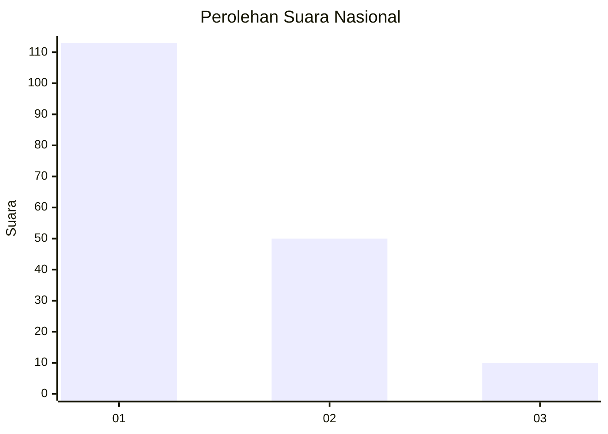
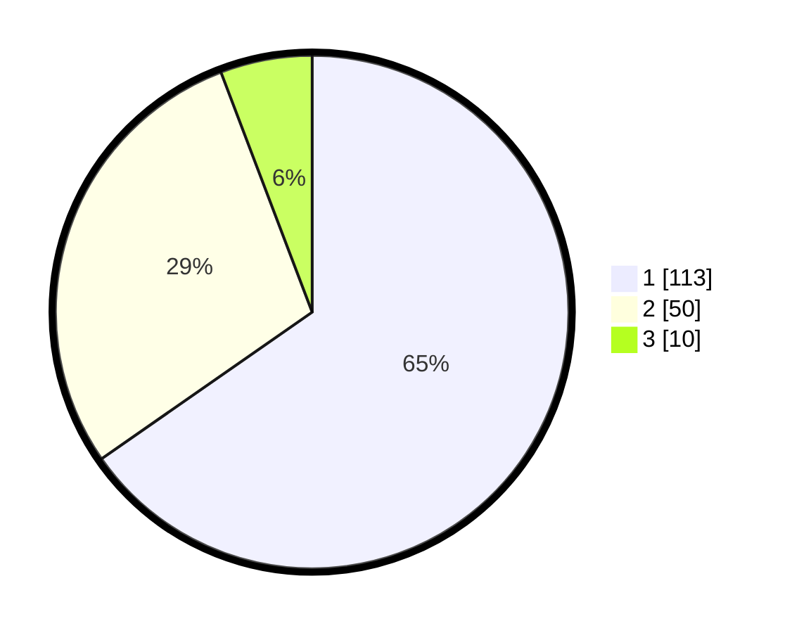

# Hasil

## Grafik

## Tabel

| No. | Nama Paslon    | Suara | Suara (raw) | Persentase |
|:--- |:-------------- | -----:| -----------:| ----------:|
| 1   | ANIES MUHAIMIN | 113   | [113][p-1]  | 65,32      |
| 2   | PRABOWO GIBRAN | 50    | [50][p-2]   | 28,90      |
| 3   | GANJAR MAHFUD  | 10    | [10][p-3]   | 5,78       |

[p-1]: https://github.com/gigit-pemilu/pemilu-2024/blob/main/pilpres/hitung-suara/sub/11-aceh/sub/04-aceh-tengah/sub/13-celala/sub/2001-arul-gading/sub/002-tps/sub/paslon-1.txt
[p-2]: https://github.com/gigit-pemilu/pemilu-2024/blob/main/pilpres/hitung-suara/sub/11-aceh/sub/04-aceh-tengah/sub/13-celala/sub/2001-arul-gading/sub/002-tps/sub/paslon-2.txt
[p-3]: https://github.com/gigit-pemilu/pemilu-2024/blob/main/pilpres/hitung-suara/sub/11-aceh/sub/04-aceh-tengah/sub/13-celala/sub/2001-arul-gading/sub/002-tps/sub/paslon-3.txt

## Foto C Plano

https://sirekap-obj-formc.kpu.go.id/3515/pemilu/ppwp/11/04/13/20/01/1104132001002-20240216-144210--3f026a16-e338-433b-bd7e-5a59b6cb99ce.jpg

https://sirekap-obj-formc.kpu.go.id/3515/pemilu/ppwp/11/04/13/20/01/1104132001002-20240216-144211--dc4a67ef-945c-4645-939b-add453895b65.jpg

https://sirekap-obj-formc.kpu.go.id/3515/pemilu/ppwp/11/04/13/20/01/1104132001002-20240216-144211--10c55769-c913-40e8-ba81-888761cae5be.jpg

## Metadata

| Key        | Value               |
| ---------- | ------------------- |
| Time Stamp | 2024-02-17 07:00:02 |

## DATA PEMILIH TETAP

Jumlah pemilih dalam DPT: **186**.
 * L: **92**.
 * P: **94**.

## DATA PENGGUNA HAK PILIH

Jumlah pengguna hak pilih dalam DPT: **169**.
 * L: **80**.
 * P: **89**.

Jumlah pengguna hak pilih dalam DPTb: **4**.
 * L: **2**.
 * P: **2**.

Jumlah pengguna hak pilih dalam DPK: **3**.
 * L: **1**.
 * P: **2**.

Jumlah pengguna hak pilih: **176**.
 * L: **83**.
 * P: **93**.

## JUMLAH SUARA SAH DAN TIDAK SAH

JUMLAH SELURUH SUARA SAH: **173**.

JUMLAH SUARA TIDAK SAH: **3**.

JUMLAH SELURUH SUARA SAH DAN SUARA TIDAK SAH: **176**.

