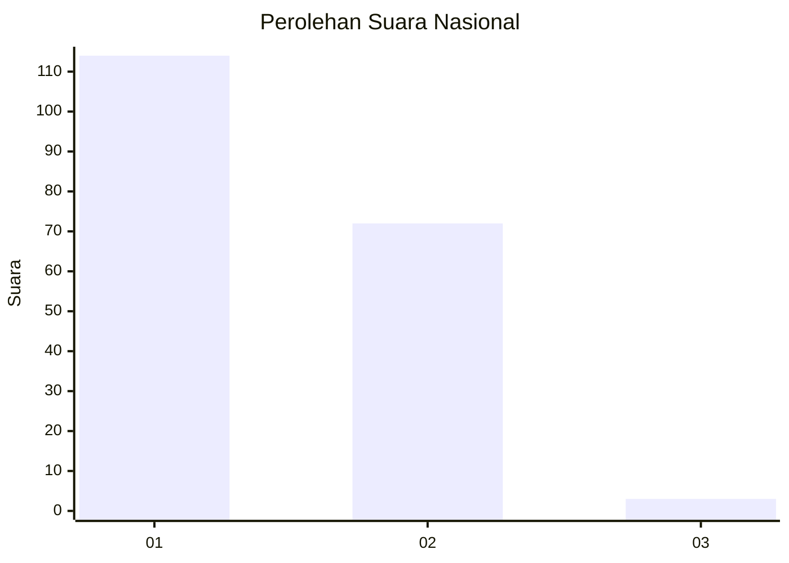
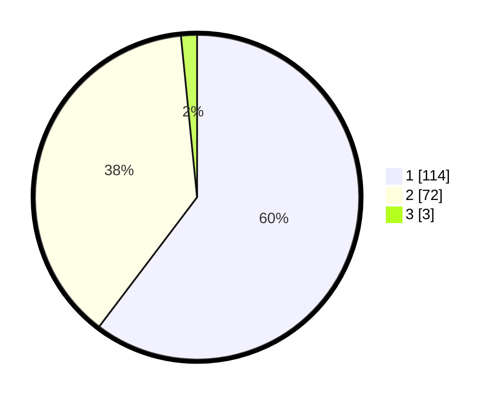

# Hasil

## Grafik

## Tabel

| No. | Nama Paslon    | Suara | Suara (raw) | Persentase |
|:--- |:-------------- | -----:| -----------:| ----------:|
| 1   | ANIES MUHAIMIN | 114   | [114][p-1]  | 60,32      |
| 2   | PRABOWO GIBRAN | 72    | [72][p-2]   | 38,10      |
| 3   | GANJAR MAHFUD  | 3     | [3][p-3]    | 1,59       |

[p-1]: https://github.com/gigit-pemilu/pemilu-2024/blob/main/pilpres/hitung-suara/sub/11-aceh/sub/04-aceh-tengah/sub/13-celala/sub/2005-cibro/sub/001-tps/sub/paslon-1.txt
[p-2]: https://github.com/gigit-pemilu/pemilu-2024/blob/main/pilpres/hitung-suara/sub/11-aceh/sub/04-aceh-tengah/sub/13-celala/sub/2005-cibro/sub/001-tps/sub/paslon-2.txt
[p-3]: https://github.com/gigit-pemilu/pemilu-2024/blob/main/pilpres/hitung-suara/sub/11-aceh/sub/04-aceh-tengah/sub/13-celala/sub/2005-cibro/sub/001-tps/sub/paslon-3.txt

## Foto C Plano

https://sirekap-obj-formc.kpu.go.id/834c/pemilu/ppwp/11/04/13/20/05/1104132005001-20240215-104049--1dac7238-4aaf-4e57-a0aa-c77618977eb8.jpg

https://sirekap-obj-formc.kpu.go.id/834c/pemilu/ppwp/11/04/13/20/05/1104132005001-20240215-104234--37dcce6d-391c-48e0-b36c-ef7df5a07ae1.jpg

## Metadata

| Key        | Value               |
| ---------- | ------------------- |
| Time Stamp | 2024-02-15 18:30:25 |

