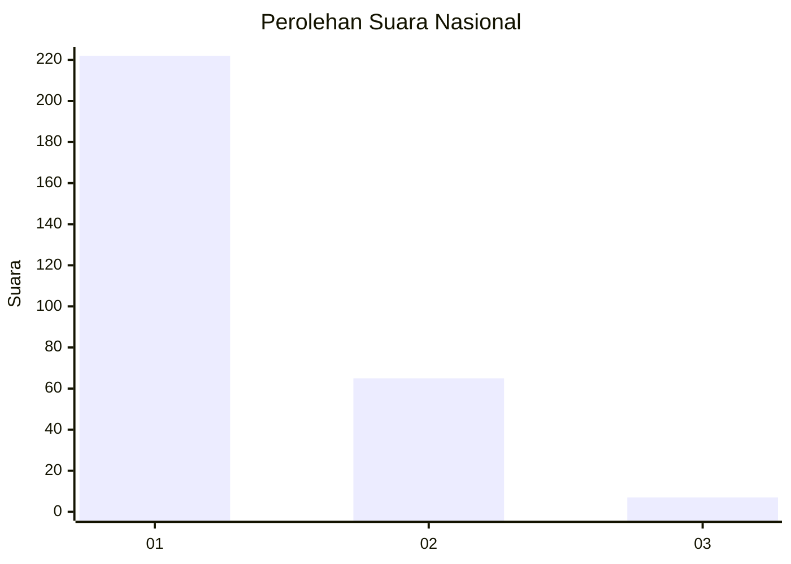
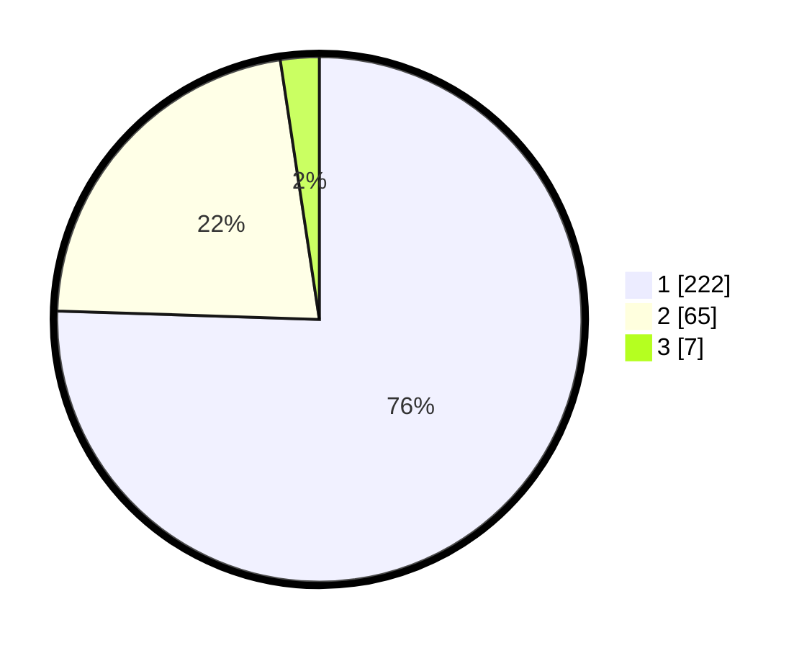

# Hasil

## Grafik

## Tabel

| No. | Nama Paslon    | Suara | Suara (raw) | Persentase |
|:--- |:-------------- | -----:| -----------:| ----------:|
| 1   | ANIES MUHAIMIN | 222   | [222][p-1]  | 75,51      |
| 2   | PRABOWO GIBRAN | 65    | [65][p-2]   | 22,11      |
| 3   | GANJAR MAHFUD  | 7     | [7][p-3]    | 2,38       |

[p-1]: https://github.com/gigit-pemilu/pemilu-2024/blob/main/pilpres/hitung-suara/sub/11-aceh/sub/04-aceh-tengah/sub/13-celala/sub/2010-melala/sub/002-tps/sub/paslon-1.txt
[p-2]: https://github.com/gigit-pemilu/pemilu-2024/blob/main/pilpres/hitung-suara/sub/11-aceh/sub/04-aceh-tengah/sub/13-celala/sub/2010-melala/sub/002-tps/sub/paslon-2.txt
[p-3]: https://github.com/gigit-pemilu/pemilu-2024/blob/main/pilpres/hitung-suara/sub/11-aceh/sub/04-aceh-tengah/sub/13-celala/sub/2010-melala/sub/002-tps/sub/paslon-3.txt

## Foto C Plano

https://sirekap-obj-formc.kpu.go.id/ca7c/pemilu/ppwp/11/04/13/20/10/1104132010002-20240215-121809--8ab5ea01-b3bc-4af5-8257-65c1b2e01e4c.jpg

https://sirekap-obj-formc.kpu.go.id/ca7c/pemilu/ppwp/11/04/13/20/10/1104132010002-20240215-082957--af1e436b-4f7c-42a9-93bd-0fa05940c8d5.jpg

https://sirekap-obj-formc.kpu.go.id/ca7c/pemilu/ppwp/11/04/13/20/10/1104132010002-20240215-122204--5c0c555b-b696-4208-8a92-02ba725ffb5a.jpg

## Metadata

| Key        | Value               |
| ---------- | ------------------- |
| Time Stamp | 2024-02-16 05:00:26 |

## DATA PEMILIH TETAP

Jumlah pemilih dalam DPT: **298**.
 * L: **151**.
 * P: **147**.

## DATA PENGGUNA HAK PILIH

Jumlah pengguna hak pilih dalam DPT: **281**.
 * L: **144**.
 * P: **137**.

Jumlah pengguna hak pilih dalam DPTb: **16**.
 * L: **9**.
 * P: **7**.

Jumlah pengguna hak pilih dalam DPK: **2**.
 * L: **1**.
 * P: **1**.

Jumlah pengguna hak pilih: **299**.
 * L: **154**.
 * P: **145**.

## JUMLAH SUARA SAH DAN TIDAK SAH

JUMLAH SELURUH SUARA SAH: **294**.

JUMLAH SUARA TIDAK SAH: **5**.

JUMLAH SELURUH SUARA SAH DAN SUARA TIDAK SAH: **299**.

