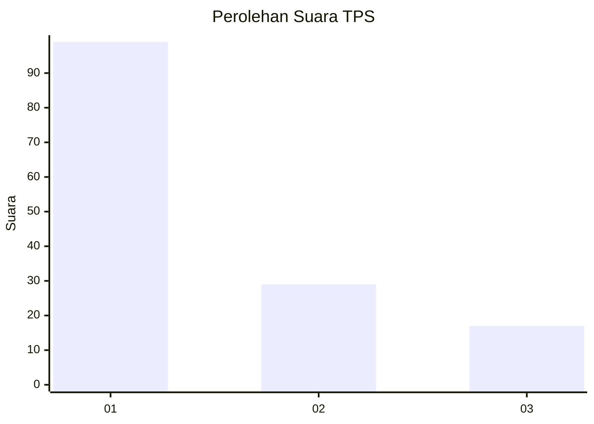
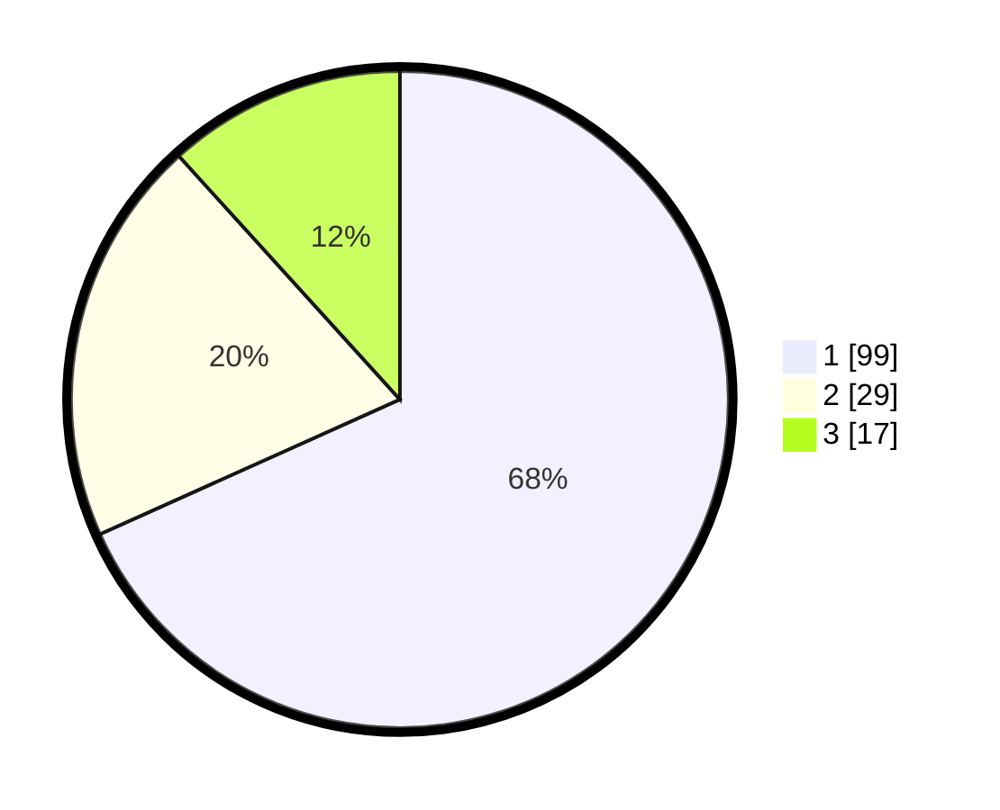

# Hasil

## Grafik

## Tabel

| No. | Nama Paslon    | Suara | Suara (raw) | Persentase |
|:--- |:-------------- | -----:| -----------:| ----------:|
| 1   | ANIES MUHAIMIN | 99    | [99][p-1]   | 68,28      |
| 2   | PRABOWO GIBRAN | 29    | [29][p-2]   | 20,00      |
| 3   | GANJAR MAHFUD  | 17    | [17][p-3]   | 11,72      |

[p-1]: https://github.com/gigit-pemilu/pemilu-2024-11-aceh/blob/main/pilpres/hitung-suara/sub/11-aceh/sub/04-aceh-tengah/sub/17-laut-tawar/sub/2001-takengon-timur/sub/002-tps/sub/paslon-1.txt
[p-2]: https://github.com/gigit-pemilu/pemilu-2024-11-aceh/blob/main/pilpres/hitung-suara/sub/11-aceh/sub/04-aceh-tengah/sub/17-laut-tawar/sub/2001-takengon-timur/sub/002-tps/sub/paslon-2.txt
[p-3]: https://github.com/gigit-pemilu/pemilu-2024-11-aceh/blob/main/pilpres/hitung-suara/sub/11-aceh/sub/04-aceh-tengah/sub/17-laut-tawar/sub/2001-takengon-timur/sub/002-tps/sub/paslon-3.txt

## Foto C Plano

https://sirekap-obj-formc.kpu.go.id/2e56/pemilu/ppwp/11/04/17/20/01/1104172001002-20240216-023226--de742931-596b-43f8-98d5-c3834d090c59.jpg

https://sirekap-obj-formc.kpu.go.id/2e56/pemilu/ppwp/11/04/17/20/01/1104172001002-20240216-023228--65301a8f-cb2f-47f2-86c6-e93131d19083.jpg

https://sirekap-obj-formc.kpu.go.id/2e56/pemilu/ppwp/11/04/17/20/01/1104172001002-20240216-023227--5bda30b9-e212-47e6-a946-04c0f49639ed.jpg

## Metadata

| Key        | Value               |
| ---------- | ------------------- |
| Time Stamp | 2024-02-16 03:00:26 |

## DATA PEMILIH TETAP

Jumlah pemilih dalam DPT: **194**.
 * L: **94**.
 * P: **100**.

## DATA PENGGUNA HAK PILIH

Jumlah pengguna hak pilih dalam DPT: **143**.
 * L: **69**.
 * P: **74**.

Jumlah pengguna hak pilih dalam DPTb: **0**.
 * L: **0**.
 * P: **0**.

Jumlah pengguna hak pilih dalam DPK: **4**.
 * L: **2**.
 * P: **2**.

Jumlah pengguna hak pilih: **147**.
 * L: **71**.
 * P: **76**.

## JUMLAH SUARA SAH DAN TIDAK SAH

JUMLAH SELURUH SUARA SAH: **145**.

JUMLAH SUARA TIDAK SAH: **2**.

JUMLAH SELURUH SUARA SAH DAN SUARA TIDAK SAH: **147**.

