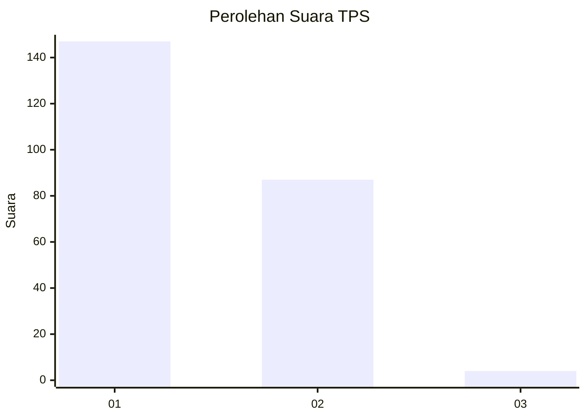
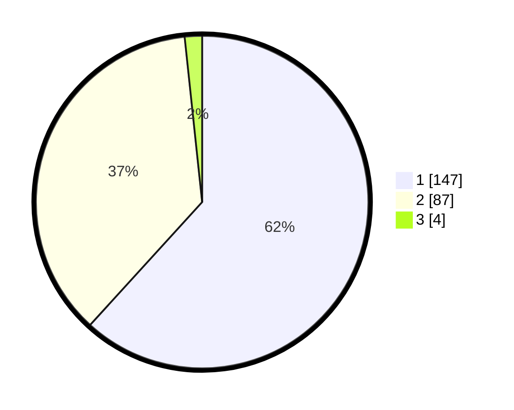

# Hasil

## Grafik

## Tabel

| No. | Nama Paslon    | Suara | Suara (raw) | Persentase |
|:--- |:-------------- | -----:| -----------:| ----------:|
| 1   | ANIES MUHAIMIN | 147   | [147][p-1]  | 61,76      |
| 2   | PRABOWO GIBRAN | 87    | [87][p-2]   | 36,55      |
| 3   | GANJAR MAHFUD  | 4     | [4][p-3]    | 1,68       |

[p-1]: https://github.com/gigit-pemilu/pemilu-2024-11-aceh/blob/main/pilpres/hitung-suara/sub/11-aceh/sub/04-aceh-tengah/sub/17-laut-tawar/sub/2001-takengon-timur/sub/003-tps/sub/paslon-1.txt
[p-2]: https://github.com/gigit-pemilu/pemilu-2024-11-aceh/blob/main/pilpres/hitung-suara/sub/11-aceh/sub/04-aceh-tengah/sub/17-laut-tawar/sub/2001-takengon-timur/sub/003-tps/sub/paslon-2.txt
[p-3]: https://github.com/gigit-pemilu/pemilu-2024-11-aceh/blob/main/pilpres/hitung-suara/sub/11-aceh/sub/04-aceh-tengah/sub/17-laut-tawar/sub/2001-takengon-timur/sub/003-tps/sub/paslon-3.txt

## Foto C Plano

https://sirekap-obj-formc.kpu.go.id/062e/pemilu/ppwp/11/04/17/20/01/1104172001003-20240215-183026--43b1bec0-3903-414b-92f8-e4f0091880ba.jpg

https://sirekap-obj-formc.kpu.go.id/062e/pemilu/ppwp/11/04/17/20/01/1104172001003-20240215-183547--1f5941f6-8487-48b1-82f0-016f49ed72c3.jpg

https://sirekap-obj-formc.kpu.go.id/062e/pemilu/ppwp/11/04/17/20/01/1104172001003-20240215-183536--df7770bd-2941-4020-b227-022421835fdc.jpg

## Metadata

| Key        | Value               |
| ---------- | ------------------- |
| Time Stamp | 2024-02-15 19:00:26 |

## DATA PEMILIH TETAP

Jumlah pemilih dalam DPT: **293**.
 * L: **136**.
 * P: **157**.

## DATA PENGGUNA HAK PILIH

Jumlah pengguna hak pilih dalam DPT: **231**.
 * L: **105**.
 * P: **126**.

Jumlah pengguna hak pilih dalam DPTb: **0**.
 * L: **0**.
 * P: **0**.

Jumlah pengguna hak pilih dalam DPK: **8**.
 * L: **5**.
 * P: **3**.

Jumlah pengguna hak pilih: **239**.
 * L: **110**.
 * P: **129**.

## JUMLAH SUARA SAH DAN TIDAK SAH

JUMLAH SELURUH SUARA SAH: **238**.

JUMLAH SUARA TIDAK SAH: **1**.

JUMLAH SELURUH SUARA SAH DAN SUARA TIDAK SAH: **239**.

