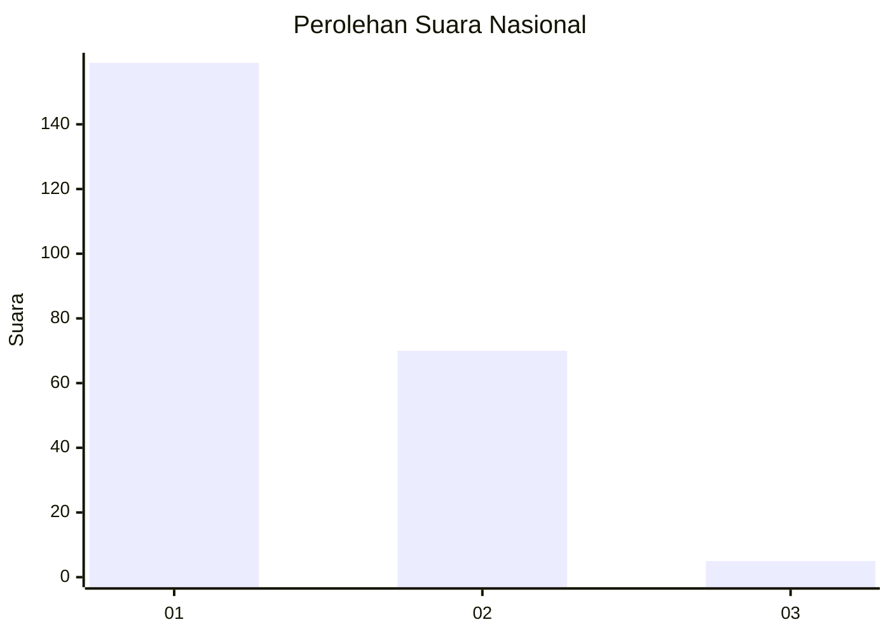
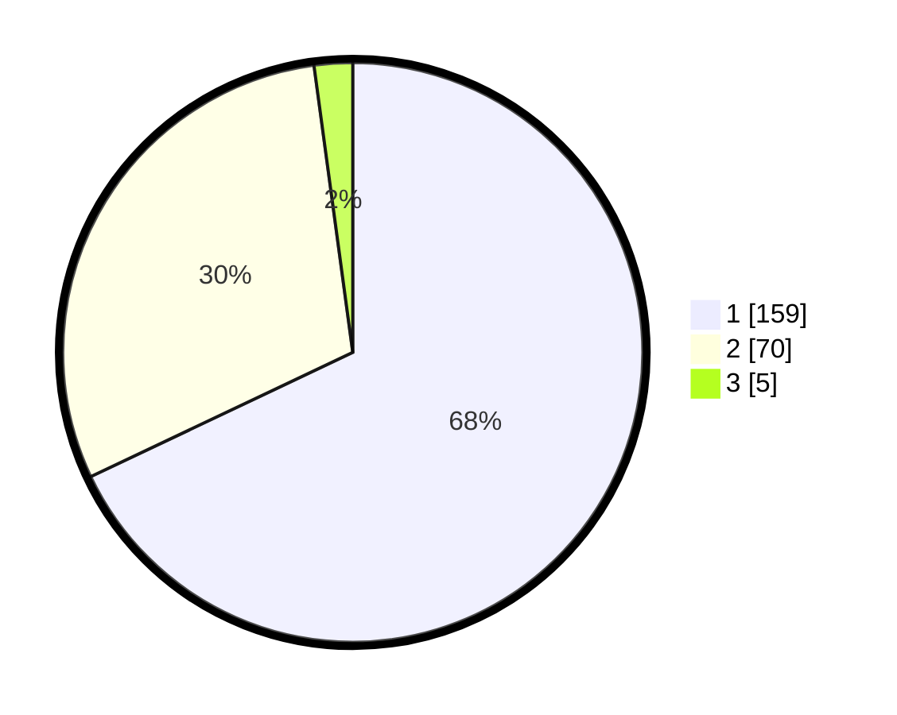

# Hasil

## Grafik

## Tabel

| No. | Nama Paslon    | Suara | Suara (raw) | Persentase |
|:--- |:-------------- | -----:| -----------:| ----------:|
| 1   | ANIES MUHAIMIN | 159   | [159][p-1]  | 67,95      |
| 2   | PRABOWO GIBRAN | 70    | [70][p-2]   | 29,91      |
| 3   | GANJAR MAHFUD  | 5     | [5][p-3]    | 2,14       |

[p-1]: https://github.com/gigit-pemilu/pemilu-2024/blob/main/pilpres/hitung-suara/sub/11-aceh/sub/04-aceh-tengah/sub/17-laut-tawar/sub/2001-takengon-timur/sub/004-tps/sub/paslon-1.txt
[p-2]: https://github.com/gigit-pemilu/pemilu-2024/blob/main/pilpres/hitung-suara/sub/11-aceh/sub/04-aceh-tengah/sub/17-laut-tawar/sub/2001-takengon-timur/sub/004-tps/sub/paslon-2.txt
[p-3]: https://github.com/gigit-pemilu/pemilu-2024/blob/main/pilpres/hitung-suara/sub/11-aceh/sub/04-aceh-tengah/sub/17-laut-tawar/sub/2001-takengon-timur/sub/004-tps/sub/paslon-3.txt

## Foto C Plano

https://sirekap-obj-formc.kpu.go.id/a993/pemilu/ppwp/11/04/17/20/01/1104172001004-20240215-222723--d5699276-fb7f-41dd-a19e-70605f049dc6.jpg

https://sirekap-obj-formc.kpu.go.id/a993/pemilu/ppwp/11/04/17/20/01/1104172001004-20240215-222725--d7d4aea7-006b-4f8f-92f7-54bf421d0295.jpg

https://sirekap-obj-formc.kpu.go.id/a993/pemilu/ppwp/11/04/17/20/01/1104172001004-20240215-222724--9c4a995c-67c7-4011-bcfa-1a094292d28c.jpg

## Metadata

| Key        | Value               |
| ---------- | ------------------- |
| Time Stamp | 2024-02-16 02:30:27 |

## DATA PEMILIH TETAP

Jumlah pemilih dalam DPT: **295**.
 * L: **136**.
 * P: **159**.

## DATA PENGGUNA HAK PILIH

Jumlah pengguna hak pilih dalam DPT: **238**.
 * L: **107**.
 * P: **131**.

Jumlah pengguna hak pilih dalam DPTb: **0**.
 * L: **0**.
 * P: **0**.

Jumlah pengguna hak pilih dalam DPK: **0**.
 * L: **0**.
 * P: **0**.

Jumlah pengguna hak pilih: **238**.
 * L: **107**.
 * P: **131**.

## JUMLAH SUARA SAH DAN TIDAK SAH

JUMLAH SELURUH SUARA SAH: **234**.

JUMLAH SUARA TIDAK SAH: **67**.

JUMLAH SELURUH SUARA SAH DAN SUARA TIDAK SAH: **301**.

