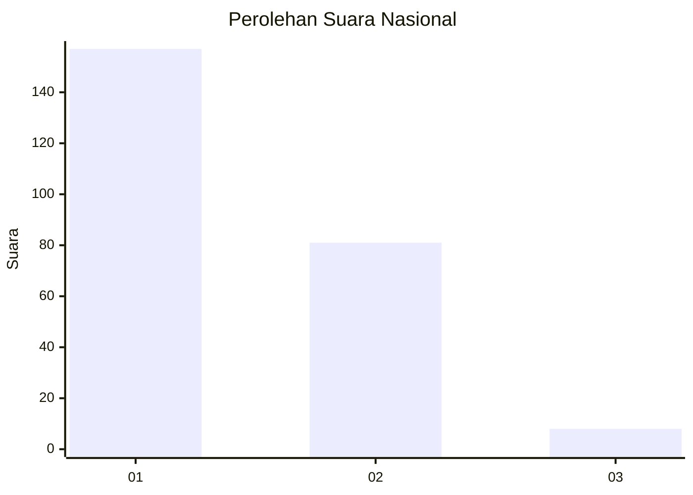
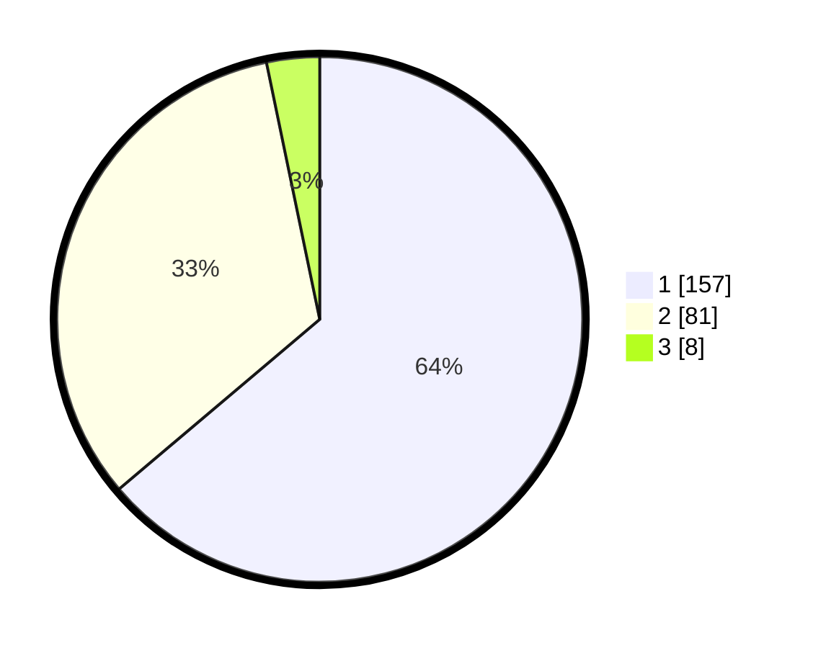

# Hasil

## Grafik

## Tabel

| No. | Nama Paslon    | Suara | Suara (raw) | Persentase |
|:--- |:-------------- | -----:| -----------:| ----------:|
| 1   | ANIES MUHAIMIN | 157   | [157][p-1]  | 63,82      |
| 2   | PRABOWO GIBRAN | 81    | [81][p-2]   | 32,93      |
| 3   | GANJAR MAHFUD  | 8     | [8][p-3]    | 3,25       |

[p-1]: https://github.com/gigit-pemilu/pemilu-2024/blob/main/pilpres/hitung-suara/sub/11-aceh/sub/04-aceh-tengah/sub/17-laut-tawar/sub/2001-takengon-timur/sub/005-tps/sub/paslon-1.txt
[p-2]: https://github.com/gigit-pemilu/pemilu-2024/blob/main/pilpres/hitung-suara/sub/11-aceh/sub/04-aceh-tengah/sub/17-laut-tawar/sub/2001-takengon-timur/sub/005-tps/sub/paslon-2.txt
[p-3]: https://github.com/gigit-pemilu/pemilu-2024/blob/main/pilpres/hitung-suara/sub/11-aceh/sub/04-aceh-tengah/sub/17-laut-tawar/sub/2001-takengon-timur/sub/005-tps/sub/paslon-3.txt

## Foto C Plano

https://sirekap-obj-formc.kpu.go.id/1d44/pemilu/ppwp/11/04/17/20/01/1104172001005-20240216-004449--4dbaa82c-723c-44cf-9bdd-32a2acddc900.jpg

https://sirekap-obj-formc.kpu.go.id/1d44/pemilu/ppwp/11/04/17/20/01/1104172001005-20240216-004450--1676f18c-724e-484b-9fef-93b852bd76af.jpg

https://sirekap-obj-formc.kpu.go.id/1d44/pemilu/ppwp/11/04/17/20/01/1104172001005-20240216-004449--73576ce2-03a9-4f3c-adac-1d3a88fb455f.jpg

## Metadata

| Key        | Value               |
| ---------- | ------------------- |
| Time Stamp | 2024-02-16 02:30:27 |

## DATA PEMILIH TETAP

Jumlah pemilih dalam DPT: **296**.
 * L: **134**.
 * P: **162**.

## DATA PENGGUNA HAK PILIH

Jumlah pengguna hak pilih dalam DPT: **242**.
 * L: **101**.
 * P: **141**.

Jumlah pengguna hak pilih dalam DPTb: **0**.
 * L: **0**.
 * P: **0**.

Jumlah pengguna hak pilih dalam DPK: **5**.
 * L: **2**.
 * P: **3**.

Jumlah pengguna hak pilih: **247**.
 * L: **103**.
 * P: **144**.

## JUMLAH SUARA SAH DAN TIDAK SAH

JUMLAH SELURUH SUARA SAH: **246**.

JUMLAH SUARA TIDAK SAH: **1**.

JUMLAH SELURUH SUARA SAH DAN SUARA TIDAK SAH: **247**.

