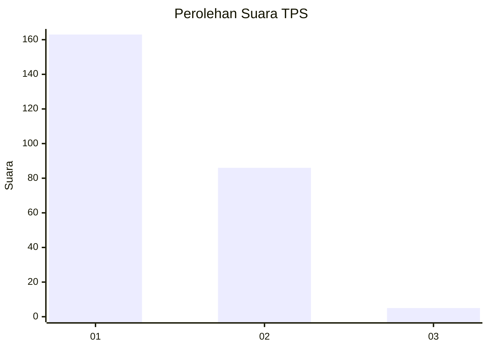
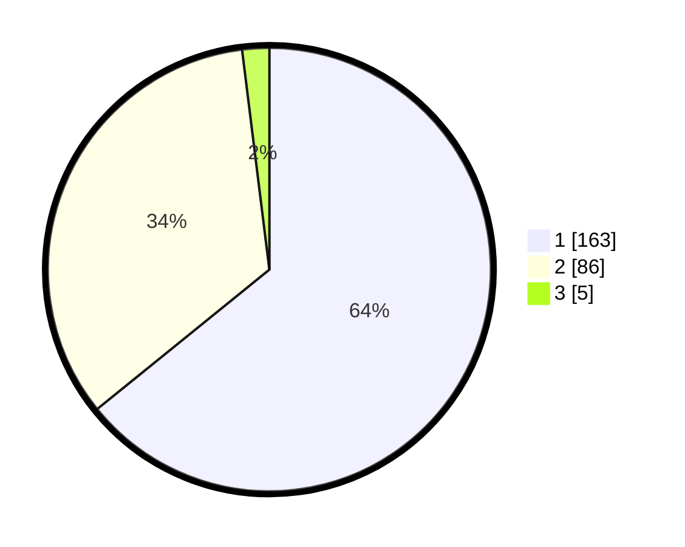

# Hasil

## Grafik

## Tabel

| No. | Nama Paslon    | Suara | Suara (raw) | Persentase |
|:--- |:-------------- | -----:| -----------:| ----------:|
| 1   | ANIES MUHAIMIN | 163   | [163][p-1]  | 64,17      |
| 2   | PRABOWO GIBRAN | 86    | [86][p-2]   | 33,86      |
| 3   | GANJAR MAHFUD  | 5     | [5][p-3]    | 1,97       |

[p-1]: https://github.com/gigit-pemilu/pemilu-2024-11-aceh/blob/main/pilpres/hitung-suara/sub/11-aceh/sub/04-aceh-tengah/sub/17-laut-tawar/sub/2001-takengon-timur/sub/006-tps/sub/paslon-1.txt
[p-2]: https://github.com/gigit-pemilu/pemilu-2024-11-aceh/blob/main/pilpres/hitung-suara/sub/11-aceh/sub/04-aceh-tengah/sub/17-laut-tawar/sub/2001-takengon-timur/sub/006-tps/sub/paslon-2.txt
[p-3]: https://github.com/gigit-pemilu/pemilu-2024-11-aceh/blob/main/pilpres/hitung-suara/sub/11-aceh/sub/04-aceh-tengah/sub/17-laut-tawar/sub/2001-takengon-timur/sub/006-tps/sub/paslon-3.txt

## Foto C Plano

https://sirekap-obj-formc.kpu.go.id/5d8d/pemilu/ppwp/11/04/17/20/01/1104172001006-20240215-033505--424fa527-7ddd-4753-9f50-3220c74ec2ac.jpg

https://sirekap-obj-formc.kpu.go.id/5d8d/pemilu/ppwp/11/04/17/20/01/1104172001006-20240215-033529--773f8475-d7dd-4dc4-83f1-3480dd7cb5ca.jpg

https://sirekap-obj-formc.kpu.go.id/5d8d/pemilu/ppwp/11/04/17/20/01/1104172001006-20240215-033518--7076633c-565d-4a41-a794-9a6553fcee86.jpg

## Metadata

| Key        | Value               |
| ---------- | ------------------- |
| Time Stamp | 2024-02-15 07:00:44 |

## DATA PEMILIH TETAP

Jumlah pemilih dalam DPT: **296**.
 * L: **143**.
 * P: **153**.

## DATA PENGGUNA HAK PILIH

Jumlah pengguna hak pilih dalam DPT: **254**.
 * L: **122**.
 * P: **132**.

Jumlah pengguna hak pilih dalam DPTb: **0**.
 * L: **0**.
 * P: **0**.

Jumlah pengguna hak pilih dalam DPK: **7**.
 * L: **4**.
 * P: **3**.

Jumlah pengguna hak pilih: **261**.
 * L: **126**.
 * P: **135**.

## JUMLAH SUARA SAH DAN TIDAK SAH

JUMLAH SELURUH SUARA SAH: **254**.

JUMLAH SUARA TIDAK SAH: **7**.

JUMLAH SELURUH SUARA SAH DAN SUARA TIDAK SAH: **261**.

