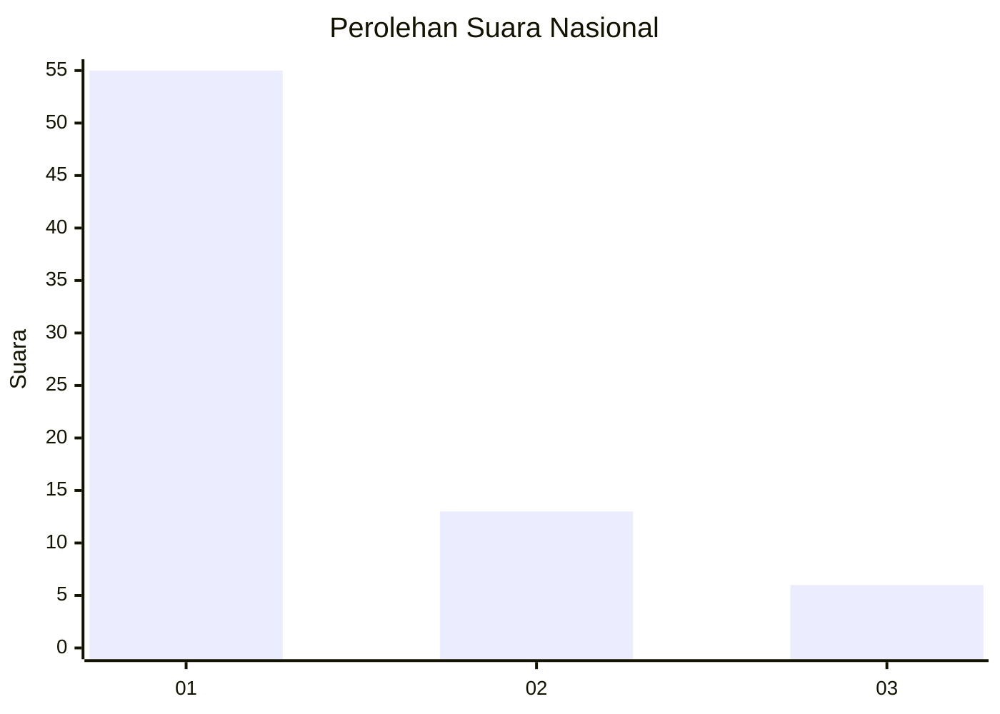
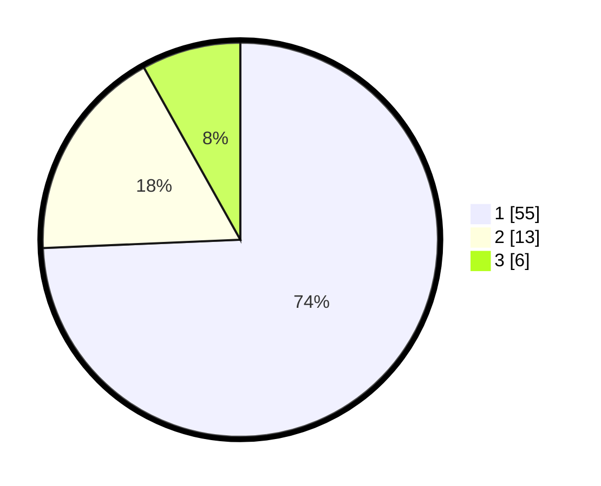

# Hasil

## Grafik

## Tabel

| No. | Nama Paslon    | Suara | Suara (raw) | Persentase |
|:--- |:-------------- | -----:| -----------:| ----------:|
| 1   | ANIES MUHAIMIN | 55    | [55][p-1]   | 74,32      |
| 2   | PRABOWO GIBRAN | 13    | [13][p-2]   | 17,57      |
| 3   | GANJAR MAHFUD  | 6     | [6][p-3]    | 8,11       |

[p-1]: https://github.com/gigit-pemilu/pemilu-2024/blob/main/pilpres/hitung-suara/sub/11-aceh/sub/04-aceh-tengah/sub/17-laut-tawar/sub/2011-rawe/sub/002-tps/sub/paslon-1.txt
[p-2]: https://github.com/gigit-pemilu/pemilu-2024/blob/main/pilpres/hitung-suara/sub/11-aceh/sub/04-aceh-tengah/sub/17-laut-tawar/sub/2011-rawe/sub/002-tps/sub/paslon-2.txt
[p-3]: https://github.com/gigit-pemilu/pemilu-2024/blob/main/pilpres/hitung-suara/sub/11-aceh/sub/04-aceh-tengah/sub/17-laut-tawar/sub/2011-rawe/sub/002-tps/sub/paslon-3.txt

## Foto C Plano

https://sirekap-obj-formc.kpu.go.id/d4cf/pemilu/ppwp/11/04/17/20/11/1104172011002-20240216-061812--6578cac1-43c9-4b49-9549-9ab9986c86bd.jpg

https://sirekap-obj-formc.kpu.go.id/d4cf/pemilu/ppwp/11/04/17/20/11/1104172011002-20240216-061820--c260e0e8-3b44-4c2a-bfb6-d6183cbed5e9.jpg

https://sirekap-obj-formc.kpu.go.id/d4cf/pemilu/ppwp/11/04/17/20/11/1104172011002-20240216-061817--aa8d8e3e-cee0-41b6-9891-23ac314288ce.jpg

## Metadata

| Key        | Value               |
| ---------- | ------------------- |
| Time Stamp | 2024-02-21 20:00:00 |

## DATA PEMILIH TETAP

Jumlah pemilih dalam DPT: **83**.
 * L: **39**.
 * P: **44**.

## DATA PENGGUNA HAK PILIH

Jumlah pengguna hak pilih dalam DPT: **74**.
 * L: **35**.
 * P: **39**.

Jumlah pengguna hak pilih dalam DPTb: **0**.
 * L: **0**.
 * P: **0**.

Jumlah pengguna hak pilih dalam DPK: **2**.
 * L: **2**.
 * P: **0**.

Jumlah pengguna hak pilih: **76**.
 * L: **37**.
 * P: **39**.

## JUMLAH SUARA SAH DAN TIDAK SAH

JUMLAH SELURUH SUARA SAH: **74**.

JUMLAH SUARA TIDAK SAH: **2**.

JUMLAH SELURUH SUARA SAH DAN SUARA TIDAK SAH: **76**.

