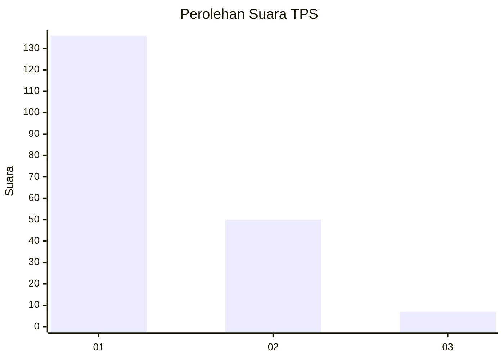
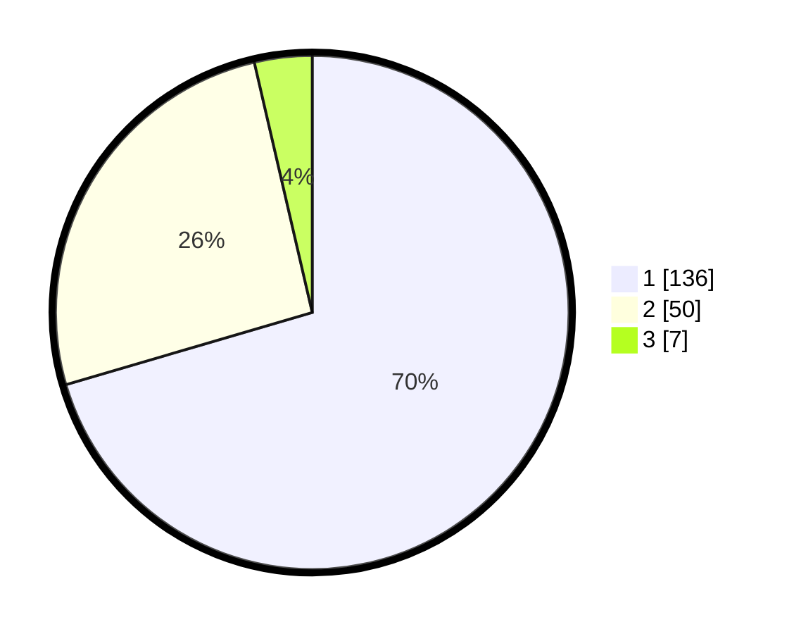

# Hasil

## Grafik

## Tabel

| No. | Nama Paslon    | Suara | Suara (raw) | Persentase |
|:--- |:-------------- | -----:| -----------:| ----------:|
| 1   | ANIES MUHAIMIN | 136   | [136][p-1]  | 70,47      |
| 2   | PRABOWO GIBRAN | 50    | [50][p-2]   | 25,91      |
| 3   | GANJAR MAHFUD  | 7     | [7][p-3]    | 3,63       |

[p-1]: https://github.com/gigit-pemilu/pemilu-2024-11-aceh/blob/main/pilpres/hitung-suara/sub/11-aceh/sub/04-aceh-tengah/sub/17-laut-tawar/sub/2013-toweren-antara/sub/001-tps/sub/paslon-1.txt
[p-2]: https://github.com/gigit-pemilu/pemilu-2024-11-aceh/blob/main/pilpres/hitung-suara/sub/11-aceh/sub/04-aceh-tengah/sub/17-laut-tawar/sub/2013-toweren-antara/sub/001-tps/sub/paslon-2.txt
[p-3]: https://github.com/gigit-pemilu/pemilu-2024-11-aceh/blob/main/pilpres/hitung-suara/sub/11-aceh/sub/04-aceh-tengah/sub/17-laut-tawar/sub/2013-toweren-antara/sub/001-tps/sub/paslon-3.txt

## Foto C Plano

https://sirekap-obj-formc.kpu.go.id/d399/pemilu/ppwp/11/04/17/20/13/1104172013001-20240214-190919--e96ac079-c45a-429b-986c-e8207f82d64a.jpg

https://sirekap-obj-formc.kpu.go.id/d399/pemilu/ppwp/11/04/17/20/13/1104172013001-20240214-232444--1d0d7f70-651e-4a2a-8fbb-d1520cdd2003.jpg

## Metadata

| Key        | Value               |
| ---------- | ------------------- |
| Time Stamp | 2024-02-20 20:00:00 |

