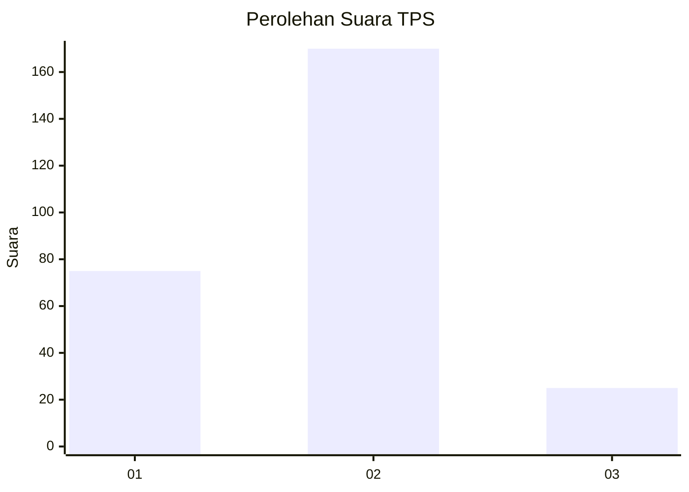
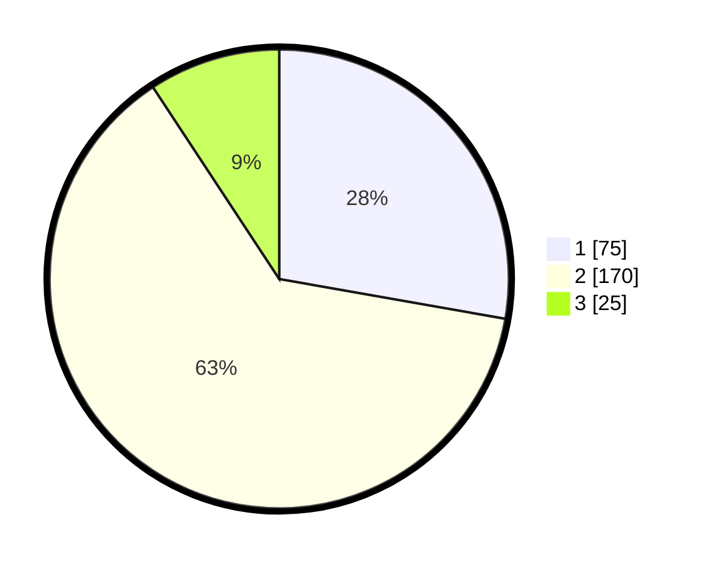

# Hasil

## Grafik

## Tabel

| No. | Nama Paslon    | Suara | Suara (raw) | Persentase |
|:--- |:-------------- | -----:| -----------:| ----------:|
| 1   | ANIES MUHAIMIN | 75    | [75][p-1]   | 27,78      |
| 2   | PRABOWO GIBRAN | 170   | [170][p-2]  | 62,96      |
| 3   | GANJAR MAHFUD  | 25    | [25][p-3]   | 9,26       |

[p-1]: https://github.com/gigit-pemilu/pemilu-2024-11-aceh/blob/main/pilpres/hitung-suara/sub/11-aceh/sub/04-aceh-tengah/sub/18-atu-lintang/sub/2001-atu-lintang/sub/001-tps/sub/paslon-1.txt
[p-2]: https://github.com/gigit-pemilu/pemilu-2024-11-aceh/blob/main/pilpres/hitung-suara/sub/11-aceh/sub/04-aceh-tengah/sub/18-atu-lintang/sub/2001-atu-lintang/sub/001-tps/sub/paslon-2.txt
[p-3]: https://github.com/gigit-pemilu/pemilu-2024-11-aceh/blob/main/pilpres/hitung-suara/sub/11-aceh/sub/04-aceh-tengah/sub/18-atu-lintang/sub/2001-atu-lintang/sub/001-tps/sub/paslon-3.txt

## Foto C Plano

https://sirekap-obj-formc.kpu.go.id/b043/pemilu/ppwp/11/04/18/20/01/1104182001001-20240215-230650--bbe7d09a-c140-449a-90cc-67ca8cc71d67.jpg

https://sirekap-obj-formc.kpu.go.id/b043/pemilu/ppwp/11/04/18/20/01/1104182001001-20240215-230652--568184ef-a9ac-4197-98cf-35089755a381.jpg

https://sirekap-obj-formc.kpu.go.id/b043/pemilu/ppwp/11/04/18/20/01/1104182001001-20240215-230651--99a47c7a-4436-4c02-8628-cfb26403d555.jpg

## Metadata

| Key        | Value               |
| ---------- | ------------------- |
| Time Stamp | 2024-02-16 02:30:27 |

## DATA PEMILIH TETAP

Jumlah pemilih dalam DPT: **292**.
 * L: **150**.
 * P: **142**.

## DATA PENGGUNA HAK PILIH

Jumlah pengguna hak pilih dalam DPT: **263**.
 * L: **135**.
 * P: **128**.

Jumlah pengguna hak pilih dalam DPTb: **9**.
 * L: **4**.
 * P: **5**.

Jumlah pengguna hak pilih dalam DPK: **0**.
 * L: **0**.
 * P: **0**.

Jumlah pengguna hak pilih: **272**.
 * L: **139**.
 * P: **133**.

## JUMLAH SUARA SAH DAN TIDAK SAH

JUMLAH SELURUH SUARA SAH: **270**.

JUMLAH SUARA TIDAK SAH: **2**.

JUMLAH SELURUH SUARA SAH DAN SUARA TIDAK SAH: **272**.

