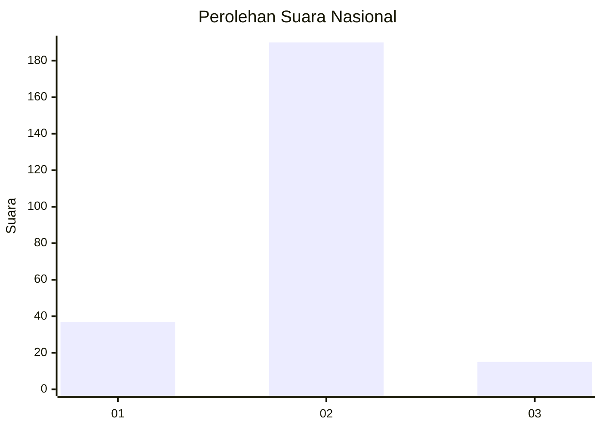
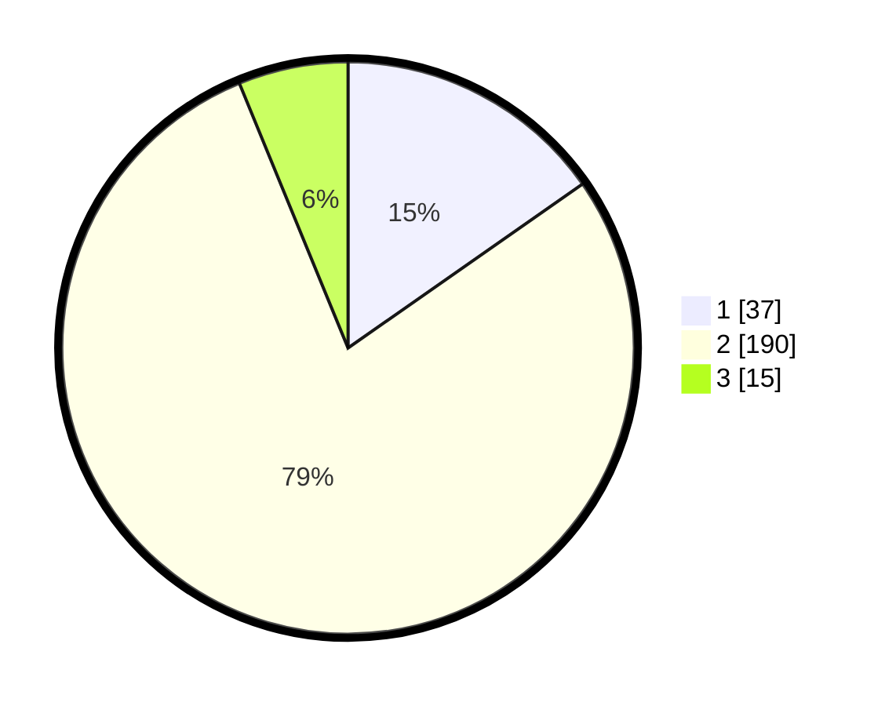

# Hasil

## Grafik

## Tabel

| No. | Nama Paslon    | Suara | Suara (raw) | Persentase |
|:--- |:-------------- | -----:| -----------:| ----------:|
| 1   | ANIES MUHAIMIN | 37    | [37][p-1]   | 15,29      |
| 2   | PRABOWO GIBRAN | 190   | [190][p-2]  | 78,51      |
| 3   | GANJAR MAHFUD  | 15    | [15][p-3]   | 6,20       |

[p-1]: https://github.com/gigit-pemilu/pemilu-2024/blob/main/pilpres/hitung-suara/sub/11-aceh/sub/04-aceh-tengah/sub/18-atu-lintang/sub/2001-atu-lintang/sub/002-tps/sub/paslon-1.txt
[p-2]: https://github.com/gigit-pemilu/pemilu-2024/blob/main/pilpres/hitung-suara/sub/11-aceh/sub/04-aceh-tengah/sub/18-atu-lintang/sub/2001-atu-lintang/sub/002-tps/sub/paslon-2.txt
[p-3]: https://github.com/gigit-pemilu/pemilu-2024/blob/main/pilpres/hitung-suara/sub/11-aceh/sub/04-aceh-tengah/sub/18-atu-lintang/sub/2001-atu-lintang/sub/002-tps/sub/paslon-3.txt

## Foto C Plano

https://sirekap-obj-formc.kpu.go.id/1f1f/pemilu/ppwp/11/04/18/20/01/1104182001002-20240216-012706--7904fa67-192c-48b6-b511-b7fc500f404a.jpg

https://sirekap-obj-formc.kpu.go.id/1f1f/pemilu/ppwp/11/04/18/20/01/1104182001002-20240215-203633--93f5f9f7-ba06-4abf-9a46-1ce589070330.jpg

https://sirekap-obj-formc.kpu.go.id/1f1f/pemilu/ppwp/11/04/18/20/01/1104182001002-20240216-012707--40b25851-3c79-4609-94e7-d1ba70c7437b.jpg

## Metadata

| Key        | Value               |
| ---------- | ------------------- |
| Time Stamp | 2024-02-16 02:30:27 |

## DATA PEMILIH TETAP

Jumlah pemilih dalam DPT: **279**.
 * L: **150**.
 * P: **129**.

## DATA PENGGUNA HAK PILIH

Jumlah pengguna hak pilih dalam DPT: **246**.
 * L: **129**.
 * P: **117**.

Jumlah pengguna hak pilih dalam DPTb: **0**.
 * L: **0**.
 * P: **0**.

Jumlah pengguna hak pilih dalam DPK: **3**.
 * L: **2**.
 * P: **1**.

Jumlah pengguna hak pilih: **249**.
 * L: **131**.
 * P: **118**.

## JUMLAH SUARA SAH DAN TIDAK SAH

JUMLAH SELURUH SUARA SAH: **242**.

JUMLAH SUARA TIDAK SAH: **7**.

JUMLAH SELURUH SUARA SAH DAN SUARA TIDAK SAH: **249**.

