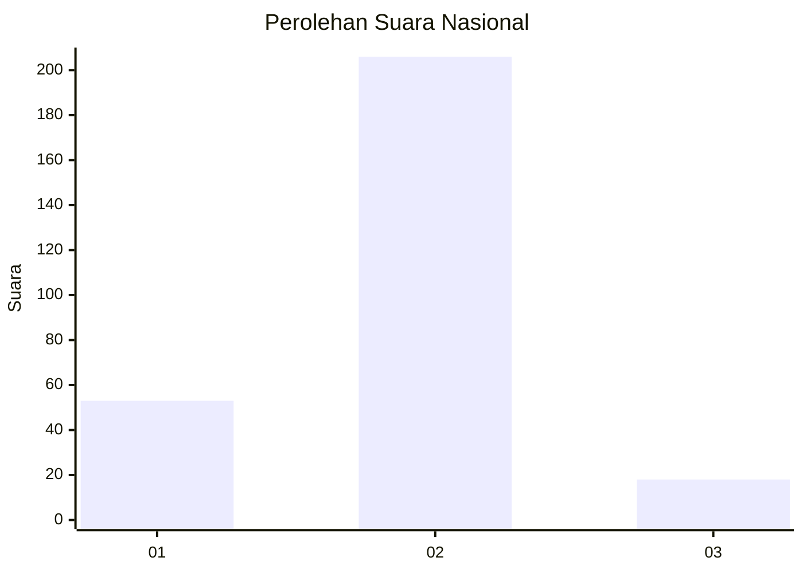
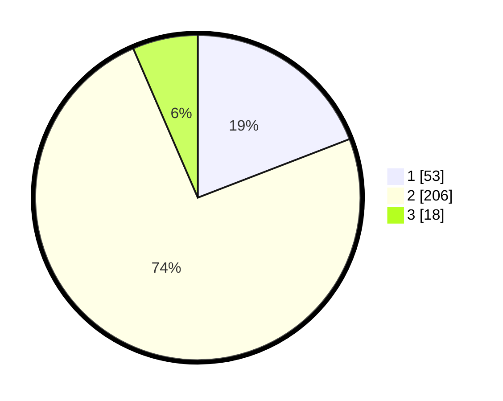

# Hasil

## Grafik

## Tabel

| No. | Nama Paslon    | Suara | Suara (raw) | Persentase |
|:--- |:-------------- | -----:| -----------:| ----------:|
| 1   | ANIES MUHAIMIN | 53    | [53][p-1]   | 19,13      |
| 2   | PRABOWO GIBRAN | 206   | [206][p-2]  | 74,37      |
| 3   | GANJAR MAHFUD  | 18    | [18][p-3]   | 6,50       |

[p-1]: https://github.com/gigit-pemilu/pemilu-2024/blob/main/pilpres/hitung-suara/sub/11-aceh/sub/04-aceh-tengah/sub/18-atu-lintang/sub/2001-atu-lintang/sub/003-tps/sub/paslon-1.txt
[p-2]: https://github.com/gigit-pemilu/pemilu-2024/blob/main/pilpres/hitung-suara/sub/11-aceh/sub/04-aceh-tengah/sub/18-atu-lintang/sub/2001-atu-lintang/sub/003-tps/sub/paslon-2.txt
[p-3]: https://github.com/gigit-pemilu/pemilu-2024/blob/main/pilpres/hitung-suara/sub/11-aceh/sub/04-aceh-tengah/sub/18-atu-lintang/sub/2001-atu-lintang/sub/003-tps/sub/paslon-3.txt

## Foto C Plano

https://sirekap-obj-formc.kpu.go.id/d2f4/pemilu/ppwp/11/04/18/20/01/1104182001003-20240215-212807--259f0cdf-69aa-4136-8af1-66b4bc8e840c.jpg

https://sirekap-obj-formc.kpu.go.id/d2f4/pemilu/ppwp/11/04/18/20/01/1104182001003-20240215-212809--7938ad7d-4d7c-4669-b430-075fb793a2ac.jpg

https://sirekap-obj-formc.kpu.go.id/d2f4/pemilu/ppwp/11/04/18/20/01/1104182001003-20240215-212808--d6348bb0-78be-4d4c-9a3b-1e928d3a54c1.jpg

## Metadata

| Key        | Value               |
| ---------- | ------------------- |
| Time Stamp | 2024-02-16 02:30:27 |

## DATA PEMILIH TETAP

Jumlah pemilih dalam DPT: **298**.
 * L: **149**.
 * P: **149**.

## DATA PENGGUNA HAK PILIH

Jumlah pengguna hak pilih dalam DPT: **270**.
 * L: **137**.
 * P: **133**.

Jumlah pengguna hak pilih dalam DPTb: **7**.
 * L: **3**.
 * P: **4**.

Jumlah pengguna hak pilih dalam DPK: **2**.
 * L: **2**.
 * P: **0**.

Jumlah pengguna hak pilih: **279**.
 * L: **142**.
 * P: **137**.

## JUMLAH SUARA SAH DAN TIDAK SAH

JUMLAH SELURUH SUARA SAH: **277**.

JUMLAH SUARA TIDAK SAH: **2**.

JUMLAH SELURUH SUARA SAH DAN SUARA TIDAK SAH: **279**.

