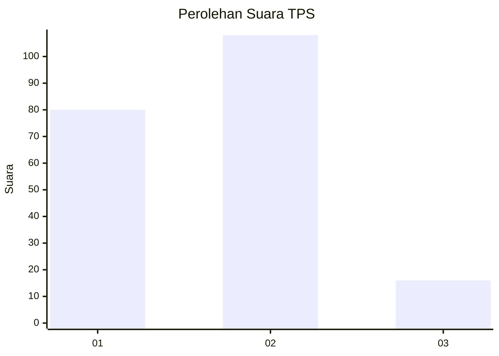
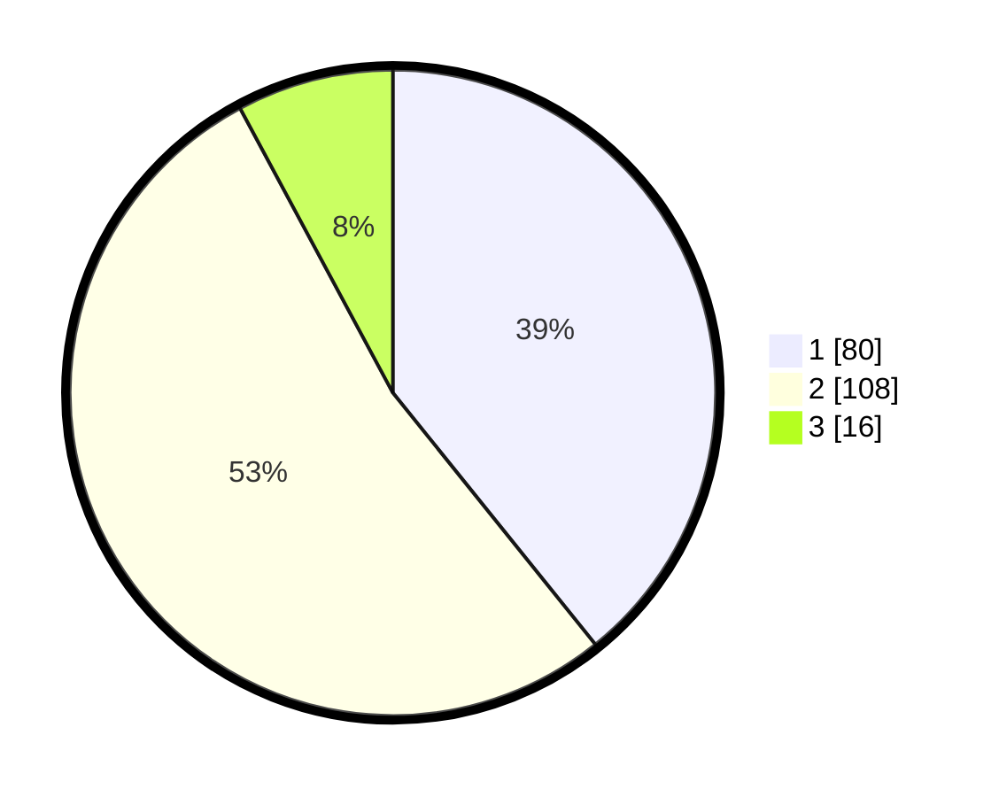

# Hasil

## Grafik

## Tabel

| No. | Nama Paslon    | Suara | Suara (raw) | Persentase |
|:--- |:-------------- | -----:| -----------:| ----------:|
| 1   | ANIES MUHAIMIN | 80    | [80][p-1]   | 39,22      |
| 2   | PRABOWO GIBRAN | 108   | [108][p-2]  | 52,94      |
| 3   | GANJAR MAHFUD  | 16    | [16][p-3]   | 7,84       |

[p-1]: https://github.com/gigit-pemilu/pemilu-2024-11-aceh/blob/main/pilpres/hitung-suara/sub/11-aceh/sub/04-aceh-tengah/sub/18-atu-lintang/sub/2002-merah-mege/sub/001-tps/sub/paslon-1.txt
[p-2]: https://github.com/gigit-pemilu/pemilu-2024-11-aceh/blob/main/pilpres/hitung-suara/sub/11-aceh/sub/04-aceh-tengah/sub/18-atu-lintang/sub/2002-merah-mege/sub/001-tps/sub/paslon-2.txt
[p-3]: https://github.com/gigit-pemilu/pemilu-2024-11-aceh/blob/main/pilpres/hitung-suara/sub/11-aceh/sub/04-aceh-tengah/sub/18-atu-lintang/sub/2002-merah-mege/sub/001-tps/sub/paslon-3.txt

## Foto C Plano

https://sirekap-obj-formc.kpu.go.id/b7d5/pemilu/ppwp/11/04/18/20/02/1104182002001-20240216-143438--ddec5f85-40c8-4367-a6ad-e2e0f640aa1f.jpg

https://sirekap-obj-formc.kpu.go.id/b7d5/pemilu/ppwp/11/04/18/20/02/1104182002001-20240216-143439--c9dd42ec-6c81-4009-b302-b1d3f5401ae1.jpg

https://sirekap-obj-formc.kpu.go.id/b7d5/pemilu/ppwp/11/04/18/20/02/1104182002001-20240216-143438--4860c0b8-762f-4181-8ce4-769c6d76f7c3.jpg

## Metadata

| Key        | Value               |
| ---------- | ------------------- |
| Time Stamp | 2024-02-17 07:00:02 |

## DATA PEMILIH TETAP

Jumlah pemilih dalam DPT: **212**.
 * L: **114**.
 * P: **98**.

## DATA PENGGUNA HAK PILIH

Jumlah pengguna hak pilih dalam DPT: **197**.
 * L: **106**.
 * P: **91**.

Jumlah pengguna hak pilih dalam DPTb: **8**.
 * L: **4**.
 * P: **4**.

Jumlah pengguna hak pilih dalam DPK: **1**.
 * L: **1**.
 * P: **0**.

Jumlah pengguna hak pilih: **206**.
 * L: **111**.
 * P: **95**.

## JUMLAH SUARA SAH DAN TIDAK SAH

JUMLAH SELURUH SUARA SAH: **204**.

JUMLAH SUARA TIDAK SAH: **2**.

JUMLAH SELURUH SUARA SAH DAN SUARA TIDAK SAH: **206**.

