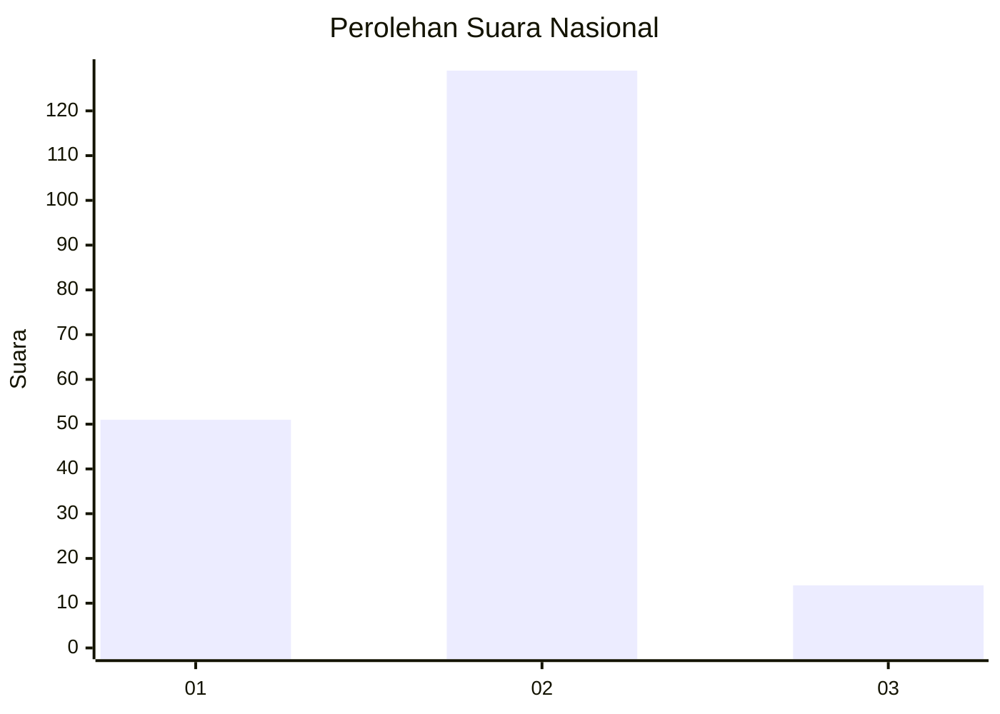
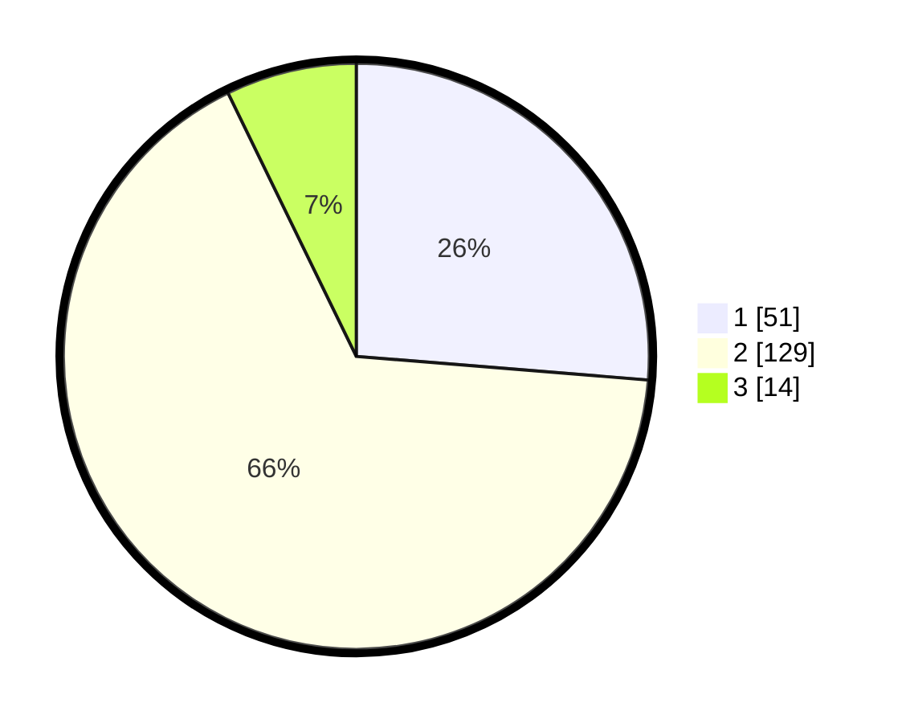

# Hasil

## Grafik

## Tabel

| No. | Nama Paslon    | Suara | Suara (raw) | Persentase |
|:--- |:-------------- | -----:| -----------:| ----------:|
| 1   | ANIES MUHAIMIN | 51    | [51][p-1]   | 26,29      |
| 2   | PRABOWO GIBRAN | 129   | [129][p-2]  | 66,49      |
| 3   | GANJAR MAHFUD  | 14    | [14][p-3]   | 7,22       |

[p-1]: https://github.com/gigit-pemilu/pemilu-2024/blob/main/pilpres/hitung-suara/sub/11-aceh/sub/04-aceh-tengah/sub/18-atu-lintang/sub/2002-merah-mege/sub/002-tps/sub/paslon-1.txt
[p-2]: https://github.com/gigit-pemilu/pemilu-2024/blob/main/pilpres/hitung-suara/sub/11-aceh/sub/04-aceh-tengah/sub/18-atu-lintang/sub/2002-merah-mege/sub/002-tps/sub/paslon-2.txt
[p-3]: https://github.com/gigit-pemilu/pemilu-2024/blob/main/pilpres/hitung-suara/sub/11-aceh/sub/04-aceh-tengah/sub/18-atu-lintang/sub/2002-merah-mege/sub/002-tps/sub/paslon-3.txt

## Foto C Plano

https://sirekap-obj-formc.kpu.go.id/1988/pemilu/ppwp/11/04/18/20/02/1104182002002-20240216-144249--5c77b1ee-a1e0-491c-b113-49cb1bf190e9.jpg

https://sirekap-obj-formc.kpu.go.id/1988/pemilu/ppwp/11/04/18/20/02/1104182002002-20240216-144250--49ef4f72-35cc-4fe0-adae-a0f54599f651.jpg

https://sirekap-obj-formc.kpu.go.id/1988/pemilu/ppwp/11/04/18/20/02/1104182002002-20240216-144250--51a50077-890f-4092-8c61-c8f3ccfc6b06.jpg

## Metadata

| Key        | Value               |
| ---------- | ------------------- |
| Time Stamp | 2024-02-17 10:30:03 |

## DATA PEMILIH TETAP

Jumlah pemilih dalam DPT: **214**.
 * L: **114**.
 * P: **100**.

## DATA PENGGUNA HAK PILIH

Jumlah pengguna hak pilih dalam DPT: **191**.
 * L: **102**.
 * P: **89**.

Jumlah pengguna hak pilih dalam DPTb: **5**.
 * L: **3**.
 * P: **2**.

Jumlah pengguna hak pilih dalam DPK: **1**.
 * L: **1**.
 * P: **0**.

Jumlah pengguna hak pilih: **197**.
 * L: **106**.
 * P: **91**.

## JUMLAH SUARA SAH DAN TIDAK SAH

JUMLAH SELURUH SUARA SAH: **194**.

JUMLAH SUARA TIDAK SAH: **3**.

JUMLAH SELURUH SUARA SAH DAN SUARA TIDAK SAH: **197**.

