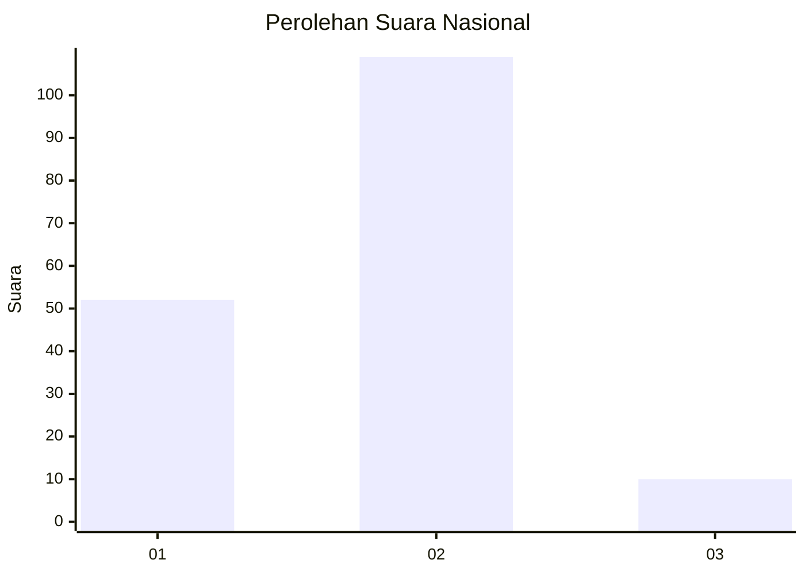
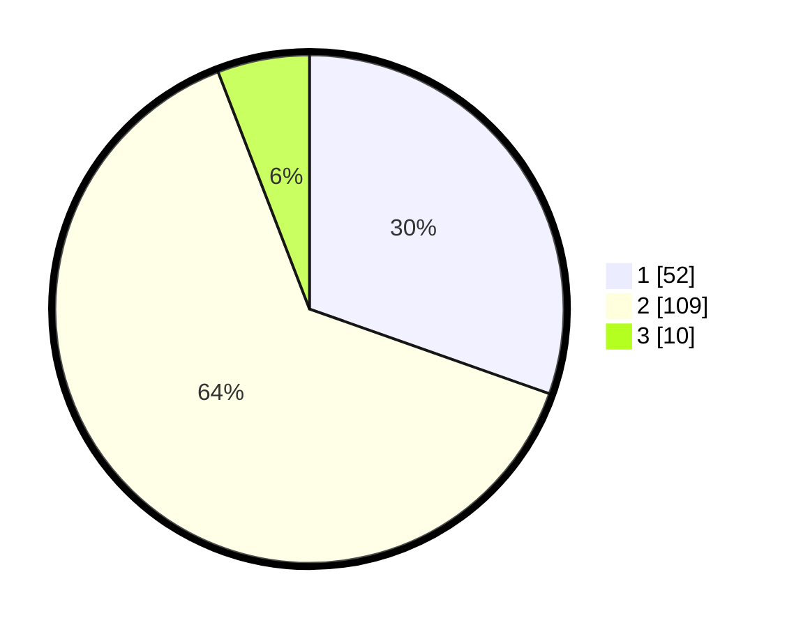

# Hasil

## Grafik

## Tabel

| No. | Nama Paslon    | Suara | Suara (raw) | Persentase |
|:--- |:-------------- | -----:| -----------:| ----------:|
| 1   | ANIES MUHAIMIN | 52    | [52][p-1]   | 30,41      |
| 2   | PRABOWO GIBRAN | 109   | [109][p-2]  | 63,74      |
| 3   | GANJAR MAHFUD  | 10    | [10][p-3]   | 5,85       |

[p-1]: https://github.com/gigit-pemilu/pemilu-2024/blob/main/pilpres/hitung-suara/sub/11-aceh/sub/04-aceh-tengah/sub/18-atu-lintang/sub/2005-gayo-murni/sub/001-tps/sub/paslon-1.txt
[p-2]: https://github.com/gigit-pemilu/pemilu-2024/blob/main/pilpres/hitung-suara/sub/11-aceh/sub/04-aceh-tengah/sub/18-atu-lintang/sub/2005-gayo-murni/sub/001-tps/sub/paslon-2.txt
[p-3]: https://github.com/gigit-pemilu/pemilu-2024/blob/main/pilpres/hitung-suara/sub/11-aceh/sub/04-aceh-tengah/sub/18-atu-lintang/sub/2005-gayo-murni/sub/001-tps/sub/paslon-3.txt

## Foto C Plano

https://sirekap-obj-formc.kpu.go.id/9948/pemilu/ppwp/11/04/18/20/05/1104182005001-20240216-151652--49d74cfb-f753-4c47-aaf4-f41aa3330bfd.jpg

https://sirekap-obj-formc.kpu.go.id/9948/pemilu/ppwp/11/04/18/20/05/1104182005001-20240216-151653--002f9f26-0b43-45e9-b3e8-12d0cc0011ea.jpg

https://sirekap-obj-formc.kpu.go.id/9948/pemilu/ppwp/11/04/18/20/05/1104182005001-20240216-151653--bf6a8443-0a54-4cdf-b6ec-8e2c7ebde282.jpg

## Metadata

| Key        | Value               |
| ---------- | ------------------- |
| Time Stamp | 2024-02-17 10:30:03 |

## DATA PEMILIH TETAP

Jumlah pemilih dalam DPT: **185**.
 * L: **99**.
 * P: **86**.

## DATA PENGGUNA HAK PILIH

Jumlah pengguna hak pilih dalam DPT: **171**.
 * L: **93**.
 * P: **78**.

Jumlah pengguna hak pilih dalam DPTb: **5**.
 * L: **3**.
 * P: **2**.

Jumlah pengguna hak pilih dalam DPK: **3**.
 * L: **2**.
 * P: **1**.

Jumlah pengguna hak pilih: **179**.
 * L: **98**.
 * P: **81**.

## JUMLAH SUARA SAH DAN TIDAK SAH

JUMLAH SELURUH SUARA SAH: **171**.

JUMLAH SUARA TIDAK SAH: **8**.

JUMLAH SELURUH SUARA SAH DAN SUARA TIDAK SAH: **179**.

