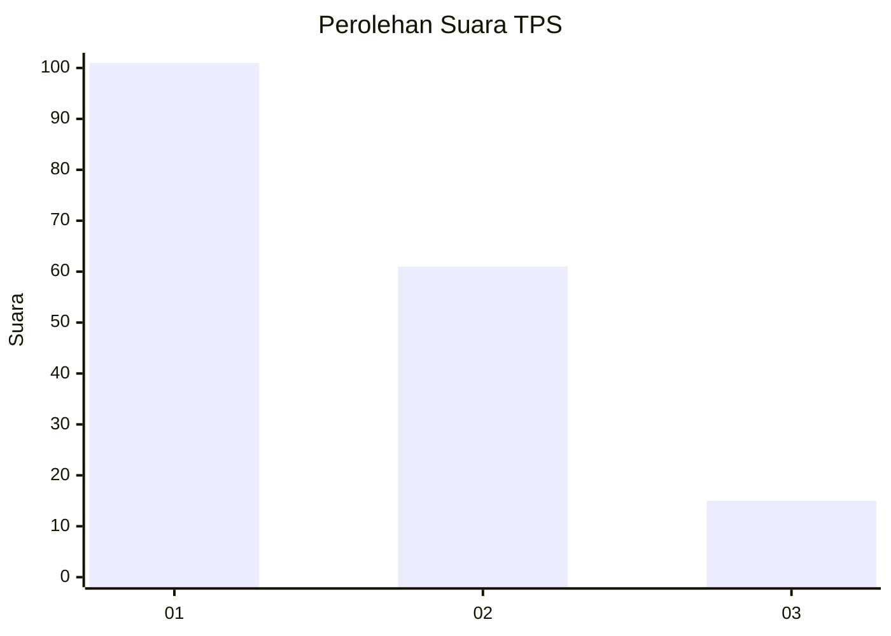
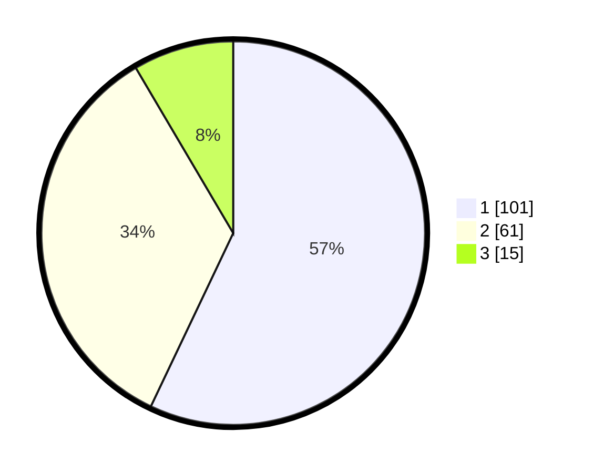

# Hasil

## Grafik

## Tabel

| No. | Nama Paslon    | Suara | Suara (raw) | Persentase |
|:--- |:-------------- | -----:| -----------:| ----------:|
| 1   | ANIES MUHAIMIN | 101   | [101][p-1]  | 57,06      |
| 2   | PRABOWO GIBRAN | 61    | [61][p-2]   | 34,46      |
| 3   | GANJAR MAHFUD  | 15    | [15][p-3]   | 8,47       |

[p-1]: https://github.com/gigit-pemilu/pemilu-2024-11-aceh/blob/main/pilpres/hitung-suara/sub/11-aceh/sub/04-aceh-tengah/sub/18-atu-lintang/sub/2008-bintang-kekelip/sub/001-tps/sub/paslon-1.txt
[p-2]: https://github.com/gigit-pemilu/pemilu-2024-11-aceh/blob/main/pilpres/hitung-suara/sub/11-aceh/sub/04-aceh-tengah/sub/18-atu-lintang/sub/2008-bintang-kekelip/sub/001-tps/sub/paslon-2.txt
[p-3]: https://github.com/gigit-pemilu/pemilu-2024-11-aceh/blob/main/pilpres/hitung-suara/sub/11-aceh/sub/04-aceh-tengah/sub/18-atu-lintang/sub/2008-bintang-kekelip/sub/001-tps/sub/paslon-3.txt

## Foto C Plano

https://sirekap-obj-formc.kpu.go.id/b7c6/pemilu/ppwp/11/04/18/20/08/1104182008001-20240215-090648--f38e7e68-a757-41fb-91ca-3ce08bf05c39.jpg

https://sirekap-obj-formc.kpu.go.id/b7c6/pemilu/ppwp/11/04/18/20/08/1104182008001-20240215-010535--039fd6bc-e699-413e-bb98-1e7f57f7679f.jpg

https://sirekap-obj-formc.kpu.go.id/b7c6/pemilu/ppwp/11/04/18/20/08/1104182008001-20240215-010552--af557beb-377f-43d8-8965-8f6b5c72c02e.jpg

## Metadata

| Key        | Value               |
| ---------- | ------------------- |
| Time Stamp | 2024-02-16 05:00:26 |

## DATA PEMILIH TETAP

Jumlah pemilih dalam DPT: **202**.
 * L: **108**.
 * P: **94**.

## DATA PENGGUNA HAK PILIH

Jumlah pengguna hak pilih dalam DPT: **170**.
 * L: **91**.
 * P: **79**.

Jumlah pengguna hak pilih dalam DPTb: **4**.
 * L: **2**.
 * P: **2**.

Jumlah pengguna hak pilih dalam DPK: **7**.
 * L: **4**.
 * P: **3**.

Jumlah pengguna hak pilih: **181**.
 * L: **97**.
 * P: **84**.

## JUMLAH SUARA SAH DAN TIDAK SAH

JUMLAH SELURUH SUARA SAH: **177**.

JUMLAH SUARA TIDAK SAH: **5**.

JUMLAH SELURUH SUARA SAH DAN SUARA TIDAK SAH: **182**.

