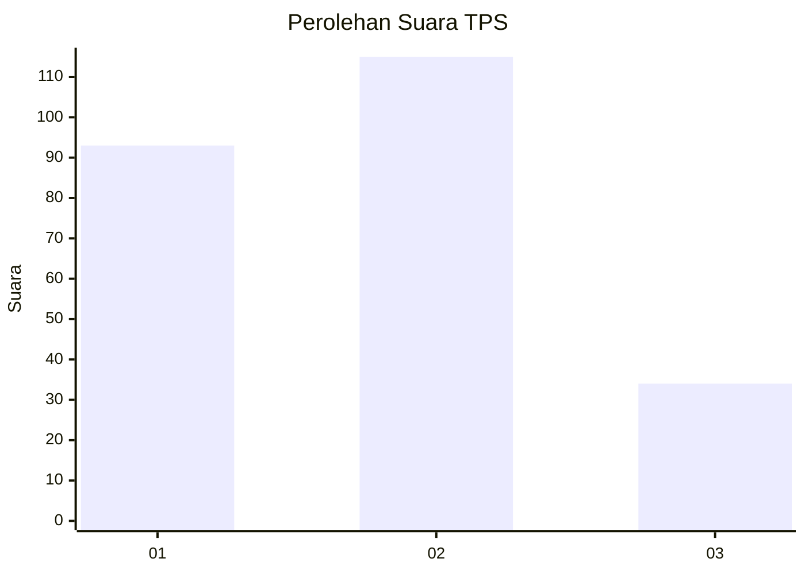
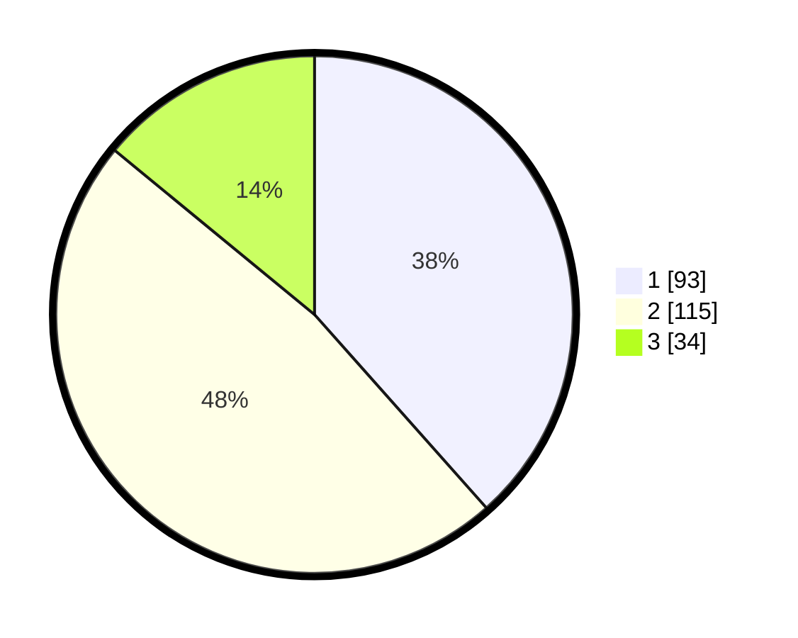

# Hasil

## Grafik

## Tabel

| No. | Nama Paslon    | Suara | Suara (raw) | Persentase |
|:--- |:-------------- | -----:| -----------:| ----------:|
| 1   | ANIES MUHAIMIN | 93    | [93][p-1]   | 38,43      |
| 2   | PRABOWO GIBRAN | 115   | [115][p-2]  | 47,52      |
| 3   | GANJAR MAHFUD  | 34    | [34][p-3]   | 14,05      |

[p-1]: https://github.com/gigit-pemilu/pemilu-2024-11-aceh/blob/main/pilpres/hitung-suara/sub/11-aceh/sub/04-aceh-tengah/sub/19-jagong-jeget/sub/2002-berawang-dewal/sub/001-tps/sub/paslon-1.txt
[p-2]: https://github.com/gigit-pemilu/pemilu-2024-11-aceh/blob/main/pilpres/hitung-suara/sub/11-aceh/sub/04-aceh-tengah/sub/19-jagong-jeget/sub/2002-berawang-dewal/sub/001-tps/sub/paslon-2.txt
[p-3]: https://github.com/gigit-pemilu/pemilu-2024-11-aceh/blob/main/pilpres/hitung-suara/sub/11-aceh/sub/04-aceh-tengah/sub/19-jagong-jeget/sub/2002-berawang-dewal/sub/001-tps/sub/paslon-3.txt

## Foto C Plano

https://sirekap-obj-formc.kpu.go.id/2c24/pemilu/ppwp/11/04/19/20/02/1104192002001-20240216-024117--748852c6-51c6-4a68-8875-228c90f1e765.jpg

https://sirekap-obj-formc.kpu.go.id/2c24/pemilu/ppwp/11/04/19/20/02/1104192002001-20240216-024127--2f985a20-df80-41ec-9a44-5a98589de185.jpg

https://sirekap-obj-formc.kpu.go.id/2c24/pemilu/ppwp/11/04/19/20/02/1104192002001-20240216-024122--3a2c5589-11d2-4b4a-9c94-4e1ae4b11cda.jpg

## Metadata

| Key        | Value               |
| ---------- | ------------------- |
| Time Stamp | 2024-02-16 03:30:26 |

## DATA PEMILIH TETAP

Jumlah pemilih dalam DPT: **281**.
 * L: **144**.
 * P: **137**.

## DATA PENGGUNA HAK PILIH

Jumlah pengguna hak pilih dalam DPT: **232**.
 * L: **119**.
 * P: **113**.

Jumlah pengguna hak pilih dalam DPTb: **3**.
 * L: **2**.
 * P: **1**.

Jumlah pengguna hak pilih dalam DPK: **8**.
 * L: **2**.
 * P: **6**.

Jumlah pengguna hak pilih: **243**.
 * L: **123**.
 * P: **120**.

## JUMLAH SUARA SAH DAN TIDAK SAH

JUMLAH SELURUH SUARA SAH: **242**.

JUMLAH SUARA TIDAK SAH: **1**.

JUMLAH SELURUH SUARA SAH DAN SUARA TIDAK SAH: **243**.

