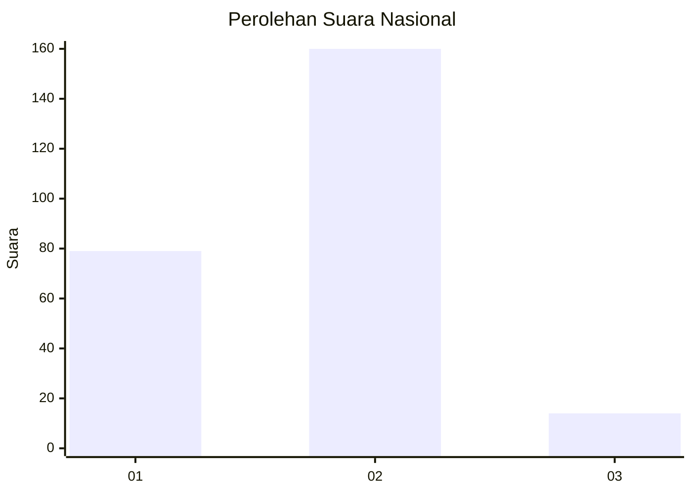
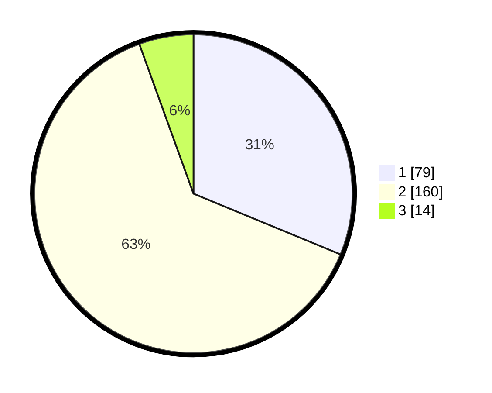

# Hasil

## Grafik

## Tabel

| No. | Nama Paslon    | Suara | Suara (raw) | Persentase |
|:--- |:-------------- | -----:| -----------:| ----------:|
| 1   | ANIES MUHAIMIN | 79    | [79][p-1]   | 31,23      |
| 2   | PRABOWO GIBRAN | 160   | [160][p-2]  | 63,24      |
| 3   | GANJAR MAHFUD  | 14    | [14][p-3]   | 5,53       |

[p-1]: https://github.com/gigit-pemilu/pemilu-2024/blob/main/pilpres/hitung-suara/sub/11-aceh/sub/04-aceh-tengah/sub/19-jagong-jeget/sub/2002-berawang-dewal/sub/002-tps/sub/paslon-1.txt
[p-2]: https://github.com/gigit-pemilu/pemilu-2024/blob/main/pilpres/hitung-suara/sub/11-aceh/sub/04-aceh-tengah/sub/19-jagong-jeget/sub/2002-berawang-dewal/sub/002-tps/sub/paslon-2.txt
[p-3]: https://github.com/gigit-pemilu/pemilu-2024/blob/main/pilpres/hitung-suara/sub/11-aceh/sub/04-aceh-tengah/sub/19-jagong-jeget/sub/2002-berawang-dewal/sub/002-tps/sub/paslon-3.txt

## Foto C Plano

https://sirekap-obj-formc.kpu.go.id/fd0c/pemilu/ppwp/11/04/19/20/02/1104192002002-20240216-002031--4ae0ef6b-858d-4564-9e44-2e0ae4769bfc.jpg

https://sirekap-obj-formc.kpu.go.id/fd0c/pemilu/ppwp/11/04/19/20/02/1104192002002-20240216-002034--969afbfa-5a7d-41ac-9f1a-b4dcc7bb5b0f.jpg

https://sirekap-obj-formc.kpu.go.id/fd0c/pemilu/ppwp/11/04/19/20/02/1104192002002-20240216-002033--24b3358c-7c24-41ee-9c56-934fbb3731cf.jpg

## Metadata

| Key        | Value               |
| ---------- | ------------------- |
| Time Stamp | 2024-02-16 02:30:27 |

## DATA PEMILIH TETAP

Jumlah pemilih dalam DPT: **277**.
 * L: **137**.
 * P: **140**.

## DATA PENGGUNA HAK PILIH

Jumlah pengguna hak pilih dalam DPT: **252**.
 * L: **124**.
 * P: **128**.

Jumlah pengguna hak pilih dalam DPTb: **7**.
 * L: **4**.
 * P: **3**.

Jumlah pengguna hak pilih dalam DPK: **0**.
 * L: **0**.
 * P: **0**.

Jumlah pengguna hak pilih: **259**.
 * L: **128**.
 * P: **131**.

## JUMLAH SUARA SAH DAN TIDAK SAH

JUMLAH SELURUH SUARA SAH: **253**.

JUMLAH SUARA TIDAK SAH: **6**.

JUMLAH SELURUH SUARA SAH DAN SUARA TIDAK SAH: **259**.

