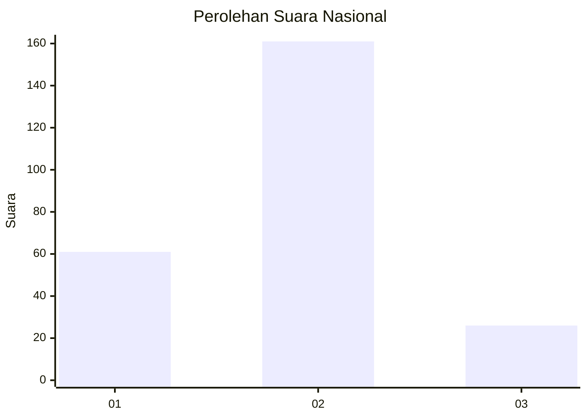
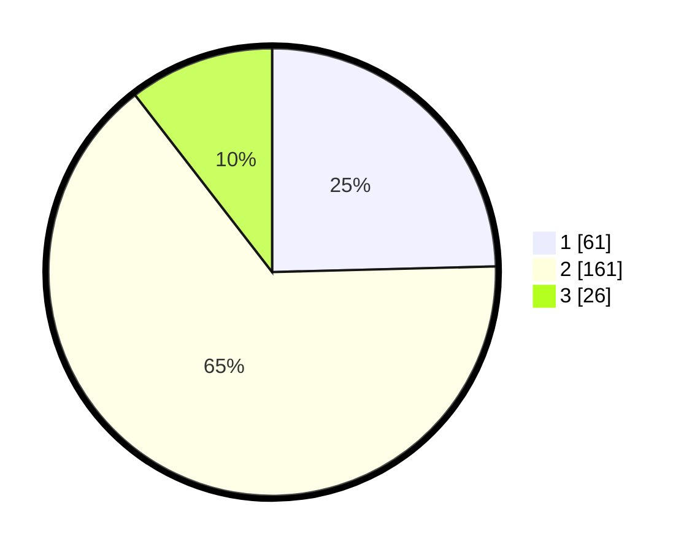

# Hasil

## Grafik

## Tabel

| No. | Nama Paslon    | Suara | Suara (raw) | Persentase |
|:--- |:-------------- | -----:| -----------:| ----------:|
| 1   | ANIES MUHAIMIN | 61    | [61][p-1]   | 24,60      |
| 2   | PRABOWO GIBRAN | 161   | [161][p-2]  | 64,92      |
| 3   | GANJAR MAHFUD  | 26    | [26][p-3]   | 10,48      |

[p-1]: https://github.com/gigit-pemilu/pemilu-2024/blob/main/pilpres/hitung-suara/sub/11-aceh/sub/04-aceh-tengah/sub/19-jagong-jeget/sub/2002-berawang-dewal/sub/003-tps/sub/paslon-1.txt
[p-2]: https://github.com/gigit-pemilu/pemilu-2024/blob/main/pilpres/hitung-suara/sub/11-aceh/sub/04-aceh-tengah/sub/19-jagong-jeget/sub/2002-berawang-dewal/sub/003-tps/sub/paslon-2.txt
[p-3]: https://github.com/gigit-pemilu/pemilu-2024/blob/main/pilpres/hitung-suara/sub/11-aceh/sub/04-aceh-tengah/sub/19-jagong-jeget/sub/2002-berawang-dewal/sub/003-tps/sub/paslon-3.txt

## Foto C Plano

https://sirekap-obj-formc.kpu.go.id/7c1c/pemilu/ppwp/11/04/19/20/02/1104192002003-20240216-190418--fd2880e1-03a7-4a99-b92f-82fdfcb62ca1.jpg

https://sirekap-obj-formc.kpu.go.id/7c1c/pemilu/ppwp/11/04/19/20/02/1104192002003-20240216-190420--68873c51-7335-4ba9-a628-54c85059ea52.jpg

https://sirekap-obj-formc.kpu.go.id/7c1c/pemilu/ppwp/11/04/19/20/02/1104192002003-20240216-190419--2f80118f-26dd-4409-86d0-5c5dd281dfc5.jpg

## Metadata

| Key        | Value               |
| ---------- | ------------------- |
| Time Stamp | 2024-02-17 07:00:02 |

## DATA PEMILIH TETAP

Jumlah pemilih dalam DPT: **285**.
 * L: **138**.
 * P: **147**.

## DATA PENGGUNA HAK PILIH

Jumlah pengguna hak pilih dalam DPT: **249**.
 * L: **124**.
 * P: **125**.

Jumlah pengguna hak pilih dalam DPTb: **0**.
 * L: **0**.
 * P: **0**.

Jumlah pengguna hak pilih dalam DPK: **2**.
 * L: **0**.
 * P: **2**.

Jumlah pengguna hak pilih: **251**.
 * L: **124**.
 * P: **127**.

## JUMLAH SUARA SAH DAN TIDAK SAH

JUMLAH SELURUH SUARA SAH: **248**.

JUMLAH SUARA TIDAK SAH: **3**.

JUMLAH SELURUH SUARA SAH DAN SUARA TIDAK SAH: **251**.

