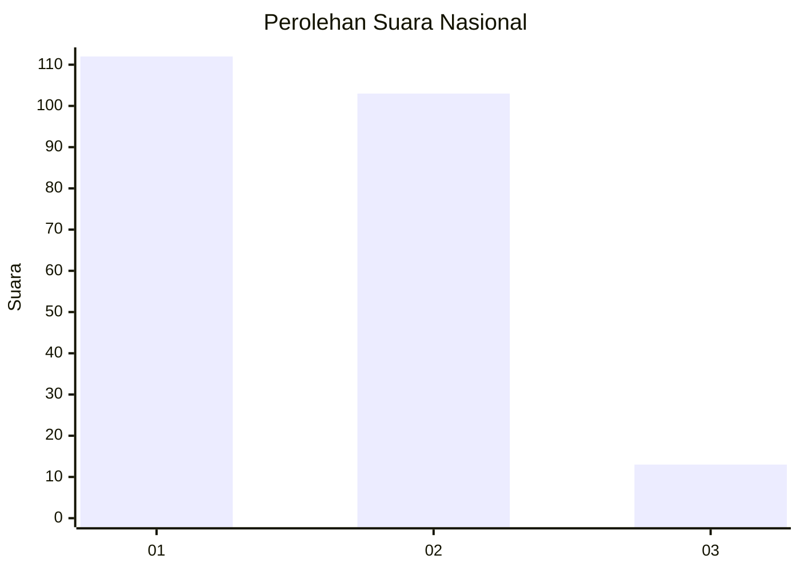
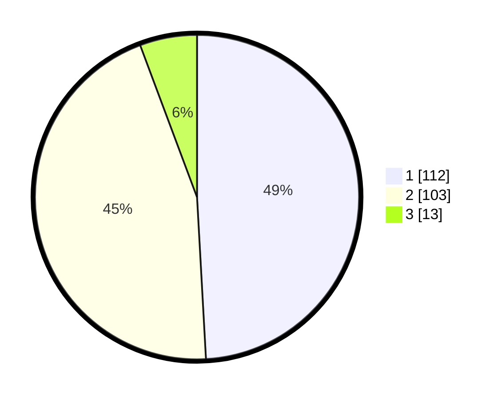

# Hasil

## Grafik

## Tabel

| No. | Nama Paslon    | Suara | Suara (raw) | Persentase |
|:--- |:-------------- | -----:| -----------:| ----------:|
| 1   | ANIES MUHAIMIN | 112   | [112][p-1]  | 49,12      |
| 2   | PRABOWO GIBRAN | 103   | [103][p-2]  | 45,18      |
| 3   | GANJAR MAHFUD  | 13    | [13][p-3]   | 5,70       |

[p-1]: https://github.com/gigit-pemilu/pemilu-2024/blob/main/pilpres/hitung-suara/sub/11-aceh/sub/04-aceh-tengah/sub/20-bies/sub/2001-bies-penentanan/sub/001-tps/sub/paslon-1.txt
[p-2]: https://github.com/gigit-pemilu/pemilu-2024/blob/main/pilpres/hitung-suara/sub/11-aceh/sub/04-aceh-tengah/sub/20-bies/sub/2001-bies-penentanan/sub/001-tps/sub/paslon-2.txt
[p-3]: https://github.com/gigit-pemilu/pemilu-2024/blob/main/pilpres/hitung-suara/sub/11-aceh/sub/04-aceh-tengah/sub/20-bies/sub/2001-bies-penentanan/sub/001-tps/sub/paslon-3.txt

## Foto C Plano

https://sirekap-obj-formc.kpu.go.id/117d/pemilu/ppwp/11/04/20/20/01/1104202001001-20240216-132556--3442fb00-cc67-45ff-8cda-07c692cc9324.jpg

https://sirekap-obj-formc.kpu.go.id/117d/pemilu/ppwp/11/04/20/20/01/1104202001001-20240216-132557--1cf45b09-f2c6-4118-8e48-2deb66b398a4.jpg

https://sirekap-obj-formc.kpu.go.id/117d/pemilu/ppwp/11/04/20/20/01/1104202001001-20240216-132556--4365a6cb-9f1e-4f96-9ed0-e88aa31abf87.jpg

## Metadata

| Key        | Value               |
| ---------- | ------------------- |
| Time Stamp | 2024-02-16 23:00:00 |

## DATA PEMILIH TETAP

Jumlah pemilih dalam DPT: **251**.
 * L: **126**.
 * P: **125**.

## DATA PENGGUNA HAK PILIH

Jumlah pengguna hak pilih dalam DPT: **223**.
 * L: **112**.
 * P: **111**.

Jumlah pengguna hak pilih dalam DPTb: **8**.
 * L: **4**.
 * P: **4**.

Jumlah pengguna hak pilih dalam DPK: **1**.
 * L: **1**.
 * P: **0**.

Jumlah pengguna hak pilih: **232**.
 * L: **117**.
 * P: **115**.

## JUMLAH SUARA SAH DAN TIDAK SAH

JUMLAH SELURUH SUARA SAH: **228**.

JUMLAH SUARA TIDAK SAH: **4**.

JUMLAH SELURUH SUARA SAH DAN SUARA TIDAK SAH: **232**.

