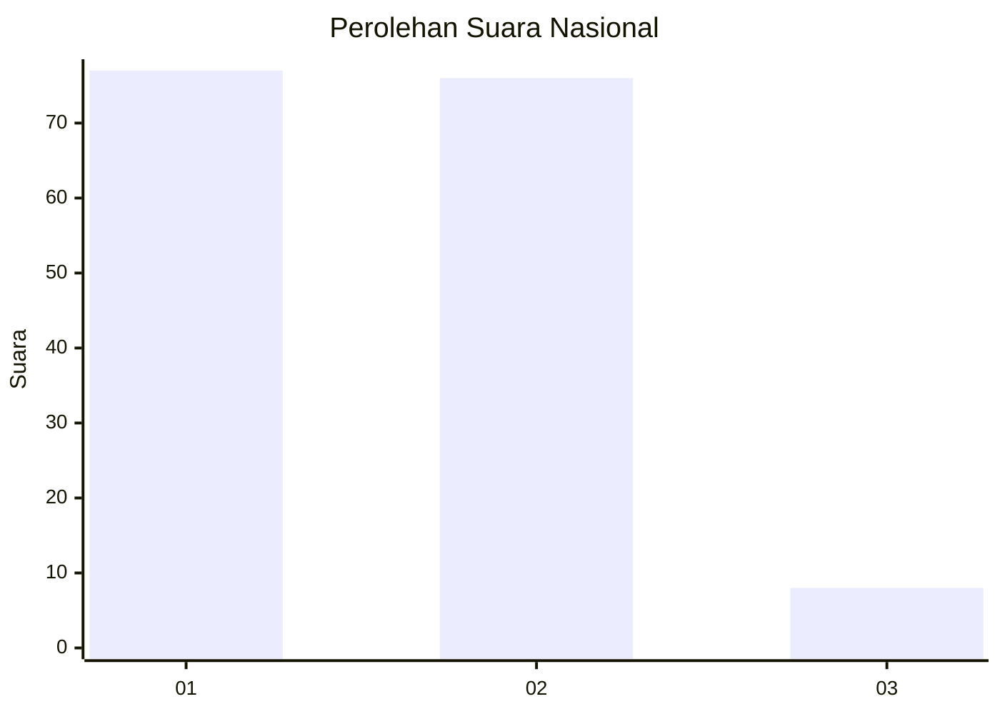
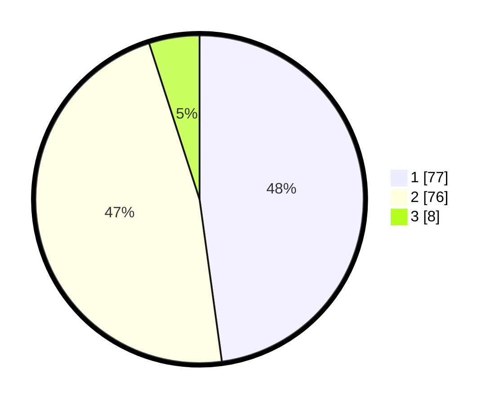

# Hasil

## Grafik

## Tabel

| No. | Nama Paslon    | Suara | Suara (raw) | Persentase |
|:--- |:-------------- | -----:| -----------:| ----------:|
| 1   | ANIES MUHAIMIN | 77    | [77][p-1]   | 47,83      |
| 2   | PRABOWO GIBRAN | 76    | [76][p-2]   | 47,20      |
| 3   | GANJAR MAHFUD  | 8     | [8][p-3]    | 4,97       |

[p-1]: https://github.com/gigit-pemilu/pemilu-2024/blob/main/pilpres/hitung-suara/sub/11-aceh/sub/04-aceh-tengah/sub/20-bies/sub/2002-bies-baru/sub/002-tps/sub/paslon-1.txt
[p-2]: https://github.com/gigit-pemilu/pemilu-2024/blob/main/pilpres/hitung-suara/sub/11-aceh/sub/04-aceh-tengah/sub/20-bies/sub/2002-bies-baru/sub/002-tps/sub/paslon-2.txt
[p-3]: https://github.com/gigit-pemilu/pemilu-2024/blob/main/pilpres/hitung-suara/sub/11-aceh/sub/04-aceh-tengah/sub/20-bies/sub/2002-bies-baru/sub/002-tps/sub/paslon-3.txt

## Foto C Plano

https://sirekap-obj-formc.kpu.go.id/6b1b/pemilu/ppwp/11/04/20/20/02/1104202002002-20240216-130716--0375e6ac-4e06-4643-ae75-bce496716b5f.jpg

https://sirekap-obj-formc.kpu.go.id/6b1b/pemilu/ppwp/11/04/20/20/02/1104202002002-20240216-130723--64b8248c-f237-474c-a09c-2fc7289e4c9d.jpg

https://sirekap-obj-formc.kpu.go.id/6b1b/pemilu/ppwp/11/04/20/20/02/1104202002002-20240216-130719--62a453d3-9d96-4217-9896-769462c263df.jpg

## Metadata

| Key        | Value               |
| ---------- | ------------------- |
| Time Stamp | 2024-02-16 23:00:00 |

## DATA PEMILIH TETAP

Jumlah pemilih dalam DPT: **177**.
 * L: **78**.
 * P: **99**.

## DATA PENGGUNA HAK PILIH

Jumlah pengguna hak pilih dalam DPT: **164**.
 * L: **72**.
 * P: **92**.

Jumlah pengguna hak pilih dalam DPTb: **2**.
 * L: **1**.
 * P: **1**.

Jumlah pengguna hak pilih dalam DPK: **2**.
 * L: **1**.
 * P: **1**.

Jumlah pengguna hak pilih: **168**.
 * L: **74**.
 * P: **94**.

## JUMLAH SUARA SAH DAN TIDAK SAH

JUMLAH SELURUH SUARA SAH: **161**.

JUMLAH SUARA TIDAK SAH: **7**.

JUMLAH SELURUH SUARA SAH DAN SUARA TIDAK SAH: **168**.

