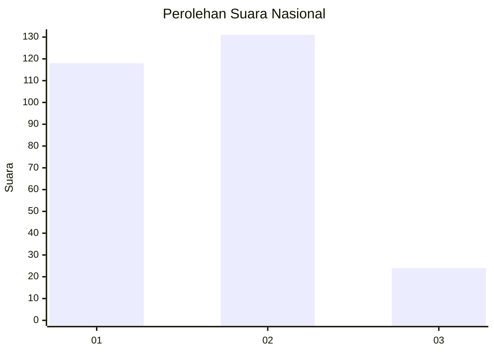
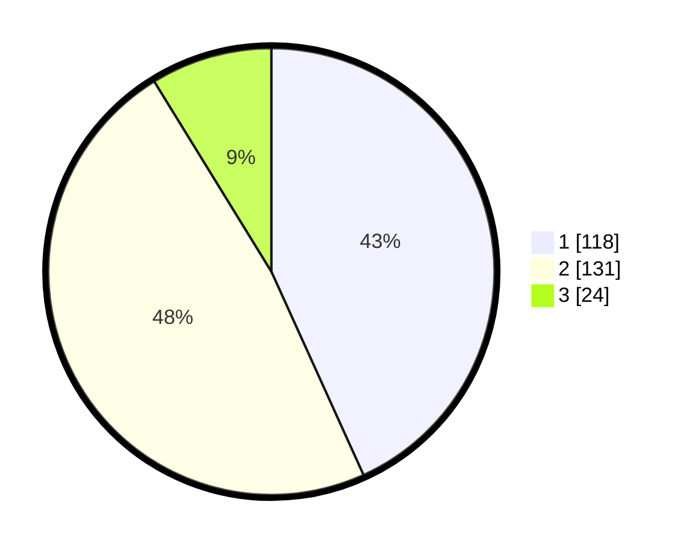

# Hasil

## Grafik

## Tabel

| No. | Nama Paslon    | Suara | Suara (raw) | Persentase |
|:--- |:-------------- | -----:| -----------:| ----------:|
| 1   | ANIES MUHAIMIN | 118   | [118][p-1]  | 43,22      |
| 2   | PRABOWO GIBRAN | 131   | [131][p-2]  | 47,99      |
| 3   | GANJAR MAHFUD  | 24    | [24][p-3]   | 8,79       |

[p-1]: https://github.com/gigit-pemilu/pemilu-2024/blob/main/pilpres/hitung-suara/sub/11-aceh/sub/04-aceh-tengah/sub/20-bies/sub/2008-pucuk-deku/sub/001-tps/sub/paslon-1.txt
[p-2]: https://github.com/gigit-pemilu/pemilu-2024/blob/main/pilpres/hitung-suara/sub/11-aceh/sub/04-aceh-tengah/sub/20-bies/sub/2008-pucuk-deku/sub/001-tps/sub/paslon-2.txt
[p-3]: https://github.com/gigit-pemilu/pemilu-2024/blob/main/pilpres/hitung-suara/sub/11-aceh/sub/04-aceh-tengah/sub/20-bies/sub/2008-pucuk-deku/sub/001-tps/sub/paslon-3.txt

## Foto C Plano

https://sirekap-obj-formc.kpu.go.id/fcf8/pemilu/ppwp/11/04/20/20/08/1104202008001-20240216-214641--64fabe87-20d6-4e1e-8ba0-cdd024c8de75.jpg

https://sirekap-obj-formc.kpu.go.id/fcf8/pemilu/ppwp/11/04/20/20/08/1104202008001-20240216-214643--44d94c2a-9059-4209-a48f-7eb87ebe5e46.jpg

https://sirekap-obj-formc.kpu.go.id/fcf8/pemilu/ppwp/11/04/20/20/08/1104202008001-20240216-214642--20a7954a-5523-40b5-b52a-d79742bb8609.jpg

## Metadata

| Key        | Value               |
| ---------- | ------------------- |
| Time Stamp | 2024-02-16 23:30:00 |

## DATA PEMILIH TETAP

Jumlah pemilih dalam DPT: **286**.
 * L: **143**.
 * P: **143**.

## DATA PENGGUNA HAK PILIH

Jumlah pengguna hak pilih dalam DPT: **268**.
 * L: **135**.
 * P: **133**.

Jumlah pengguna hak pilih dalam DPTb: **5**.
 * L: **1**.
 * P: **4**.

Jumlah pengguna hak pilih dalam DPK: **3**.
 * L: **2**.
 * P: **1**.

Jumlah pengguna hak pilih: **276**.
 * L: **138**.
 * P: **138**.

## JUMLAH SUARA SAH DAN TIDAK SAH

JUMLAH SELURUH SUARA SAH: **273**.

JUMLAH SUARA TIDAK SAH: **3**.

JUMLAH SELURUH SUARA SAH DAN SUARA TIDAK SAH: **276**.

