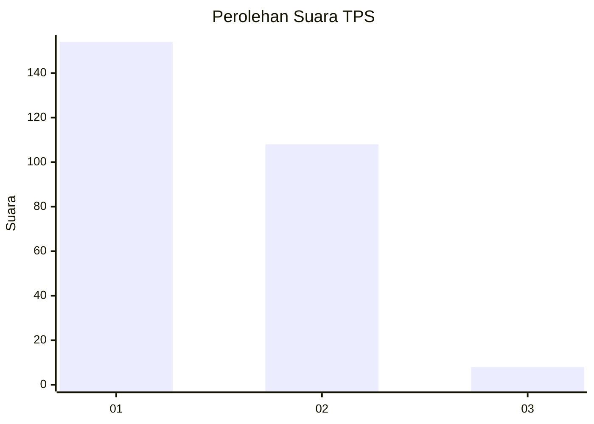
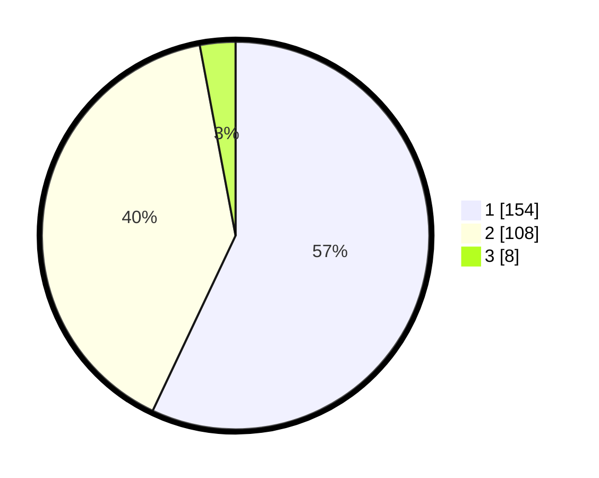

# Hasil

## Grafik

## Tabel

| No. | Nama Paslon    | Suara | Suara (raw) | Persentase |
|:--- |:-------------- | -----:| -----------:| ----------:|
| 1   | ANIES MUHAIMIN | 154   | [154][p-1]  | 57,04      |
| 2   | PRABOWO GIBRAN | 108   | [108][p-2]  | 40,00      |
| 3   | GANJAR MAHFUD  | 8     | [8][p-3]    | 2,96       |

[p-1]: https://github.com/gigit-pemilu/pemilu-2024-11-aceh/blob/main/pilpres/hitung-suara/sub/11-aceh/sub/04-aceh-tengah/sub/20-bies/sub/2011-simpang-uning-niken/sub/002-tps/sub/paslon-1.txt
[p-2]: https://github.com/gigit-pemilu/pemilu-2024-11-aceh/blob/main/pilpres/hitung-suara/sub/11-aceh/sub/04-aceh-tengah/sub/20-bies/sub/2011-simpang-uning-niken/sub/002-tps/sub/paslon-2.txt
[p-3]: https://github.com/gigit-pemilu/pemilu-2024-11-aceh/blob/main/pilpres/hitung-suara/sub/11-aceh/sub/04-aceh-tengah/sub/20-bies/sub/2011-simpang-uning-niken/sub/002-tps/sub/paslon-3.txt

## Foto C Plano

https://sirekap-obj-formc.kpu.go.id/76b2/pemilu/ppwp/11/04/20/20/11/1104202011002-20240216-132931--6c3d9730-e559-41e3-8ba8-0f6e131a7a66.jpg

https://sirekap-obj-formc.kpu.go.id/76b2/pemilu/ppwp/11/04/20/20/11/1104202011002-20240216-132932--0a6fe07d-26e0-4d8b-abe9-587976855d03.jpg

https://sirekap-obj-formc.kpu.go.id/76b2/pemilu/ppwp/11/04/20/20/11/1104202011002-20240216-132932--8ffd96be-aef9-4006-a8f4-2f013f972362.jpg

## Metadata

| Key        | Value               |
| ---------- | ------------------- |
| Time Stamp | 2024-02-16 23:30:00 |

## DATA PEMILIH TETAP

Jumlah pemilih dalam DPT: **295**.
 * L: **136**.
 * P: **159**.

## DATA PENGGUNA HAK PILIH

Jumlah pengguna hak pilih dalam DPT: **275**.
 * L: **120**.
 * P: **145**.

Jumlah pengguna hak pilih dalam DPTb: **1**.
 * L: **1**.
 * P: **0**.

Jumlah pengguna hak pilih dalam DPK: **9**.
 * L: **6**.
 * P: **3**.

Jumlah pengguna hak pilih: **275**.
 * L: **127**.
 * P: **148**.

## JUMLAH SUARA SAH DAN TIDAK SAH

JUMLAH SELURUH SUARA SAH: **270**.

JUMLAH SUARA TIDAK SAH: **5**.

JUMLAH SELURUH SUARA SAH DAN SUARA TIDAK SAH: **275**.

