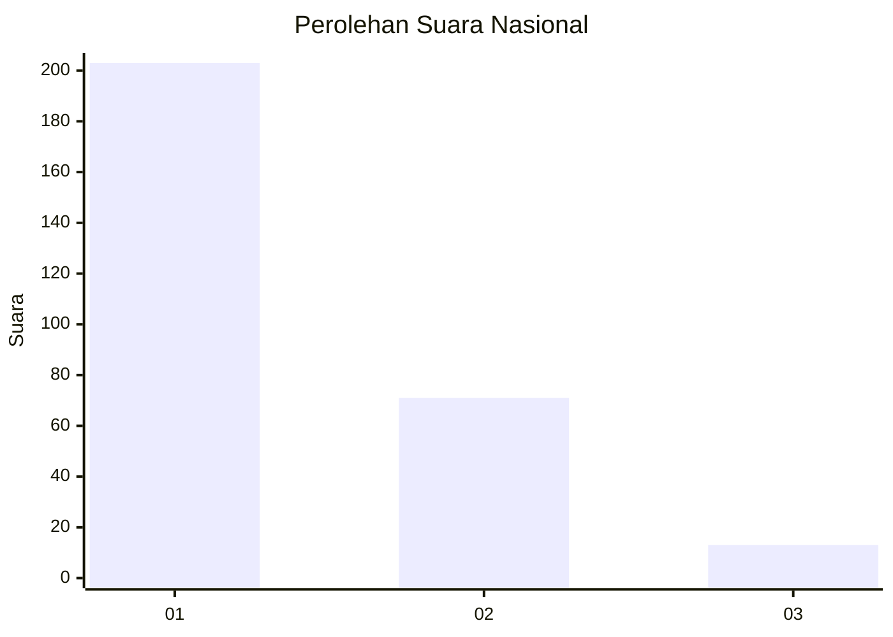
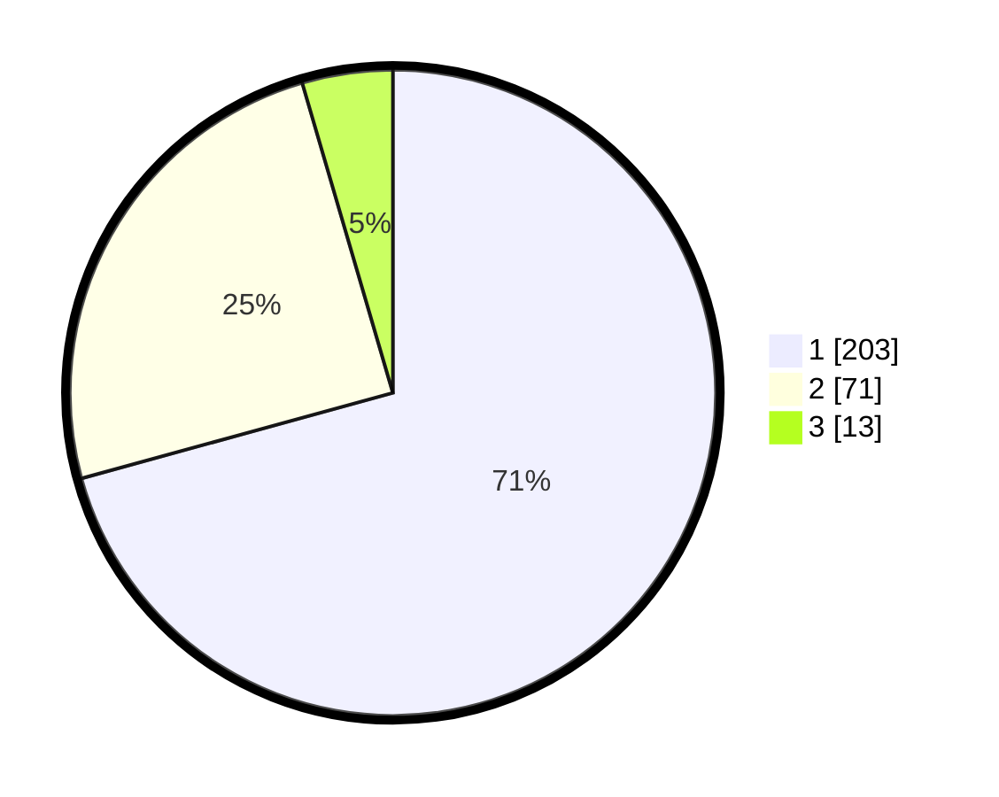

# Hasil

## Grafik

## Tabel

| No. | Nama Paslon    | Suara | Suara (raw) | Persentase |
|:--- |:-------------- | -----:| -----------:| ----------:|
| 1   | ANIES MUHAIMIN | 203   | [203][p-1]  | 70,73      |
| 2   | PRABOWO GIBRAN | 71    | [71][p-2]   | 24,74      |
| 3   | GANJAR MAHFUD  | 13    | [13][p-3]   | 4,53       |

[p-1]: https://github.com/gigit-pemilu/pemilu-2024/blob/main/pilpres/hitung-suara/sub/11-aceh/sub/04-aceh-tengah/sub/20-bies/sub/2012-karang-bayur/sub/001-tps/sub/paslon-1.txt
[p-2]: https://github.com/gigit-pemilu/pemilu-2024/blob/main/pilpres/hitung-suara/sub/11-aceh/sub/04-aceh-tengah/sub/20-bies/sub/2012-karang-bayur/sub/001-tps/sub/paslon-2.txt
[p-3]: https://github.com/gigit-pemilu/pemilu-2024/blob/main/pilpres/hitung-suara/sub/11-aceh/sub/04-aceh-tengah/sub/20-bies/sub/2012-karang-bayur/sub/001-tps/sub/paslon-3.txt

## Foto C Plano

https://sirekap-obj-formc.kpu.go.id/8c31/pemilu/ppwp/11/04/20/20/12/1104202012001-20240215-144717--804be683-6e02-4d62-8409-04e0b7fef7dc.jpg

https://sirekap-obj-formc.kpu.go.id/8c31/pemilu/ppwp/11/04/20/20/12/1104202012001-20240214-193003--6abbfcdb-af6e-445b-8f0d-a5093863be15.jpg

https://sirekap-obj-formc.kpu.go.id/8c31/pemilu/ppwp/11/04/20/20/12/1104202012001-20240214-193255--949c506b-2823-4efe-85c9-266bd3fb1af3.jpg

## Metadata

| Key        | Value               |
| ---------- | ------------------- |
| Time Stamp | 2024-02-16 05:30:26 |

## DATA PEMILIH TETAP

Jumlah pemilih dalam DPT: **299**.
 * L: **149**.
 * P: **150**.

## DATA PENGGUNA HAK PILIH

Jumlah pengguna hak pilih dalam DPT: **277**.
 * L: **139**.
 * P: **138**.

Jumlah pengguna hak pilih dalam DPTb: **9**.
 * L: **3**.
 * P: **6**.

Jumlah pengguna hak pilih dalam DPK: **3**.
 * L: **1**.
 * P: **2**.

Jumlah pengguna hak pilih: **289**.
 * L: **143**.
 * P: **146**.

## JUMLAH SUARA SAH DAN TIDAK SAH

JUMLAH SELURUH SUARA SAH: **287**.

JUMLAH SUARA TIDAK SAH: **2**.

JUMLAH SELURUH SUARA SAH DAN SUARA TIDAK SAH: **289**.

