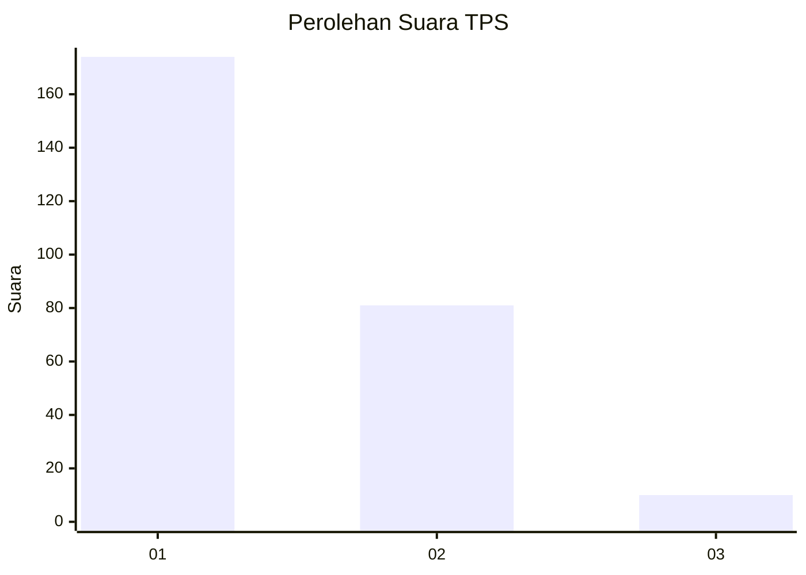
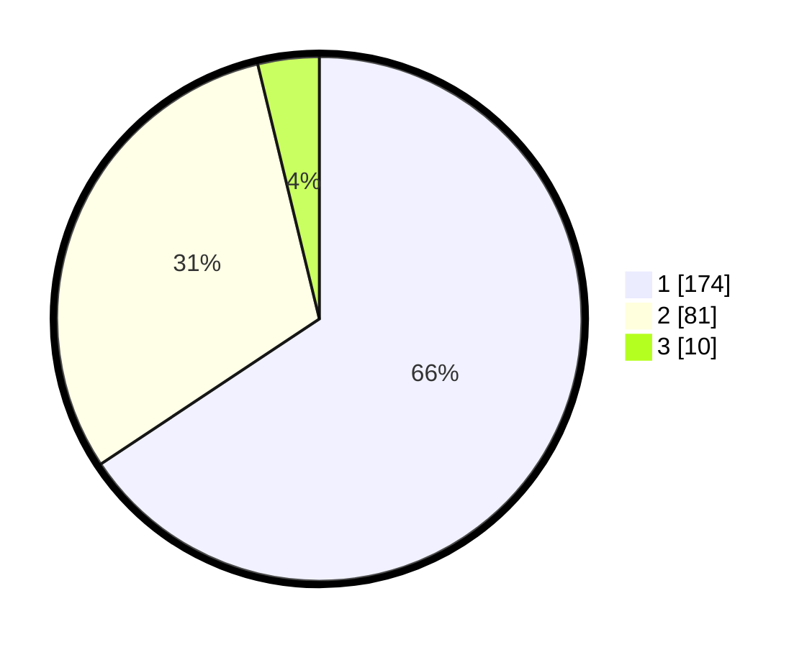

# Hasil

## Grafik

## Tabel

| No. | Nama Paslon    | Suara | Suara (raw) | Persentase |
|:--- |:-------------- | -----:| -----------:| ----------:|
| 1   | ANIES MUHAIMIN | 174   | [174][p-1]  | 65,66      |
| 2   | PRABOWO GIBRAN | 81    | [81][p-2]   | 30,57      |
| 3   | GANJAR MAHFUD  | 10    | [10][p-3]   | 3,77       |

[p-1]: https://github.com/gigit-pemilu/pemilu-2024-11-aceh/blob/main/pilpres/hitung-suara/sub/11-aceh/sub/04-aceh-tengah/sub/21-rusip-antara/sub/2001-pantan-tengah/sub/001-tps/sub/paslon-1.txt
[p-2]: https://github.com/gigit-pemilu/pemilu-2024-11-aceh/blob/main/pilpres/hitung-suara/sub/11-aceh/sub/04-aceh-tengah/sub/21-rusip-antara/sub/2001-pantan-tengah/sub/001-tps/sub/paslon-2.txt
[p-3]: https://github.com/gigit-pemilu/pemilu-2024-11-aceh/blob/main/pilpres/hitung-suara/sub/11-aceh/sub/04-aceh-tengah/sub/21-rusip-antara/sub/2001-pantan-tengah/sub/001-tps/sub/paslon-3.txt

## Foto C Plano

https://sirekap-obj-formc.kpu.go.id/0cf4/pemilu/ppwp/11/04/21/20/01/1104212001001-20240214-193300--22487b5e-14fa-4000-9774-ecbe45cccb1a.jpg

https://sirekap-obj-formc.kpu.go.id/0cf4/pemilu/ppwp/11/04/21/20/01/1104212001001-20240220-161256--3db97104-c360-4e6d-8f06-9ab43d86998c.jpg

https://sirekap-obj-formc.kpu.go.id/0cf4/pemilu/ppwp/11/04/21/20/01/1104212001001-20240214-193552--0edcd3a6-5788-4c3e-920c-f171905b4d5e.jpg

## Metadata

| Key        | Value               |
| ---------- | ------------------- |
| Time Stamp | 2024-02-20 20:00:00 |

## DATA PEMILIH TETAP

Jumlah pemilih dalam DPT: **287**.
 * L: **146**.
 * P: **141**.

## DATA PENGGUNA HAK PILIH

Jumlah pengguna hak pilih dalam DPT: **265**.
 * L: **136**.
 * P: **129**.

Jumlah pengguna hak pilih dalam DPTb: **4**.
 * L: **1**.
 * P: **3**.

Jumlah pengguna hak pilih dalam DPK: **3**.
 * L: **3**.
 * P: **0**.

Jumlah pengguna hak pilih: **272**.
 * L: **140**.
 * P: **132**.

## JUMLAH SUARA SAH DAN TIDAK SAH

JUMLAH SELURUH SUARA SAH: **265**.

JUMLAH SUARA TIDAK SAH: **7**.

JUMLAH SELURUH SUARA SAH DAN SUARA TIDAK SAH: **272**.

