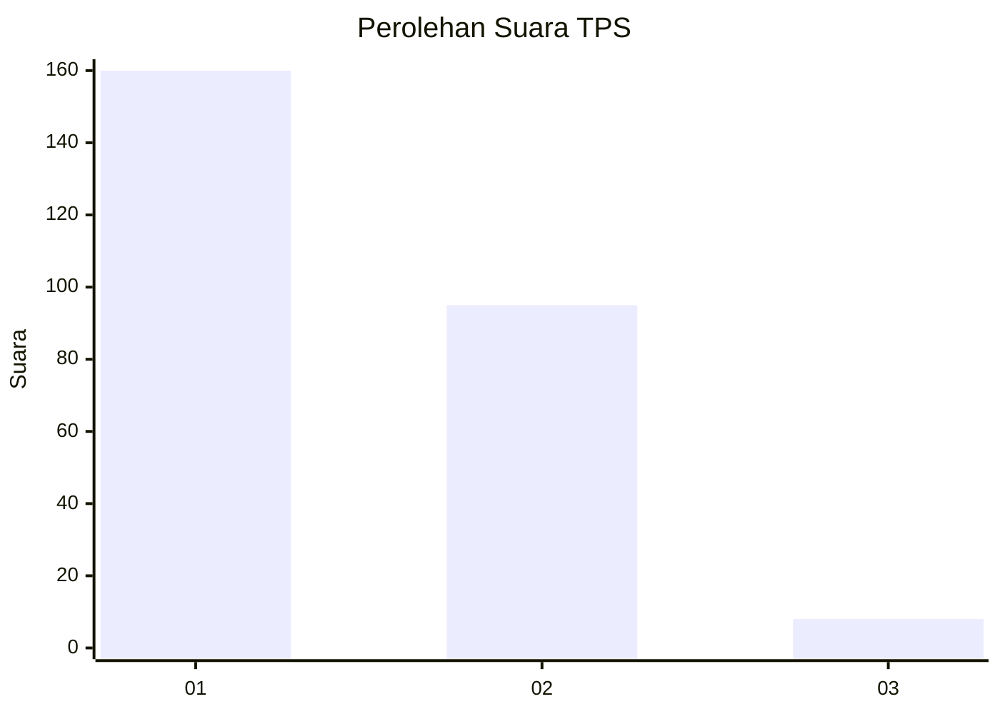
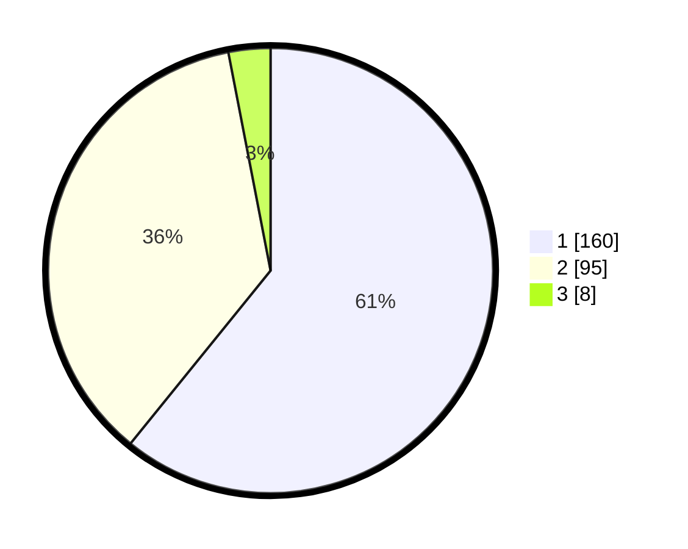

# Hasil

## Grafik

## Tabel

| No. | Nama Paslon    | Suara | Suara (raw) | Persentase |
|:--- |:-------------- | -----:| -----------:| ----------:|
| 1   | ANIES MUHAIMIN | 160   | [160][p-1]  | 60,84      |
| 2   | PRABOWO GIBRAN | 95    | [95][p-2]   | 36,12      |
| 3   | GANJAR MAHFUD  | 8     | [8][p-3]    | 3,04       |

[p-1]: https://github.com/gigit-pemilu/pemilu-2024-11-aceh/blob/main/pilpres/hitung-suara/sub/11-aceh/sub/04-aceh-tengah/sub/21-rusip-antara/sub/2001-pantan-tengah/sub/002-tps/sub/paslon-1.txt
[p-2]: https://github.com/gigit-pemilu/pemilu-2024-11-aceh/blob/main/pilpres/hitung-suara/sub/11-aceh/sub/04-aceh-tengah/sub/21-rusip-antara/sub/2001-pantan-tengah/sub/002-tps/sub/paslon-2.txt
[p-3]: https://github.com/gigit-pemilu/pemilu-2024-11-aceh/blob/main/pilpres/hitung-suara/sub/11-aceh/sub/04-aceh-tengah/sub/21-rusip-antara/sub/2001-pantan-tengah/sub/002-tps/sub/paslon-3.txt

## Foto C Plano

https://sirekap-obj-formc.kpu.go.id/2fcc/pemilu/ppwp/11/04/21/20/01/1104212001002-20240216-150706--ca3f28b7-dd04-412f-a922-7c6a981dbdfa.jpg

https://sirekap-obj-formc.kpu.go.id/2fcc/pemilu/ppwp/11/04/21/20/01/1104212001002-20240216-150707--8f5dc0dd-1c9a-43ef-a3e7-34d0cacd209b.jpg

https://sirekap-obj-formc.kpu.go.id/2fcc/pemilu/ppwp/11/04/21/20/01/1104212001002-20240216-150707--90e4cdeb-40d2-42a9-8d3f-f5581b3920d5.jpg

## Metadata

| Key        | Value               |
| ---------- | ------------------- |
| Time Stamp | 2024-02-17 10:30:03 |

## DATA PEMILIH TETAP

Jumlah pemilih dalam DPT: **286**.
 * L: **137**.
 * P: **149**.

## DATA PENGGUNA HAK PILIH

Jumlah pengguna hak pilih dalam DPT: **259**.
 * L: **126**.
 * P: **133**.

Jumlah pengguna hak pilih dalam DPTb: **5**.
 * L: **2**.
 * P: **3**.

Jumlah pengguna hak pilih dalam DPK: **7**.
 * L: **5**.
 * P: **2**.

Jumlah pengguna hak pilih: **271**.
 * L: **133**.
 * P: **138**.

## JUMLAH SUARA SAH DAN TIDAK SAH

JUMLAH SELURUH SUARA SAH: **263**.

JUMLAH SUARA TIDAK SAH: **8**.

JUMLAH SELURUH SUARA SAH DAN SUARA TIDAK SAH: **271**.

