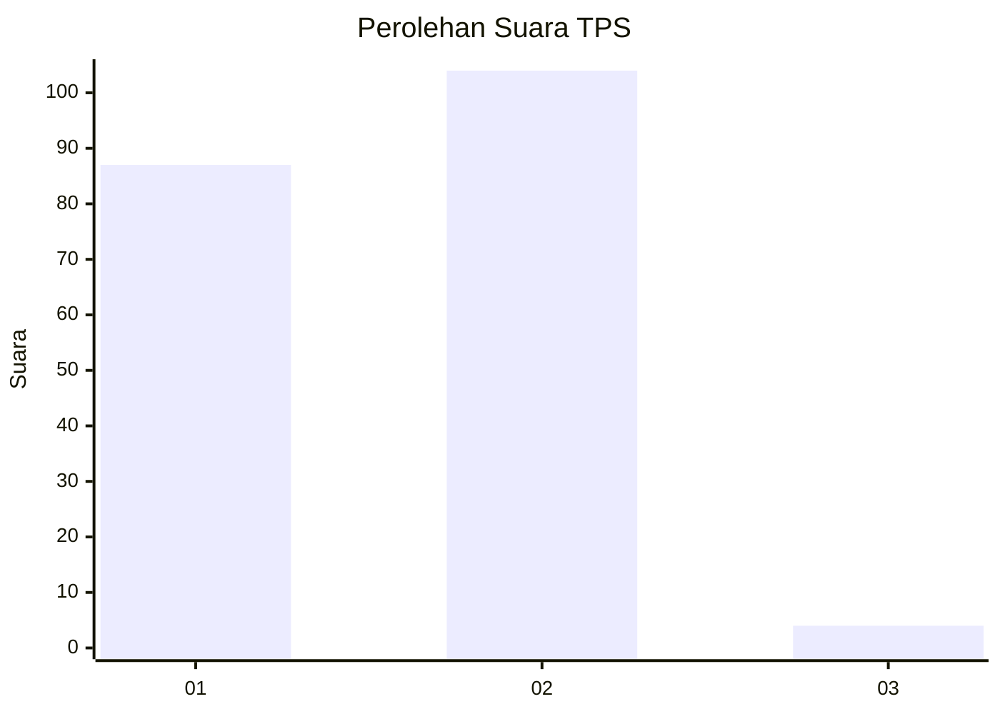
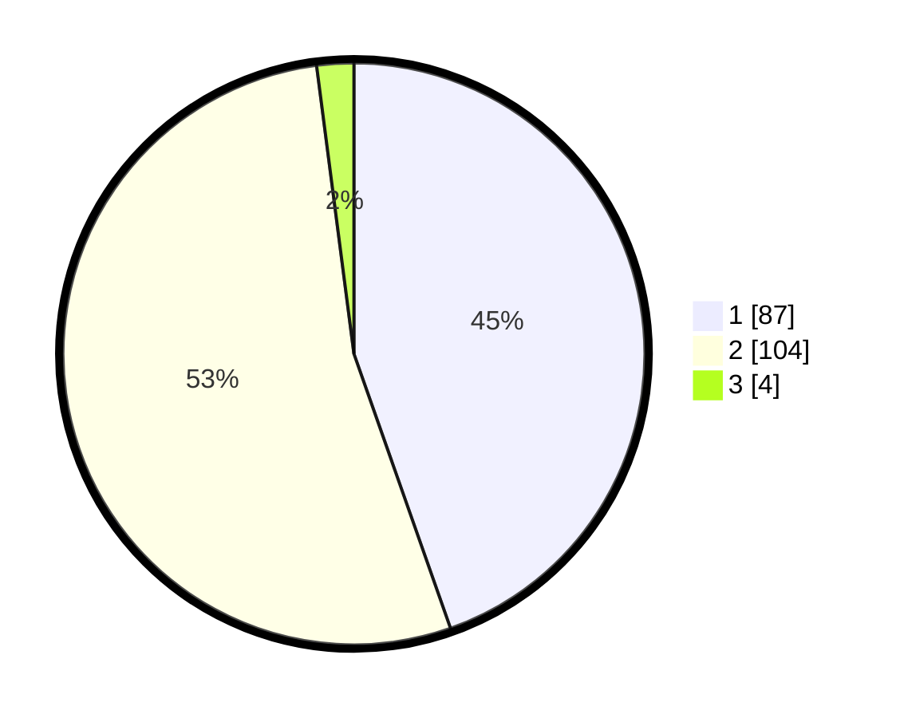

# Hasil

## Grafik

## Tabel

| No. | Nama Paslon    | Suara | Suara (raw) | Persentase |
|:--- |:-------------- | -----:| -----------:| ----------:|
| 1   | ANIES MUHAIMIN | 87    | [87][p-1]   | 44,62      |
| 2   | PRABOWO GIBRAN | 104   | [104][p-2]  | 53,33      |
| 3   | GANJAR MAHFUD  | 4     | [4][p-3]    | 2,05       |

[p-1]: https://github.com/gigit-pemilu/pemilu-2024-11-aceh/blob/main/pilpres/hitung-suara/sub/11-aceh/sub/04-aceh-tengah/sub/21-rusip-antara/sub/2002-rusip/sub/002-tps/sub/paslon-1.txt
[p-2]: https://github.com/gigit-pemilu/pemilu-2024-11-aceh/blob/main/pilpres/hitung-suara/sub/11-aceh/sub/04-aceh-tengah/sub/21-rusip-antara/sub/2002-rusip/sub/002-tps/sub/paslon-2.txt
[p-3]: https://github.com/gigit-pemilu/pemilu-2024-11-aceh/blob/main/pilpres/hitung-suara/sub/11-aceh/sub/04-aceh-tengah/sub/21-rusip-antara/sub/2002-rusip/sub/002-tps/sub/paslon-3.txt

## Foto C Plano

https://sirekap-obj-formc.kpu.go.id/0125/pemilu/ppwp/11/04/21/20/02/1104212002002-20240216-154853--e33b43ed-38de-42e1-bb78-38217af8e004.jpg

https://sirekap-obj-formc.kpu.go.id/0125/pemilu/ppwp/11/04/21/20/02/1104212002002-20240216-154854--e463117a-459a-4ec3-97cb-ccb94abe7b4c.jpg

https://sirekap-obj-formc.kpu.go.id/0125/pemilu/ppwp/11/04/21/20/02/1104212002002-20240216-154853--e81d97ef-6955-477f-92c0-c9b536d34b82.jpg

## Metadata

| Key        | Value               |
| ---------- | ------------------- |
| Time Stamp | 2024-02-21 20:00:00 |

## DATA PEMILIH TETAP

Jumlah pemilih dalam DPT: **215**.
 * L: **120**.
 * P: **95**.

## DATA PENGGUNA HAK PILIH

Jumlah pengguna hak pilih dalam DPT: **199**.
 * L: **107**.
 * P: **92**.

Jumlah pengguna hak pilih dalam DPTb: **1**.
 * L: **0**.
 * P: **1**.

Jumlah pengguna hak pilih dalam DPK: **2**.
 * L: **1**.
 * P: **1**.

Jumlah pengguna hak pilih: **202**.
 * L: **108**.
 * P: **94**.

## JUMLAH SUARA SAH DAN TIDAK SAH

JUMLAH SELURUH SUARA SAH: **195**.

JUMLAH SUARA TIDAK SAH: **7**.

JUMLAH SELURUH SUARA SAH DAN SUARA TIDAK SAH: **202**.

