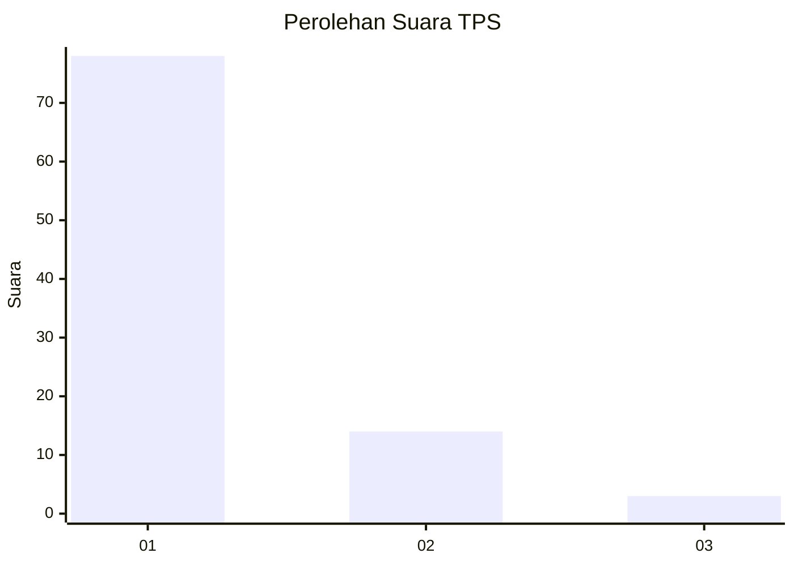
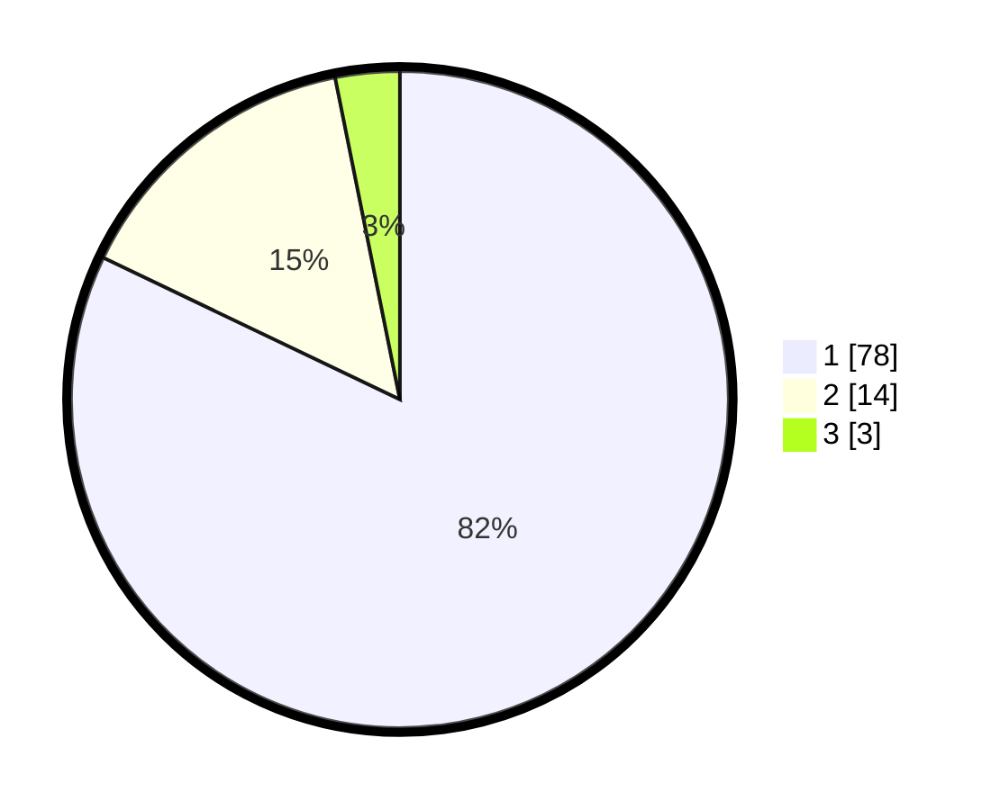

# Hasil

## Grafik

## Tabel

| No. | Nama Paslon    | Suara | Suara (raw) | Persentase |
|:--- |:-------------- | -----:| -----------:| ----------:|
| 1   | ANIES MUHAIMIN | 78    | [78][p-1]   | 82,11      |
| 2   | PRABOWO GIBRAN | 14    | [14][p-2]   | 14,74      |
| 3   | GANJAR MAHFUD  | 3     | [3][p-3]    | 3,16       |

[p-1]: https://github.com/gigit-pemilu/pemilu-2024-11-aceh/blob/main/pilpres/hitung-suara/sub/11-aceh/sub/04-aceh-tengah/sub/21-rusip-antara/sub/2002-rusip/sub/003-tps/sub/paslon-1.txt
[p-2]: https://github.com/gigit-pemilu/pemilu-2024-11-aceh/blob/main/pilpres/hitung-suara/sub/11-aceh/sub/04-aceh-tengah/sub/21-rusip-antara/sub/2002-rusip/sub/003-tps/sub/paslon-2.txt
[p-3]: https://github.com/gigit-pemilu/pemilu-2024-11-aceh/blob/main/pilpres/hitung-suara/sub/11-aceh/sub/04-aceh-tengah/sub/21-rusip-antara/sub/2002-rusip/sub/003-tps/sub/paslon-3.txt

## Foto C Plano

https://sirekap-obj-formc.kpu.go.id/0562/pemilu/ppwp/11/04/21/20/02/1104212002003-20240219-180653--30924a34-8db0-4dae-8629-c7c6ee73b233.jpg

https://sirekap-obj-formc.kpu.go.id/0562/pemilu/ppwp/11/04/21/20/02/1104212002003-20240219-180655--b88aaf7d-7330-4f65-ac6b-28d14c318189.jpg

https://sirekap-obj-formc.kpu.go.id/0562/pemilu/ppwp/11/04/21/20/02/1104212002003-20240219-180654--0d7712ec-7ae3-4495-9fa6-68b6f7401663.jpg

## Metadata

| Key        | Value               |
| ---------- | ------------------- |
| Time Stamp | 2024-02-20 12:00:00 |

## DATA PEMILIH TETAP

Jumlah pemilih dalam DPT: **109**.
 * L: **50**.
 * P: **59**.

## DATA PENGGUNA HAK PILIH

Jumlah pengguna hak pilih dalam DPT: **95**.
 * L: **44**.
 * P: **51**.

Jumlah pengguna hak pilih dalam DPTb: **2**.
 * L: **1**.
 * P: **1**.

Jumlah pengguna hak pilih dalam DPK: **2**.
 * L: **1**.
 * P: **1**.

Jumlah pengguna hak pilih: **99**.
 * L: **46**.
 * P: **53**.

## JUMLAH SUARA SAH DAN TIDAK SAH

JUMLAH SELURUH SUARA SAH: **95**.

JUMLAH SUARA TIDAK SAH: **4**.

JUMLAH SELURUH SUARA SAH DAN SUARA TIDAK SAH: **99**.

