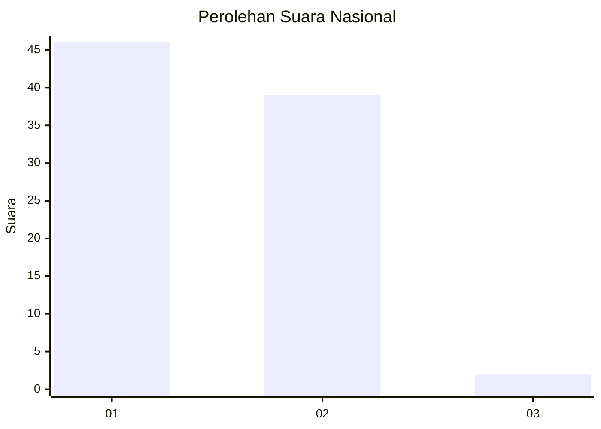
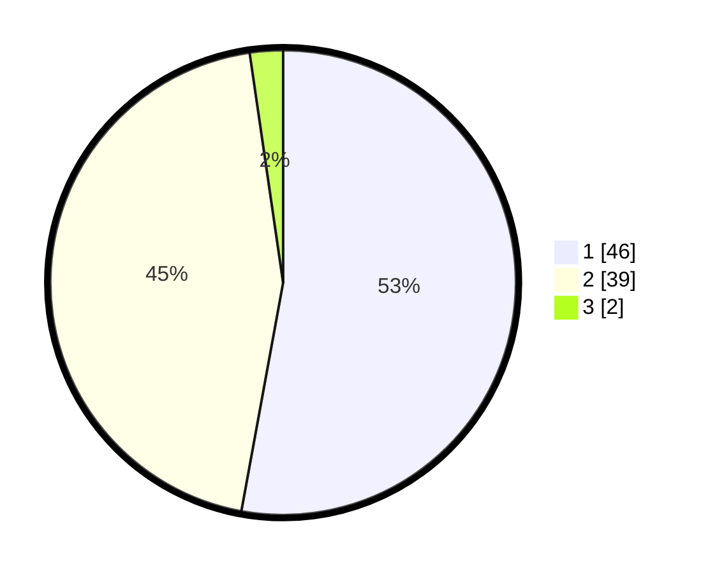

# Hasil

## Grafik

## Tabel

| No. | Nama Paslon    | Suara | Suara (raw) | Persentase |
|:--- |:-------------- | -----:| -----------:| ----------:|
| 1   | ANIES MUHAIMIN | 46    | [46][p-1]   | 52,87      |
| 2   | PRABOWO GIBRAN | 39    | [39][p-2]   | 44,83      |
| 3   | GANJAR MAHFUD  | 2     | [2][p-3]    | 2,30       |

[p-1]: https://github.com/gigit-pemilu/pemilu-2024/blob/main/pilpres/hitung-suara/sub/11-aceh/sub/04-aceh-tengah/sub/21-rusip-antara/sub/2009-kerawang/sub/002-tps/sub/paslon-1.txt
[p-2]: https://github.com/gigit-pemilu/pemilu-2024/blob/main/pilpres/hitung-suara/sub/11-aceh/sub/04-aceh-tengah/sub/21-rusip-antara/sub/2009-kerawang/sub/002-tps/sub/paslon-2.txt
[p-3]: https://github.com/gigit-pemilu/pemilu-2024/blob/main/pilpres/hitung-suara/sub/11-aceh/sub/04-aceh-tengah/sub/21-rusip-antara/sub/2009-kerawang/sub/002-tps/sub/paslon-3.txt

## Foto C Plano

https://sirekap-obj-formc.kpu.go.id/cd86/pemilu/ppwp/11/04/21/20/09/1104212009002-20240216-135821--ca3bdc7d-d7be-4d0f-b0bb-690f02f90cf3.jpg

https://sirekap-obj-formc.kpu.go.id/cd86/pemilu/ppwp/11/04/21/20/09/1104212009002-20240216-135823--380c1d91-0cd0-44cc-95c9-092d2058beb9.jpg

https://sirekap-obj-formc.kpu.go.id/cd86/pemilu/ppwp/11/04/21/20/09/1104212009002-20240216-135822--2610df72-1b9f-4beb-9075-338786ebe802.jpg

## Metadata

| Key        | Value               |
| ---------- | ------------------- |
| Time Stamp | 2024-02-17 10:30:03 |

## DATA PEMILIH TETAP

Jumlah pemilih dalam DPT: **96**.
 * L: **56**.
 * P: **40**.

## DATA PENGGUNA HAK PILIH

Jumlah pengguna hak pilih dalam DPT: **86**.
 * L: **49**.
 * P: **37**.

Jumlah pengguna hak pilih dalam DPTb: **0**.
 * L: **0**.
 * P: **0**.

Jumlah pengguna hak pilih dalam DPK: **1**.
 * L: **1**.
 * P: **0**.

Jumlah pengguna hak pilih: **87**.
 * L: **50**.
 * P: **37**.

## JUMLAH SUARA SAH DAN TIDAK SAH

JUMLAH SELURUH SUARA SAH: **87**.

JUMLAH SUARA TIDAK SAH: **0**.

JUMLAH SELURUH SUARA SAH DAN SUARA TIDAK SAH: **87**.

