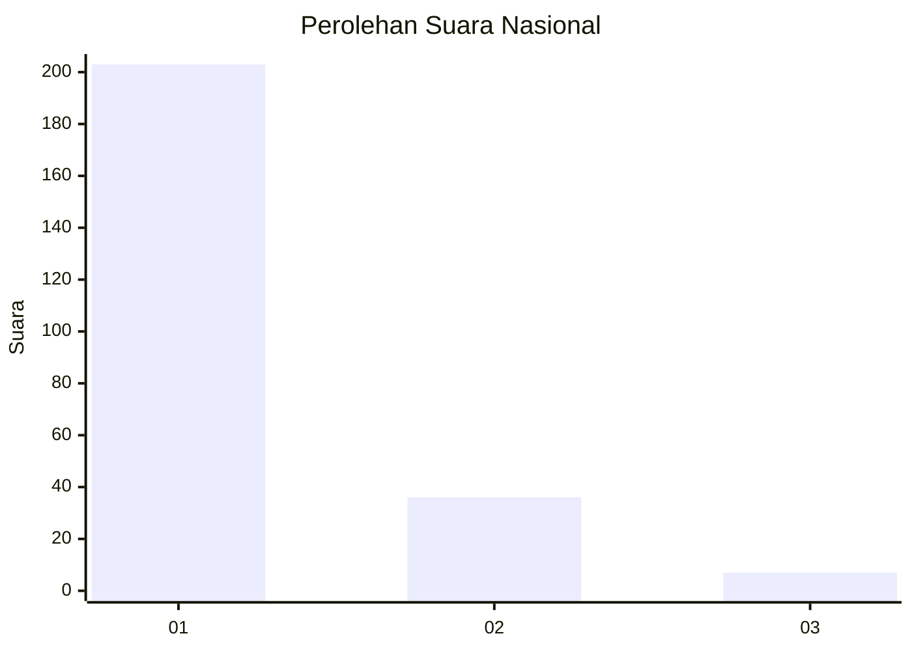
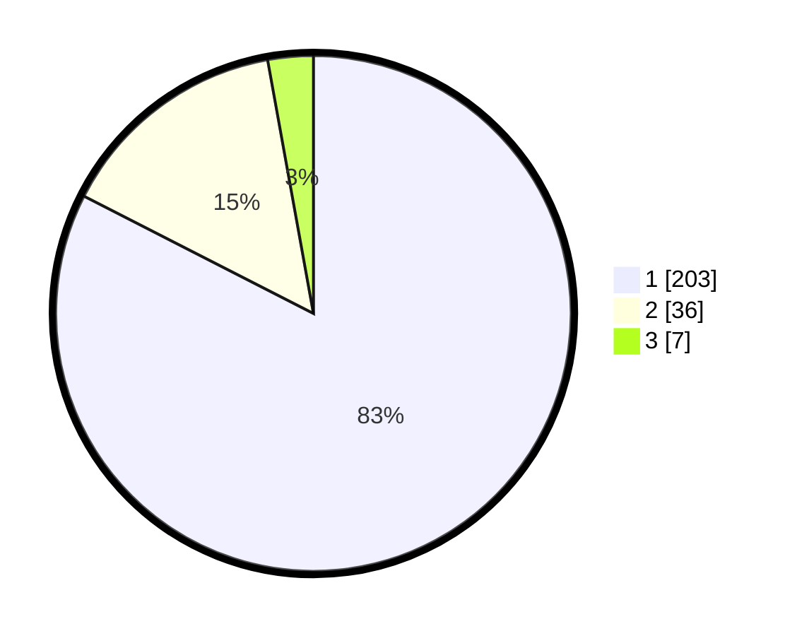

# Hasil

## Grafik

## Tabel

| No. | Nama Paslon    | Suara | Suara (raw) | Persentase |
|:--- |:-------------- | -----:| -----------:| ----------:|
| 1   | ANIES MUHAIMIN | 203   | [203][p-1]  | 82,52      |
| 2   | PRABOWO GIBRAN | 36    | [36][p-2]   | 14,63      |
| 3   | GANJAR MAHFUD  | 7     | [7][p-3]    | 2,85       |

[p-1]: https://github.com/gigit-pemilu/pemilu-2024/blob/main/pilpres/hitung-suara/sub/11-aceh/sub/04-aceh-tengah/sub/21-rusip-antara/sub/2011-paya-tampu/sub/001-tps/sub/paslon-1.txt
[p-2]: https://github.com/gigit-pemilu/pemilu-2024/blob/main/pilpres/hitung-suara/sub/11-aceh/sub/04-aceh-tengah/sub/21-rusip-antara/sub/2011-paya-tampu/sub/001-tps/sub/paslon-2.txt
[p-3]: https://github.com/gigit-pemilu/pemilu-2024/blob/main/pilpres/hitung-suara/sub/11-aceh/sub/04-aceh-tengah/sub/21-rusip-antara/sub/2011-paya-tampu/sub/001-tps/sub/paslon-3.txt

## Foto C Plano

https://sirekap-obj-formc.kpu.go.id/ac70/pemilu/ppwp/11/04/21/20/11/1104212011001-20240216-131958--91b14942-3565-456b-9cdf-ada14e615682.jpg

https://sirekap-obj-formc.kpu.go.id/ac70/pemilu/ppwp/11/04/21/20/11/1104212011001-20240214-204531--1e43099d-2a86-4b5e-8baf-a3faa1db2675.jpg

https://sirekap-obj-formc.kpu.go.id/ac70/pemilu/ppwp/11/04/21/20/11/1104212011001-20240214-204706--82abae2d-9001-4d5c-a5cd-83ca04719ef7.jpg

## Metadata

| Key        | Value               |
| ---------- | ------------------- |
| Time Stamp | 2024-02-16 13:30:32 |

## DATA PEMILIH TETAP

Jumlah pemilih dalam DPT: **282**.
 * L: **150**.
 * P: **132**.

## DATA PENGGUNA HAK PILIH

Jumlah pengguna hak pilih dalam DPT: **223**.
 * L: **116**.
 * P: **107**.

Jumlah pengguna hak pilih dalam DPTb: **8**.
 * L: **1**.
 * P: **7**.

Jumlah pengguna hak pilih dalam DPK: **15**.
 * L: **5**.
 * P: **10**.

Jumlah pengguna hak pilih: **246**.
 * L: **122**.
 * P: **124**.

## JUMLAH SUARA SAH DAN TIDAK SAH

JUMLAH SELURUH SUARA SAH: **246**.

JUMLAH SUARA TIDAK SAH: **0**.

JUMLAH SELURUH SUARA SAH DAN SUARA TIDAK SAH: **246**.

