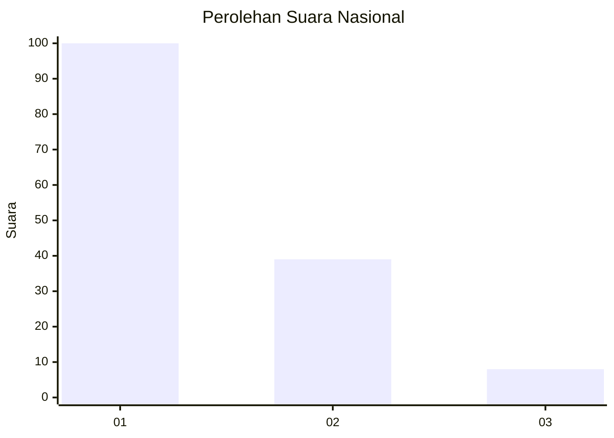
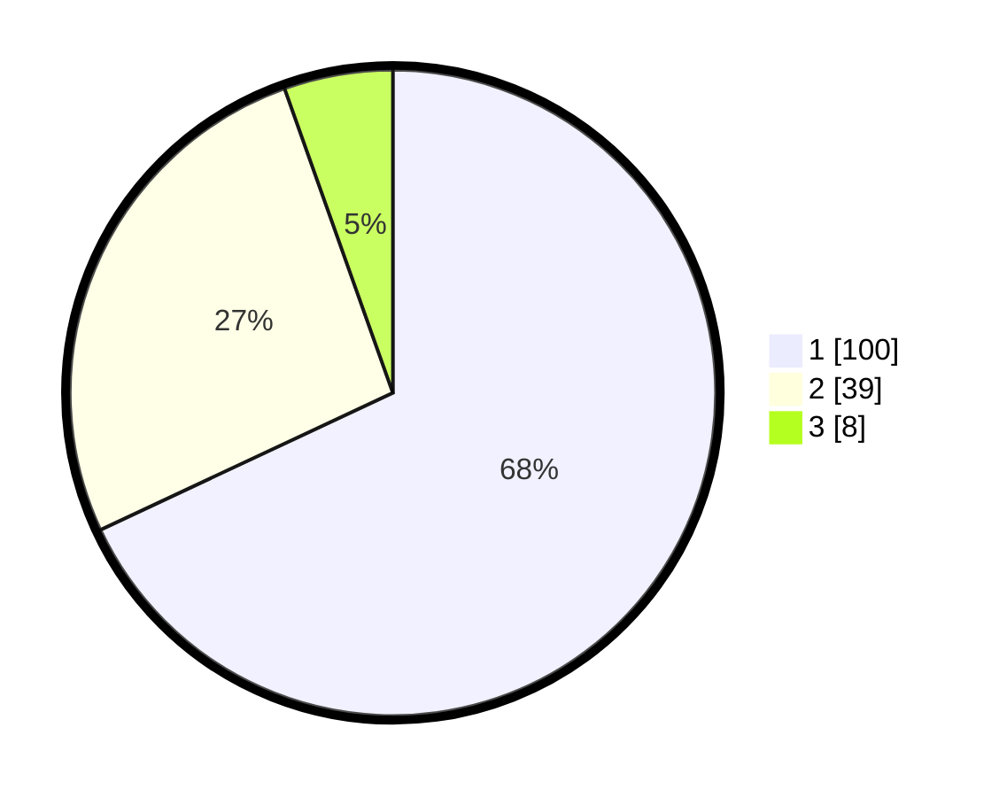

# Hasil

## Grafik

## Tabel

| No. | Nama Paslon    | Suara | Suara (raw) | Persentase |
|:--- |:-------------- | -----:| -----------:| ----------:|
| 1   | ANIES MUHAIMIN | 100   | [100][p-1]  | 68,03      |
| 2   | PRABOWO GIBRAN | 39    | [39][p-2]   | 26,53      |
| 3   | GANJAR MAHFUD  | 8     | [8][p-3]    | 5,44       |

[p-1]: https://github.com/gigit-pemilu/pemilu-2024/blob/main/pilpres/hitung-suara/sub/11-aceh/sub/04-aceh-tengah/sub/21-rusip-antara/sub/2011-paya-tampu/sub/002-tps/sub/paslon-1.txt
[p-2]: https://github.com/gigit-pemilu/pemilu-2024/blob/main/pilpres/hitung-suara/sub/11-aceh/sub/04-aceh-tengah/sub/21-rusip-antara/sub/2011-paya-tampu/sub/002-tps/sub/paslon-2.txt
[p-3]: https://github.com/gigit-pemilu/pemilu-2024/blob/main/pilpres/hitung-suara/sub/11-aceh/sub/04-aceh-tengah/sub/21-rusip-antara/sub/2011-paya-tampu/sub/002-tps/sub/paslon-3.txt

## Foto C Plano

https://sirekap-obj-formc.kpu.go.id/5bc9/pemilu/ppwp/11/04/21/20/11/1104212011002-20240216-151729--220266c4-ee0b-46db-a516-c4c36d61db38.jpg

https://sirekap-obj-formc.kpu.go.id/5bc9/pemilu/ppwp/11/04/21/20/11/1104212011002-20240216-151731--98840061-8f4f-4f1f-b1c2-8241f00b690e.jpg

https://sirekap-obj-formc.kpu.go.id/5bc9/pemilu/ppwp/11/04/21/20/11/1104212011002-20240216-151730--23f865d5-fbe6-4a2e-92c9-70950a22d347.jpg

## Metadata

| Key        | Value               |
| ---------- | ------------------- |
| Time Stamp | 2024-02-17 10:30:03 |

## DATA PEMILIH TETAP

Jumlah pemilih dalam DPT: **179**.
 * L: **98**.
 * P: **81**.

## DATA PENGGUNA HAK PILIH

Jumlah pengguna hak pilih dalam DPT: **139**.
 * L: **77**.
 * P: **62**.

Jumlah pengguna hak pilih dalam DPTb: **4**.
 * L: **1**.
 * P: **3**.

Jumlah pengguna hak pilih dalam DPK: **6**.
 * L: **3**.
 * P: **3**.

Jumlah pengguna hak pilih: **149**.
 * L: **81**.
 * P: **68**.

## JUMLAH SUARA SAH DAN TIDAK SAH

JUMLAH SELURUH SUARA SAH: **147**.

JUMLAH SUARA TIDAK SAH: **2**.

JUMLAH SELURUH SUARA SAH DAN SUARA TIDAK SAH: **149**.

