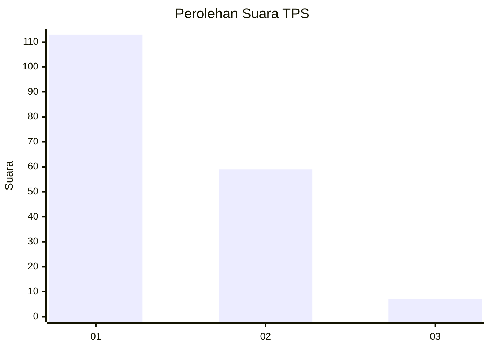
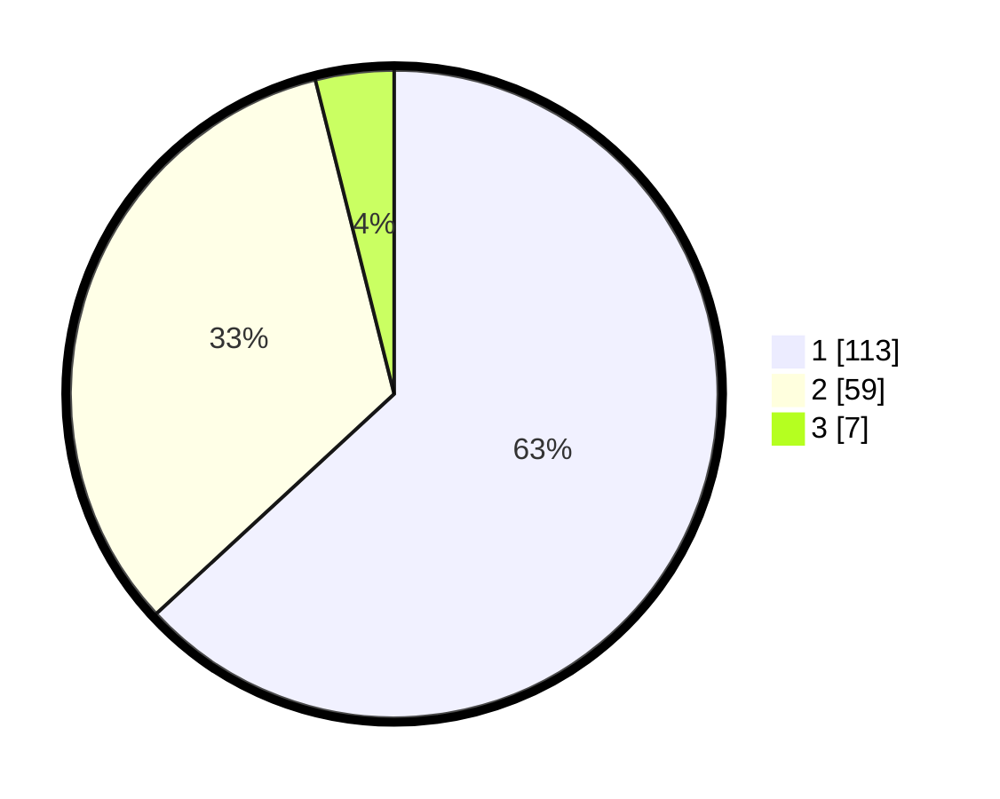

# Hasil

## Grafik

## Tabel

| No. | Nama Paslon    | Suara | Suara (raw) | Persentase |
|:--- |:-------------- | -----:| -----------:| ----------:|
| 1   | ANIES MUHAIMIN | 113   | [113][p-1]  | 63,13      |
| 2   | PRABOWO GIBRAN | 59    | [59][p-2]   | 32,96      |
| 3   | GANJAR MAHFUD  | 7     | [7][p-3]    | 3,91       |

[p-1]: https://github.com/gigit-pemilu/pemilu-2024-11-aceh/blob/main/pilpres/hitung-suara/sub/11-aceh/sub/05-aceh-barat/sub/01-johan-pahlawan/sub/2001-suak-indrapuri/sub/001-tps/sub/paslon-1.txt
[p-2]: https://github.com/gigit-pemilu/pemilu-2024-11-aceh/blob/main/pilpres/hitung-suara/sub/11-aceh/sub/05-aceh-barat/sub/01-johan-pahlawan/sub/2001-suak-indrapuri/sub/001-tps/sub/paslon-2.txt
[p-3]: https://github.com/gigit-pemilu/pemilu-2024-11-aceh/blob/main/pilpres/hitung-suara/sub/11-aceh/sub/05-aceh-barat/sub/01-johan-pahlawan/sub/2001-suak-indrapuri/sub/001-tps/sub/paslon-3.txt

## Foto C Plano

https://sirekap-obj-formc.kpu.go.id/2568/pemilu/ppwp/11/05/01/20/01/1105012001001-20240215-032719--c3c3f2f2-d291-4af6-9d97-4caef197b67d.jpg

https://sirekap-obj-formc.kpu.go.id/2568/pemilu/ppwp/11/05/01/20/01/1105012001001-20240215-031724--b910ecf2-9542-4281-a8df-8d4511f4870f.jpg

https://sirekap-obj-formc.kpu.go.id/2568/pemilu/ppwp/11/05/01/20/01/1105012001001-20240215-032840--f752efab-6981-428d-b2f6-fb08bf2316e9.jpg

## Metadata

| Key        | Value               |
| ---------- | ------------------- |
| Time Stamp | 2024-02-15 09:00:24 |

