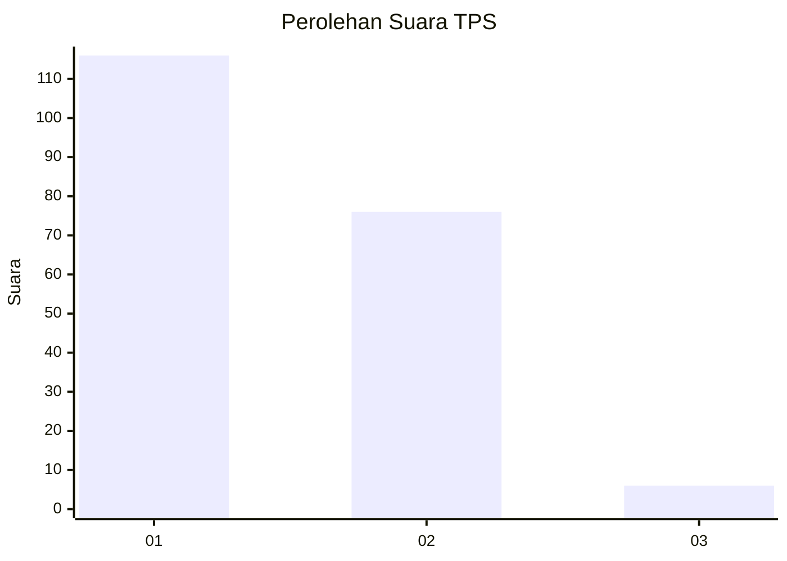
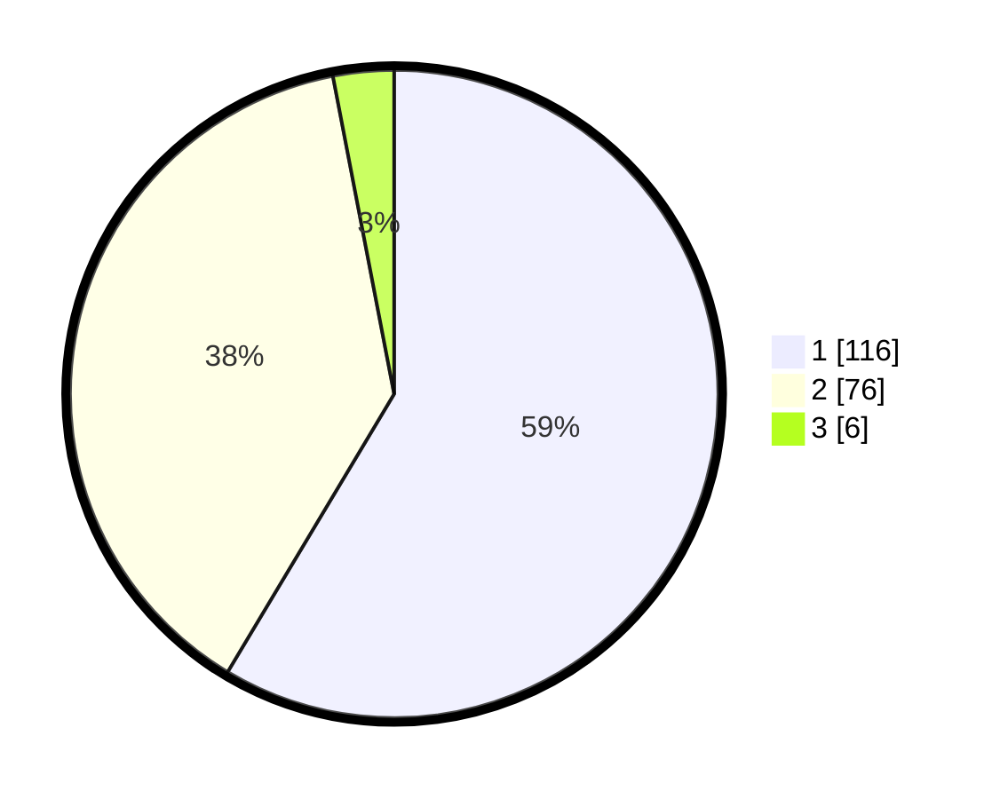

# Hasil

## Grafik

## Tabel

| No. | Nama Paslon    | Suara | Suara (raw) | Persentase |
|:--- |:-------------- | -----:| -----------:| ----------:|
| 1   | ANIES MUHAIMIN | 116   | [116][p-1]  | 58,59      |
| 2   | PRABOWO GIBRAN | 76    | [76][p-2]   | 38,38      |
| 3   | GANJAR MAHFUD  | 6     | [6][p-3]    | 3,03       |

[p-1]: https://github.com/gigit-pemilu/pemilu-2024-11-aceh/blob/main/pilpres/hitung-suara/sub/11-aceh/sub/05-aceh-barat/sub/01-johan-pahlawan/sub/2001-suak-indrapuri/sub/002-tps/sub/paslon-1.txt
[p-2]: https://github.com/gigit-pemilu/pemilu-2024-11-aceh/blob/main/pilpres/hitung-suara/sub/11-aceh/sub/05-aceh-barat/sub/01-johan-pahlawan/sub/2001-suak-indrapuri/sub/002-tps/sub/paslon-2.txt
[p-3]: https://github.com/gigit-pemilu/pemilu-2024-11-aceh/blob/main/pilpres/hitung-suara/sub/11-aceh/sub/05-aceh-barat/sub/01-johan-pahlawan/sub/2001-suak-indrapuri/sub/002-tps/sub/paslon-3.txt

## Foto C Plano

https://sirekap-obj-formc.kpu.go.id/37e7/pemilu/ppwp/11/05/01/20/01/1105012001002-20240215-042859--2d747446-951e-4fbf-9785-e7c3131b4067.jpg

https://sirekap-obj-formc.kpu.go.id/37e7/pemilu/ppwp/11/05/01/20/01/1105012001002-20240215-043017--e75c4393-e7c8-48ae-a922-637f3c6a60d7.jpg

https://sirekap-obj-formc.kpu.go.id/37e7/pemilu/ppwp/11/05/01/20/01/1105012001002-20240214-155530--063634e7-f231-412e-9f7f-d185b1dc95aa.jpg

## Metadata

| Key        | Value               |
| ---------- | ------------------- |
| Time Stamp | 2024-02-19 06:16:00 |

## DATA PEMILIH TETAP

Jumlah pemilih dalam DPT: **221**.
 * L: **106**.
 * P: **115**.

## DATA PENGGUNA HAK PILIH

Jumlah pengguna hak pilih dalam DPT: **190**.
 * L: **87**.
 * P: **103**.

Jumlah pengguna hak pilih dalam DPTb: **7**.
 * L: **2**.
 * P: **5**.

Jumlah pengguna hak pilih dalam DPK: **3**.
 * L: **2**.
 * P: **1**.

Jumlah pengguna hak pilih: **200**.
 * L: **91**.
 * P: **109**.

## JUMLAH SUARA SAH DAN TIDAK SAH

JUMLAH SELURUH SUARA SAH: **198**.

JUMLAH SUARA TIDAK SAH: **2**.

JUMLAH SELURUH SUARA SAH DAN SUARA TIDAK SAH: **200**.

