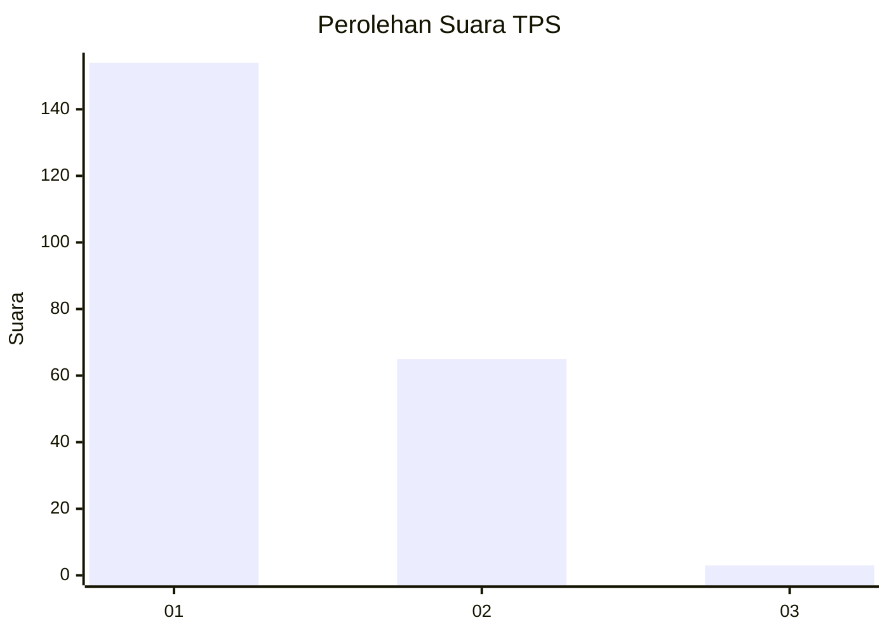
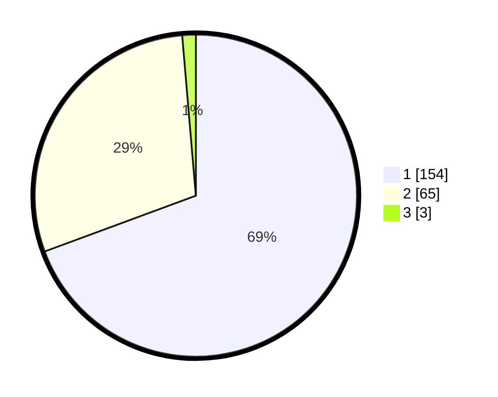

# Hasil

## Grafik

## Tabel

| No. | Nama Paslon    | Suara | Suara (raw) | Persentase |
|:--- |:-------------- | -----:| -----------:| ----------:|
| 1   | ANIES MUHAIMIN | 154   | [154][p-1]  | 69,37      |
| 2   | PRABOWO GIBRAN | 65    | [65][p-2]   | 29,28      |
| 3   | GANJAR MAHFUD  | 3     | [3][p-3]    | 1,35       |

[p-1]: https://github.com/gigit-pemilu/pemilu-2024-11-aceh/blob/main/pilpres/hitung-suara/sub/11-aceh/sub/05-aceh-barat/sub/01-johan-pahlawan/sub/2002-kampung-belakang/sub/002-tps/sub/paslon-1.txt
[p-2]: https://github.com/gigit-pemilu/pemilu-2024-11-aceh/blob/main/pilpres/hitung-suara/sub/11-aceh/sub/05-aceh-barat/sub/01-johan-pahlawan/sub/2002-kampung-belakang/sub/002-tps/sub/paslon-2.txt
[p-3]: https://github.com/gigit-pemilu/pemilu-2024-11-aceh/blob/main/pilpres/hitung-suara/sub/11-aceh/sub/05-aceh-barat/sub/01-johan-pahlawan/sub/2002-kampung-belakang/sub/002-tps/sub/paslon-3.txt

## Foto C Plano

https://sirekap-obj-formc.kpu.go.id/d8f7/pemilu/ppwp/11/05/01/20/02/1105012002002-20240215-111559--cdbeca64-88e9-4411-b114-3d6f4f9a2427.jpg

https://sirekap-obj-formc.kpu.go.id/d8f7/pemilu/ppwp/11/05/01/20/02/1105012002002-20240214-224900--5d34b446-0e33-4c53-b72c-5babf16853a3.jpg

https://sirekap-obj-formc.kpu.go.id/d8f7/pemilu/ppwp/11/05/01/20/02/1105012002002-20240214-225230--5267542b-5530-48fe-9dcf-e08181fabee3.jpg

## Metadata

| Key        | Value               |
| ---------- | ------------------- |
| Time Stamp | 2024-02-16 01:00:27 |

## DATA PEMILIH TETAP

Jumlah pemilih dalam DPT: **254**.
 * L: **131**.
 * P: **123**.

## DATA PENGGUNA HAK PILIH

Jumlah pengguna hak pilih dalam DPT: **217**.
 * L: **112**.
 * P: **105**.

Jumlah pengguna hak pilih dalam DPTb: **5**.
 * L: **3**.
 * P: **2**.

Jumlah pengguna hak pilih dalam DPK: **2**.
 * L: **1**.
 * P: **1**.

Jumlah pengguna hak pilih: **224**.
 * L: **116**.
 * P: **108**.

## JUMLAH SUARA SAH DAN TIDAK SAH

JUMLAH SELURUH SUARA SAH: **222**.

JUMLAH SUARA TIDAK SAH: **2**.

JUMLAH SELURUH SUARA SAH DAN SUARA TIDAK SAH: **224**.

