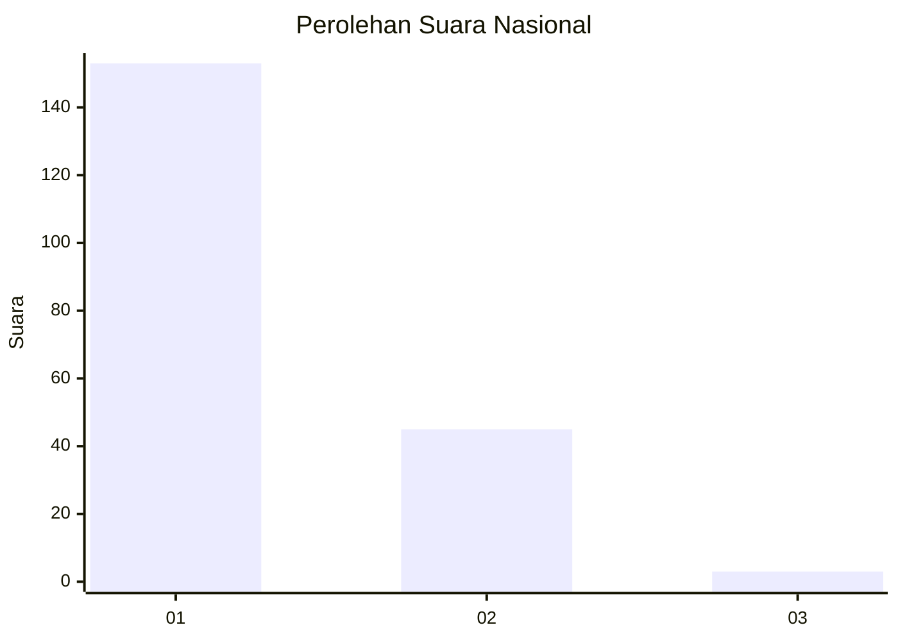
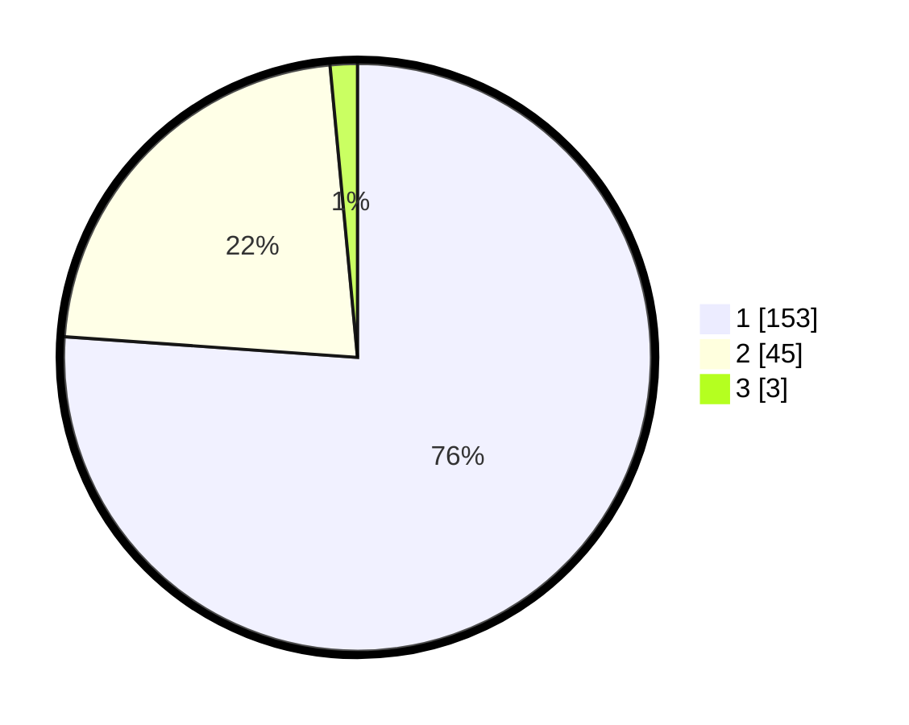

# Hasil

## Grafik

## Tabel

| No. | Nama Paslon    | Suara | Suara (raw) | Persentase |
|:--- |:-------------- | -----:| -----------:| ----------:|
| 1   | ANIES MUHAIMIN | 153   | [153][p-1]  | 76,12      |
| 2   | PRABOWO GIBRAN | 45    | [45][p-2]   | 22,39      |
| 3   | GANJAR MAHFUD  | 3     | [3][p-3]    | 1,49       |

[p-1]: https://github.com/gigit-pemilu/pemilu-2024/blob/main/pilpres/hitung-suara/sub/11-aceh/sub/05-aceh-barat/sub/01-johan-pahlawan/sub/2002-kampung-belakang/sub/003-tps/sub/paslon-1.txt
[p-2]: https://github.com/gigit-pemilu/pemilu-2024/blob/main/pilpres/hitung-suara/sub/11-aceh/sub/05-aceh-barat/sub/01-johan-pahlawan/sub/2002-kampung-belakang/sub/003-tps/sub/paslon-2.txt
[p-3]: https://github.com/gigit-pemilu/pemilu-2024/blob/main/pilpres/hitung-suara/sub/11-aceh/sub/05-aceh-barat/sub/01-johan-pahlawan/sub/2002-kampung-belakang/sub/003-tps/sub/paslon-3.txt

## Foto C Plano

https://sirekap-obj-formc.kpu.go.id/38e9/pemilu/ppwp/11/05/01/20/02/1105012002003-20240218-125134--7d38f6ec-de28-47b7-91e0-79d40a97499a.jpg

https://sirekap-obj-formc.kpu.go.id/38e9/pemilu/ppwp/11/05/01/20/02/1105012002003-20240218-125136--ac1044d5-4ee5-45ee-9fed-704d55bfe8da.jpg

https://sirekap-obj-formc.kpu.go.id/38e9/pemilu/ppwp/11/05/01/20/02/1105012002003-20240218-125135--dbf923c2-3c47-4806-b8e3-24bfc37bdea9.jpg

## Metadata

| Key        | Value               |
| ---------- | ------------------- |
| Time Stamp | 2024-02-24 22:31:28 |

## DATA PEMILIH TETAP

Jumlah pemilih dalam DPT: **239**.
 * L: **120**.
 * P: **119**.

## DATA PENGGUNA HAK PILIH

Jumlah pengguna hak pilih dalam DPT: **195**.
 * L: **96**.
 * P: **99**.

Jumlah pengguna hak pilih dalam DPTb: **5**.
 * L: **2**.
 * P: **3**.

Jumlah pengguna hak pilih dalam DPK: **4**.
 * L: **3**.
 * P: **1**.

Jumlah pengguna hak pilih: **204**.
 * L: **101**.
 * P: **103**.

## JUMLAH SUARA SAH DAN TIDAK SAH

JUMLAH SELURUH SUARA SAH: **201**.

JUMLAH SUARA TIDAK SAH: **3**.

JUMLAH SELURUH SUARA SAH DAN SUARA TIDAK SAH: **204**.

