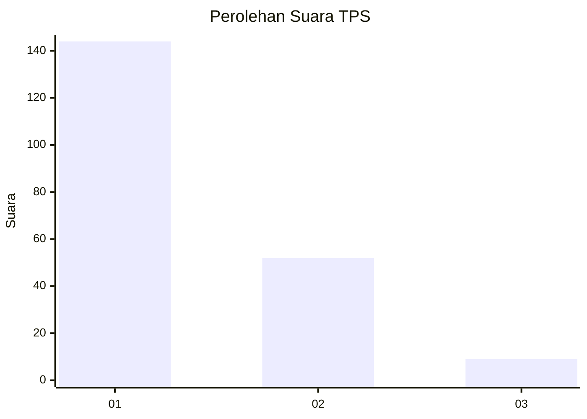
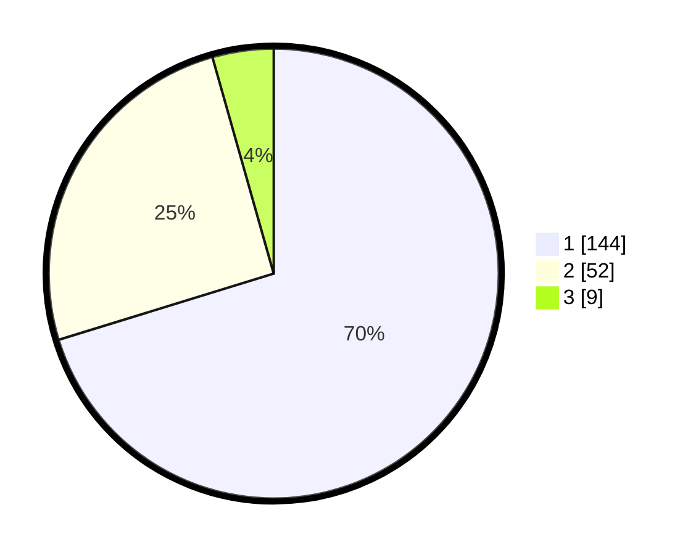

# Hasil

## Grafik

## Tabel

| No. | Nama Paslon    | Suara | Suara (raw) | Persentase |
|:--- |:-------------- | -----:| -----------:| ----------:|
| 1   | ANIES MUHAIMIN | 144   | [144][p-1]  | 70,24      |
| 2   | PRABOWO GIBRAN | 52    | [52][p-2]   | 25,37      |
| 3   | GANJAR MAHFUD  | 9     | [9][p-3]    | 4,39       |

[p-1]: https://github.com/gigit-pemilu/pemilu-2024-11-aceh/blob/main/pilpres/hitung-suara/sub/11-aceh/sub/05-aceh-barat/sub/01-johan-pahlawan/sub/2002-kampung-belakang/sub/004-tps/sub/paslon-1.txt
[p-2]: https://github.com/gigit-pemilu/pemilu-2024-11-aceh/blob/main/pilpres/hitung-suara/sub/11-aceh/sub/05-aceh-barat/sub/01-johan-pahlawan/sub/2002-kampung-belakang/sub/004-tps/sub/paslon-2.txt
[p-3]: https://github.com/gigit-pemilu/pemilu-2024-11-aceh/blob/main/pilpres/hitung-suara/sub/11-aceh/sub/05-aceh-barat/sub/01-johan-pahlawan/sub/2002-kampung-belakang/sub/004-tps/sub/paslon-3.txt

## Foto C Plano

https://sirekap-obj-formc.kpu.go.id/95d5/pemilu/ppwp/11/05/01/20/02/1105012002004-20240216-134904--206d3de0-0098-4ced-9321-2e67bc711935.jpg

https://sirekap-obj-formc.kpu.go.id/95d5/pemilu/ppwp/11/05/01/20/02/1105012002004-20240216-134905--0c7c7175-e3bd-4e84-bfca-751a10fa9668.jpg

https://sirekap-obj-formc.kpu.go.id/95d5/pemilu/ppwp/11/05/01/20/02/1105012002004-20240216-134904--9286bd6e-7a1a-49ff-9d01-cdfa3f69c239.jpg

## Metadata

| Key        | Value               |
| ---------- | ------------------- |
| Time Stamp | 2024-02-16 21:01:00 |

## DATA PEMILIH TETAP

Jumlah pemilih dalam DPT: **258**.
 * L: **123**.
 * P: **135**.

## DATA PENGGUNA HAK PILIH

Jumlah pengguna hak pilih dalam DPT: **200**.
 * L: **90**.
 * P: **110**.

Jumlah pengguna hak pilih dalam DPTb: **4**.
 * L: **3**.
 * P: **1**.

Jumlah pengguna hak pilih dalam DPK: **2**.
 * L: **1**.
 * P: **1**.

Jumlah pengguna hak pilih: **206**.
 * L: **94**.
 * P: **112**.

## JUMLAH SUARA SAH DAN TIDAK SAH

JUMLAH SELURUH SUARA SAH: **205**.

JUMLAH SUARA TIDAK SAH: **1**.

JUMLAH SELURUH SUARA SAH DAN SUARA TIDAK SAH: **206**.

