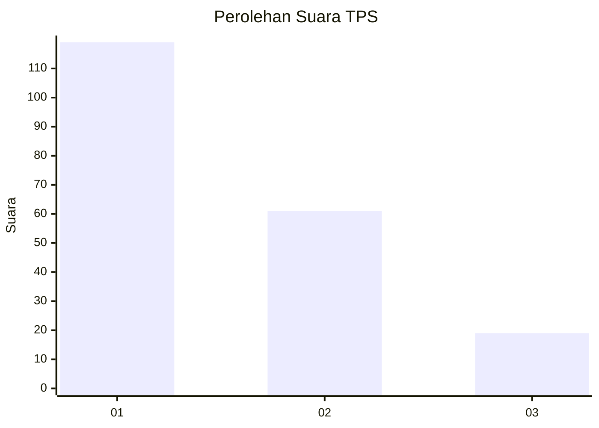
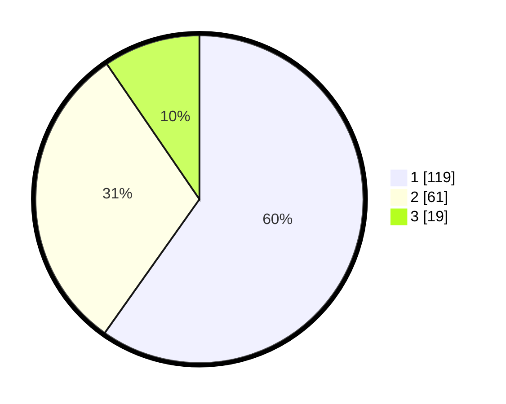

# Hasil

## Grafik

## Tabel

| No. | Nama Paslon    | Suara | Suara (raw) | Persentase |
|:--- |:-------------- | -----:| -----------:| ----------:|
| 1   | ANIES MUHAIMIN | 119   | [119][p-1]  | 59,80      |
| 2   | PRABOWO GIBRAN | 61    | [61][p-2]   | 30,65      |
| 3   | GANJAR MAHFUD  | 19    | [19][p-3]   | 9,55       |

[p-1]: https://github.com/gigit-pemilu/pemilu-2024-11-aceh/blob/main/pilpres/hitung-suara/sub/11-aceh/sub/05-aceh-barat/sub/01-johan-pahlawan/sub/2002-kampung-belakang/sub/006-tps/sub/paslon-1.txt
[p-2]: https://github.com/gigit-pemilu/pemilu-2024-11-aceh/blob/main/pilpres/hitung-suara/sub/11-aceh/sub/05-aceh-barat/sub/01-johan-pahlawan/sub/2002-kampung-belakang/sub/006-tps/sub/paslon-2.txt
[p-3]: https://github.com/gigit-pemilu/pemilu-2024-11-aceh/blob/main/pilpres/hitung-suara/sub/11-aceh/sub/05-aceh-barat/sub/01-johan-pahlawan/sub/2002-kampung-belakang/sub/006-tps/sub/paslon-3.txt

## Foto C Plano

https://sirekap-obj-formc.kpu.go.id/2db4/pemilu/ppwp/11/05/01/20/02/1105012002006-20240215-092821--0ba33ec8-2c1d-4b3e-8d4a-be207a9658b0.jpg

https://sirekap-obj-formc.kpu.go.id/2db4/pemilu/ppwp/11/05/01/20/02/1105012002006-20240215-093857--8f66bf13-3a81-4fa9-9e2f-dc6765702bd8.jpg

https://sirekap-obj-formc.kpu.go.id/2db4/pemilu/ppwp/11/05/01/20/02/1105012002006-20240215-094302--1890da5f-bfab-4eec-9f35-10127fbef7ec.jpg

## Metadata

| Key        | Value               |
| ---------- | ------------------- |
| Time Stamp | 2024-02-15 20:30:46 |

