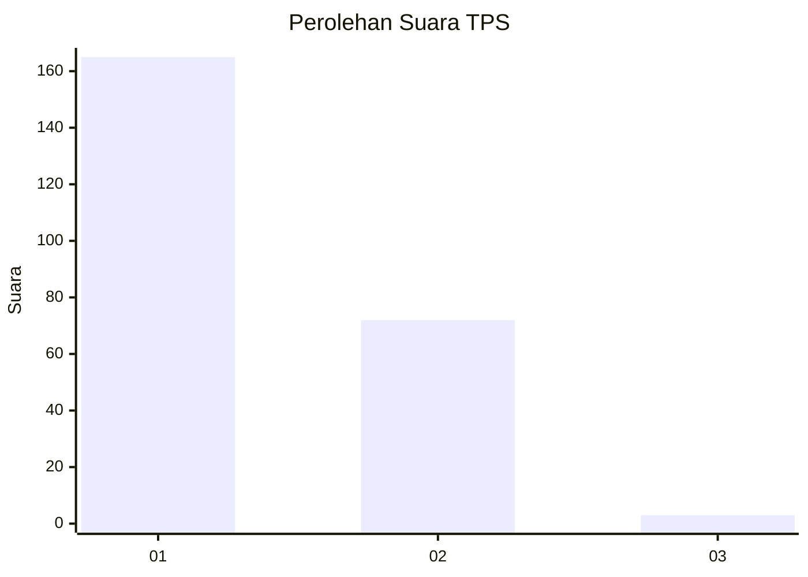
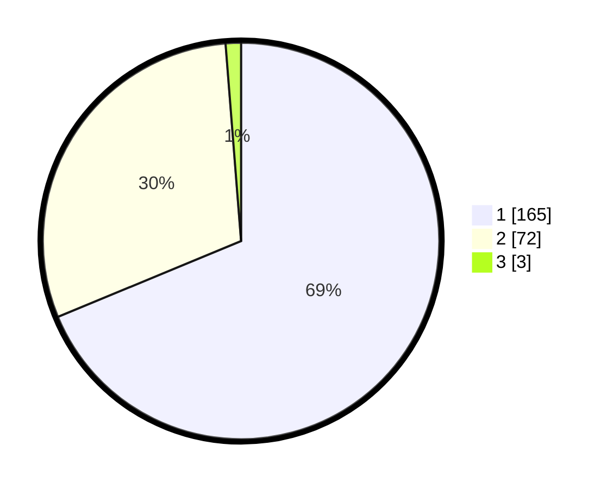

# Hasil

## Grafik

## Tabel

| No. | Nama Paslon    | Suara | Suara (raw) | Persentase |
|:--- |:-------------- | -----:| -----------:| ----------:|
| 1   | ANIES MUHAIMIN | 165   | [165][p-1]  | 68,75      |
| 2   | PRABOWO GIBRAN | 72    | [72][p-2]   | 30,00      |
| 3   | GANJAR MAHFUD  | 3     | [3][p-3]    | 1,25       |

[p-1]: https://github.com/gigit-pemilu/pemilu-2024-11-aceh/blob/main/pilpres/hitung-suara/sub/11-aceh/sub/05-aceh-barat/sub/01-johan-pahlawan/sub/2003-ujong-kalak/sub/007-tps/sub/paslon-1.txt
[p-2]: https://github.com/gigit-pemilu/pemilu-2024-11-aceh/blob/main/pilpres/hitung-suara/sub/11-aceh/sub/05-aceh-barat/sub/01-johan-pahlawan/sub/2003-ujong-kalak/sub/007-tps/sub/paslon-2.txt
[p-3]: https://github.com/gigit-pemilu/pemilu-2024-11-aceh/blob/main/pilpres/hitung-suara/sub/11-aceh/sub/05-aceh-barat/sub/01-johan-pahlawan/sub/2003-ujong-kalak/sub/007-tps/sub/paslon-3.txt

## Foto C Plano

https://sirekap-obj-formc.kpu.go.id/3331/pemilu/ppwp/11/05/01/20/03/1105012003007-20240215-081832--f9fae094-d023-4374-a7c1-0dbc19500e24.jpg

https://sirekap-obj-formc.kpu.go.id/3331/pemilu/ppwp/11/05/01/20/03/1105012003007-20240215-081912--35443d88-4f85-4f8a-b236-363a3de55580.jpg

## Metadata

| Key        | Value               |
| ---------- | ------------------- |
| Time Stamp | 2024-02-15 15:00:29 |

