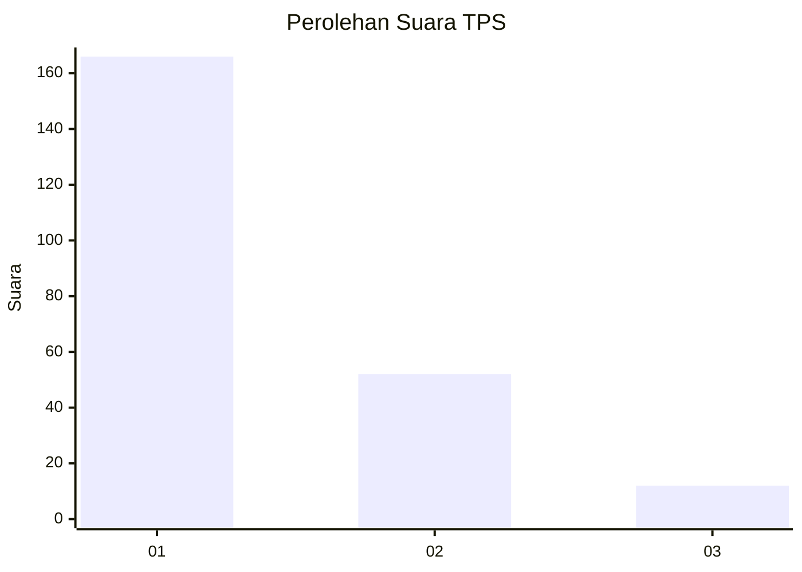
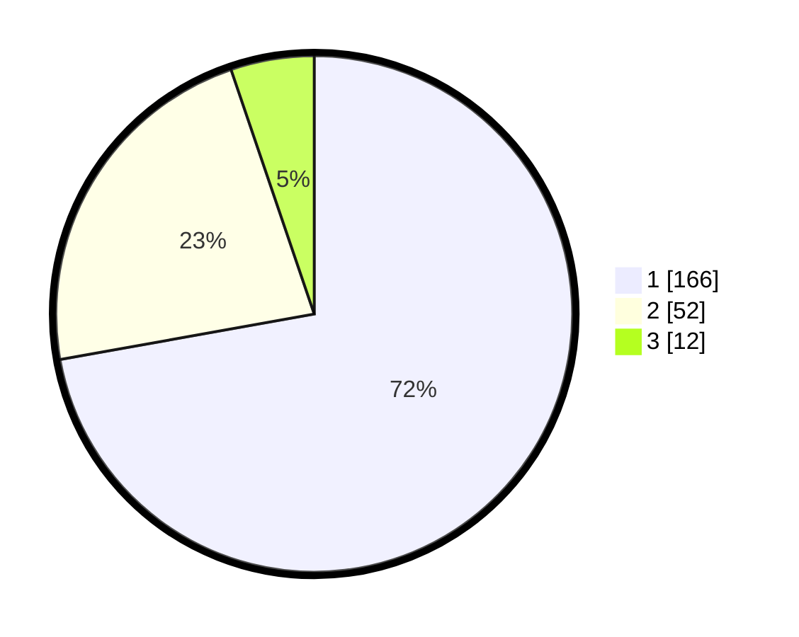

# Hasil

## Grafik

## Tabel

| No. | Nama Paslon    | Suara | Suara (raw) | Persentase |
|:--- |:-------------- | -----:| -----------:| ----------:|
| 1   | ANIES MUHAIMIN | 166   | [166][p-1]  | 72,17      |
| 2   | PRABOWO GIBRAN | 52    | [52][p-2]   | 22,61      |
| 3   | GANJAR MAHFUD  | 12    | [12][p-3]   | 5,22       |

[p-1]: https://github.com/gigit-pemilu/pemilu-2024-11-aceh/blob/main/pilpres/hitung-suara/sub/11-aceh/sub/05-aceh-barat/sub/01-johan-pahlawan/sub/2004-kuta-padang/sub/003-tps/sub/paslon-1.txt
[p-2]: https://github.com/gigit-pemilu/pemilu-2024-11-aceh/blob/main/pilpres/hitung-suara/sub/11-aceh/sub/05-aceh-barat/sub/01-johan-pahlawan/sub/2004-kuta-padang/sub/003-tps/sub/paslon-2.txt
[p-3]: https://github.com/gigit-pemilu/pemilu-2024-11-aceh/blob/main/pilpres/hitung-suara/sub/11-aceh/sub/05-aceh-barat/sub/01-johan-pahlawan/sub/2004-kuta-padang/sub/003-tps/sub/paslon-3.txt

## Foto C Plano

https://sirekap-obj-formc.kpu.go.id/772f/pemilu/ppwp/11/05/01/20/04/1105012004003-20240214-193838--0ad66861-d873-4f61-8883-6f33571154ac.jpg

https://sirekap-obj-formc.kpu.go.id/772f/pemilu/ppwp/11/05/01/20/04/1105012004003-20240214-193941--2ef0ff79-4a2f-41a2-8931-29940b56a534.jpg

https://sirekap-obj-formc.kpu.go.id/772f/pemilu/ppwp/11/05/01/20/04/1105012004003-20240214-232904--729ac769-bd78-4d9b-87a3-ece34aa0e62f.jpg

## Metadata

| Key        | Value               |
| ---------- | ------------------- |
| Time Stamp | 2024-02-15 03:06:03 |

