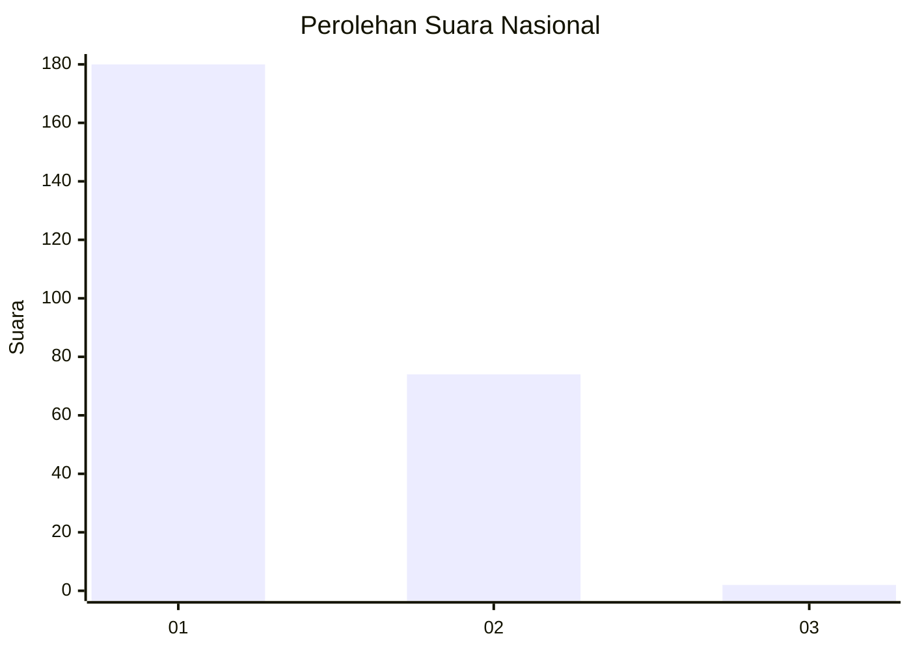
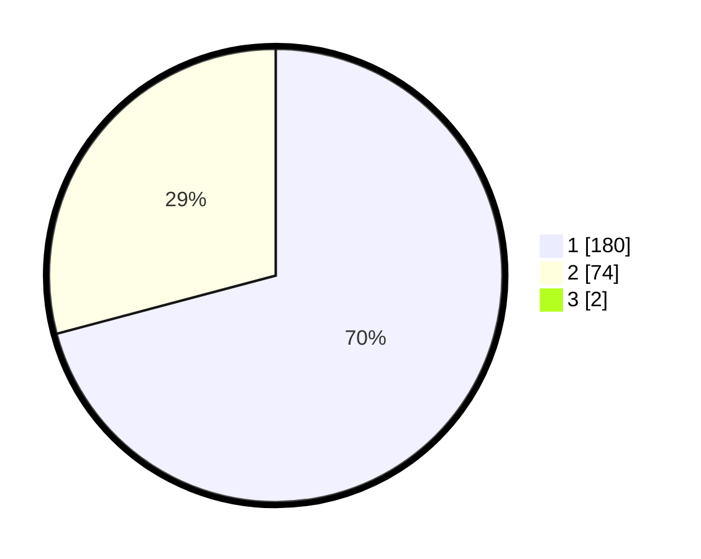

# Hasil

## Grafik

## Tabel

| No. | Nama Paslon    | Suara | Suara (raw) | Persentase |
|:--- |:-------------- | -----:| -----------:| ----------:|
| 1   | ANIES MUHAIMIN | 180   | [180][p-1]  | 70,31      |
| 2   | PRABOWO GIBRAN | 74    | [74][p-2]   | 28,91      |
| 3   | GANJAR MAHFUD  | 2     | [2][p-3]    | 0,78       |

[p-1]: https://github.com/gigit-pemilu/pemilu-2024/blob/main/pilpres/hitung-suara/sub/11-aceh/sub/05-aceh-barat/sub/01-johan-pahlawan/sub/2004-kuta-padang/sub/004-tps/sub/paslon-1.txt
[p-2]: https://github.com/gigit-pemilu/pemilu-2024/blob/main/pilpres/hitung-suara/sub/11-aceh/sub/05-aceh-barat/sub/01-johan-pahlawan/sub/2004-kuta-padang/sub/004-tps/sub/paslon-2.txt
[p-3]: https://github.com/gigit-pemilu/pemilu-2024/blob/main/pilpres/hitung-suara/sub/11-aceh/sub/05-aceh-barat/sub/01-johan-pahlawan/sub/2004-kuta-padang/sub/004-tps/sub/paslon-3.txt

## Foto C Plano

https://sirekap-obj-formc.kpu.go.id/07b8/pemilu/ppwp/11/05/01/20/04/1105012004004-20240215-083007--27a20381-5efc-4dc9-82d2-d09fb7784da0.jpg

https://sirekap-obj-formc.kpu.go.id/07b8/pemilu/ppwp/11/05/01/20/04/1105012004004-20240215-083151--94dc2bab-068b-4786-b4db-0fa360ac9300.jpg

https://sirekap-obj-formc.kpu.go.id/07b8/pemilu/ppwp/11/05/01/20/04/1105012004004-20240215-083306--9c0ea7b5-0d0e-4137-a155-9d88d6779ce6.jpg

## Metadata

| Key        | Value               |
| ---------- | ------------------- |
| Time Stamp | 2024-02-15 20:00:44 |

