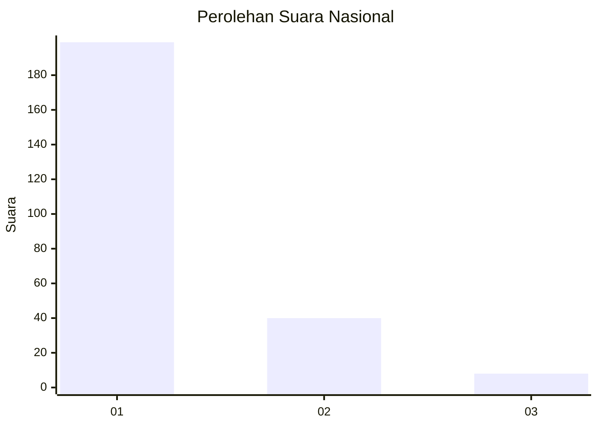
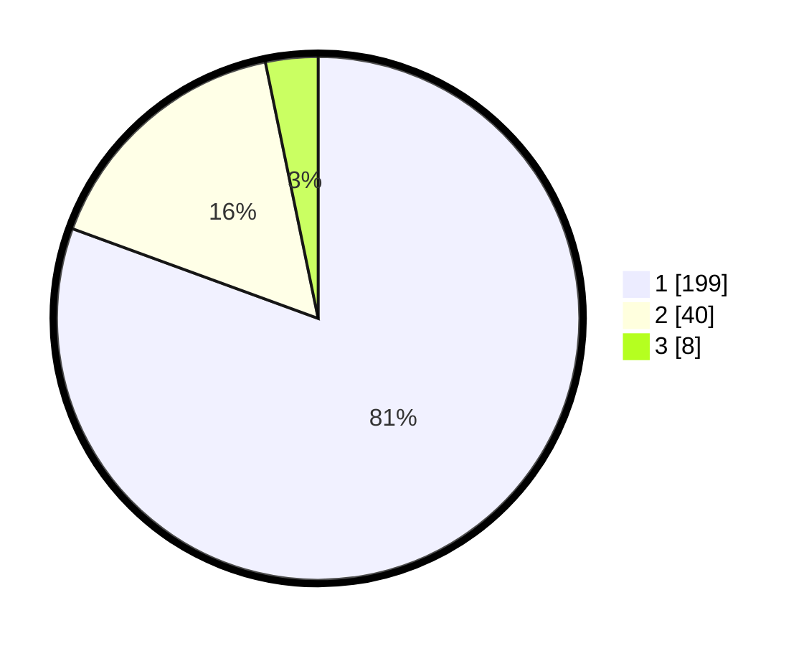

# Hasil

## Grafik

## Tabel

| No. | Nama Paslon    | Suara | Suara (raw) | Persentase |
|:--- |:-------------- | -----:| -----------:| ----------:|
| 1   | ANIES MUHAIMIN | 199   | [199][p-1]  | 80,57      |
| 2   | PRABOWO GIBRAN | 40    | [40][p-2]   | 16,19      |
| 3   | GANJAR MAHFUD  | 8     | [8][p-3]    | 3,24       |

[p-1]: https://github.com/gigit-pemilu/pemilu-2024/blob/main/pilpres/hitung-suara/sub/11-aceh/sub/05-aceh-barat/sub/01-johan-pahlawan/sub/2004-kuta-padang/sub/005-tps/sub/paslon-1.txt
[p-2]: https://github.com/gigit-pemilu/pemilu-2024/blob/main/pilpres/hitung-suara/sub/11-aceh/sub/05-aceh-barat/sub/01-johan-pahlawan/sub/2004-kuta-padang/sub/005-tps/sub/paslon-2.txt
[p-3]: https://github.com/gigit-pemilu/pemilu-2024/blob/main/pilpres/hitung-suara/sub/11-aceh/sub/05-aceh-barat/sub/01-johan-pahlawan/sub/2004-kuta-padang/sub/005-tps/sub/paslon-3.txt

## Foto C Plano

https://sirekap-obj-formc.kpu.go.id/4fea/pemilu/ppwp/11/05/01/20/04/1105012004005-20240215-050352--033d9735-9280-4ad3-bd02-4087680de481.jpg

https://sirekap-obj-formc.kpu.go.id/4fea/pemilu/ppwp/11/05/01/20/04/1105012004005-20240215-050432--70c54353-364c-4afa-b064-902e5540241f.jpg

https://sirekap-obj-formc.kpu.go.id/4fea/pemilu/ppwp/11/05/01/20/04/1105012004005-20240215-050122--f633a017-596e-463f-bf17-02bf7af3118a.jpg

## Metadata

| Key        | Value               |
| ---------- | ------------------- |
| Time Stamp | 2024-02-15 17:30:25 |

