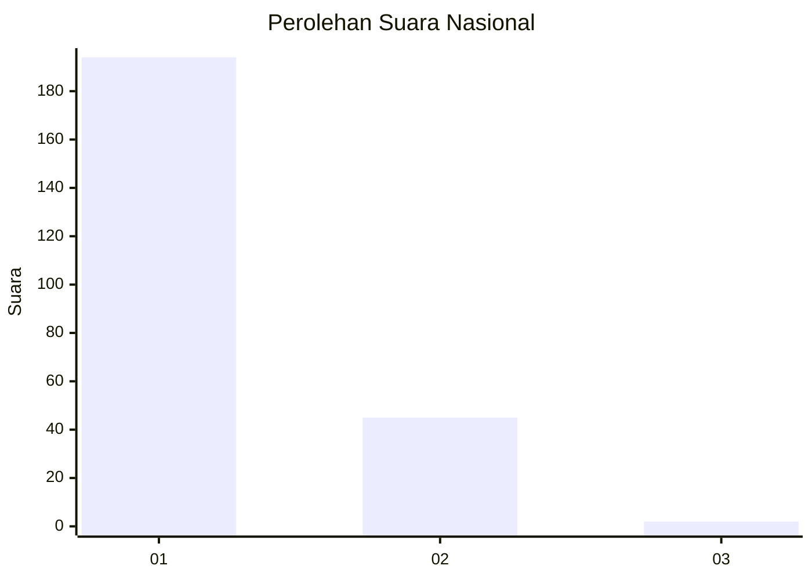
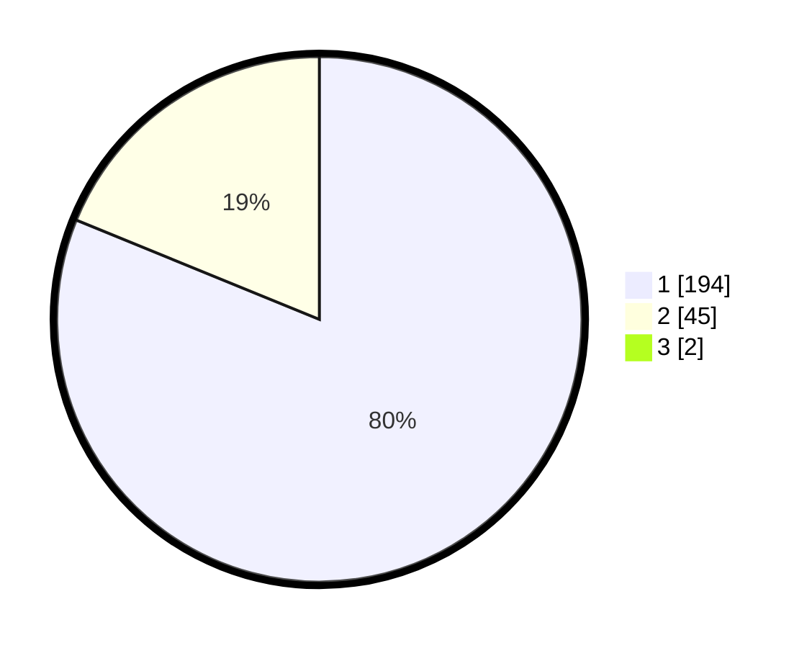

# Hasil

## Grafik

## Tabel

| No. | Nama Paslon    | Suara | Suara (raw) | Persentase |
|:--- |:-------------- | -----:| -----------:| ----------:|
| 1   | ANIES MUHAIMIN | 194   | [194][p-1]  | 80,50      |
| 2   | PRABOWO GIBRAN | 45    | [45][p-2]   | 18,67      |
| 3   | GANJAR MAHFUD  | 2     | [2][p-3]    | 0,83       |

[p-1]: https://github.com/gigit-pemilu/pemilu-2024/blob/main/pilpres/hitung-suara/sub/11-aceh/sub/05-aceh-barat/sub/01-johan-pahlawan/sub/2004-kuta-padang/sub/006-tps/sub/paslon-1.txt
[p-2]: https://github.com/gigit-pemilu/pemilu-2024/blob/main/pilpres/hitung-suara/sub/11-aceh/sub/05-aceh-barat/sub/01-johan-pahlawan/sub/2004-kuta-padang/sub/006-tps/sub/paslon-2.txt
[p-3]: https://github.com/gigit-pemilu/pemilu-2024/blob/main/pilpres/hitung-suara/sub/11-aceh/sub/05-aceh-barat/sub/01-johan-pahlawan/sub/2004-kuta-padang/sub/006-tps/sub/paslon-3.txt

## Foto C Plano

https://sirekap-obj-formc.kpu.go.id/7484/pemilu/ppwp/11/05/01/20/04/1105012004006-20240214-234133--3736b2b9-683d-4f7d-9f39-5e772ba2e03a.jpg

https://sirekap-obj-formc.kpu.go.id/7484/pemilu/ppwp/11/05/01/20/04/1105012004006-20240214-213514--2ff22a90-b2e2-43e7-8ed1-1301aeb820e8.jpg

https://sirekap-obj-formc.kpu.go.id/7484/pemilu/ppwp/11/05/01/20/04/1105012004006-20240214-213625--6ac14ad0-690f-4f1e-8241-46d679db1e3a.jpg

## Metadata

| Key        | Value               |
| ---------- | ------------------- |
| Time Stamp | 2024-02-16 11:00:29 |

