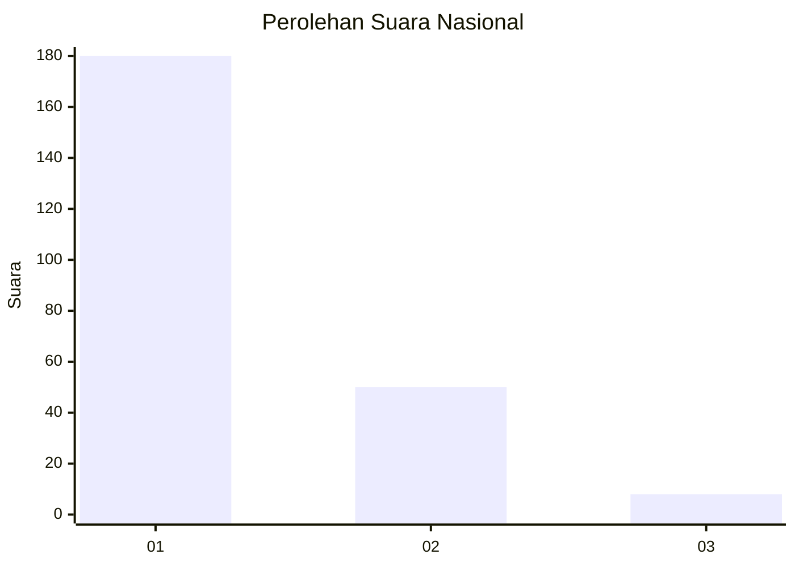
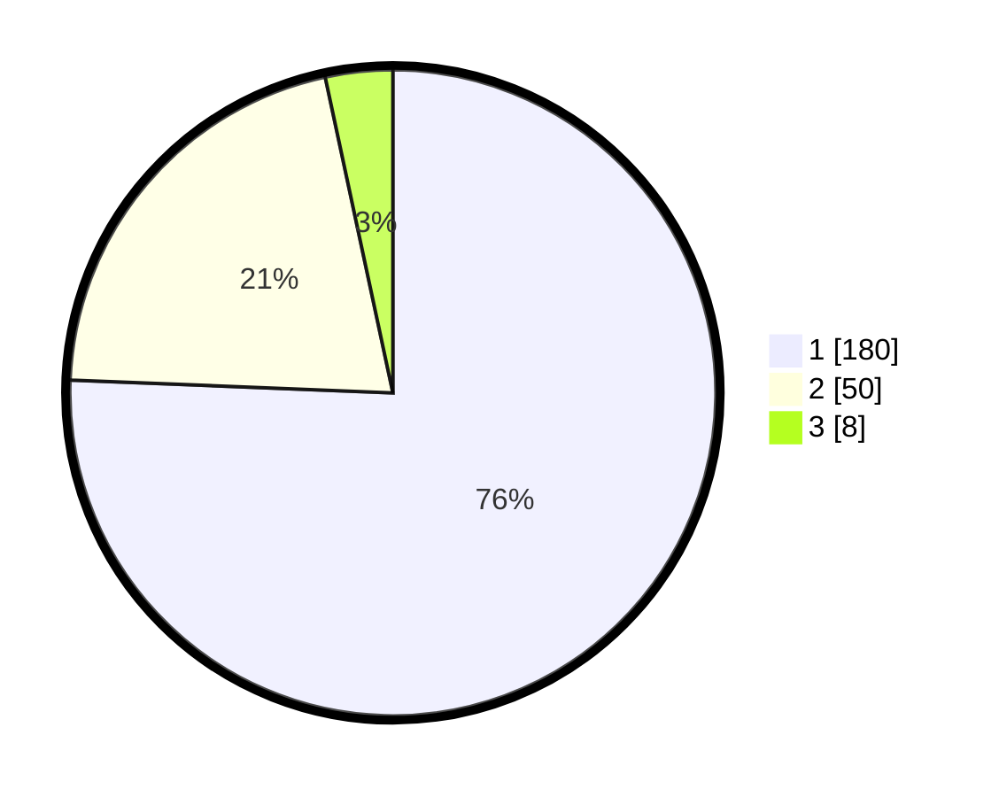

# Hasil

## Grafik

## Tabel

| No. | Nama Paslon    | Suara | Suara (raw) | Persentase |
|:--- |:-------------- | -----:| -----------:| ----------:|
| 1   | ANIES MUHAIMIN | 180   | [180][p-1]  | 75,63      |
| 2   | PRABOWO GIBRAN | 50    | [50][p-2]   | 21,01      |
| 3   | GANJAR MAHFUD  | 8     | [8][p-3]    | 3,36       |

[p-1]: https://github.com/gigit-pemilu/pemilu-2024/blob/main/pilpres/hitung-suara/sub/11-aceh/sub/05-aceh-barat/sub/01-johan-pahlawan/sub/2005-ujong-baroh/sub/003-tps/sub/paslon-1.txt
[p-2]: https://github.com/gigit-pemilu/pemilu-2024/blob/main/pilpres/hitung-suara/sub/11-aceh/sub/05-aceh-barat/sub/01-johan-pahlawan/sub/2005-ujong-baroh/sub/003-tps/sub/paslon-2.txt
[p-3]: https://github.com/gigit-pemilu/pemilu-2024/blob/main/pilpres/hitung-suara/sub/11-aceh/sub/05-aceh-barat/sub/01-johan-pahlawan/sub/2005-ujong-baroh/sub/003-tps/sub/paslon-3.txt

## Foto C Plano

https://sirekap-obj-formc.kpu.go.id/759f/pemilu/ppwp/11/05/01/20/05/1105012005003-20240214-201335--6c918834-2d64-4ee2-ab33-1c16d40b85a8.jpg

https://sirekap-obj-formc.kpu.go.id/759f/pemilu/ppwp/11/05/01/20/05/1105012005003-20240215-083942--b2325dcc-d0ab-4522-a53f-77a8a36c7cf0.jpg

https://sirekap-obj-formc.kpu.go.id/759f/pemilu/ppwp/11/05/01/20/05/1105012005003-20240214-201525--221d85b5-0fa3-490b-bb82-1d3c07e8de05.jpg

## Metadata

| Key        | Value               |
| ---------- | ------------------- |
| Time Stamp | 2024-02-15 20:00:44 |

