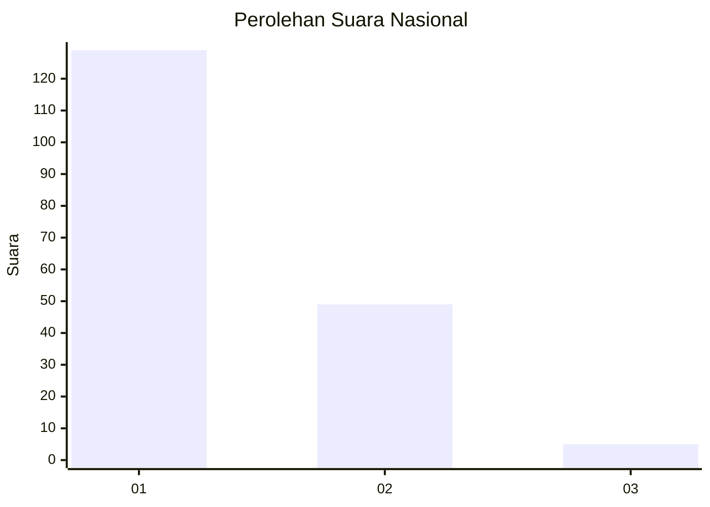
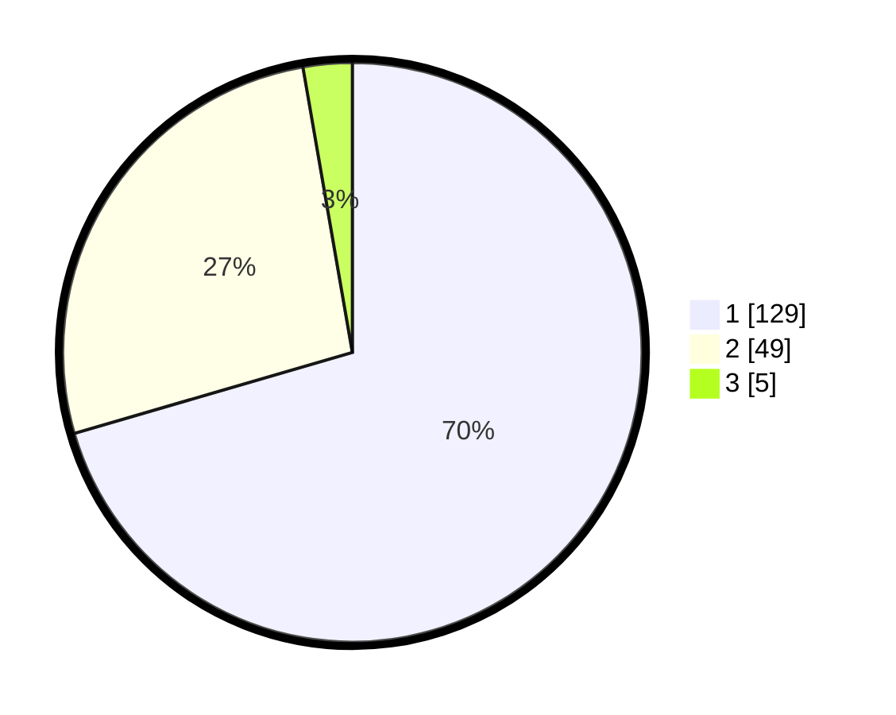

# Hasil

## Grafik

## Tabel

| No. | Nama Paslon    | Suara | Suara (raw) | Persentase |
|:--- |:-------------- | -----:| -----------:| ----------:|
| 1   | ANIES MUHAIMIN | 129   | [129][p-1]  | 70,49      |
| 2   | PRABOWO GIBRAN | 49    | [49][p-2]   | 26,78      |
| 3   | GANJAR MAHFUD  | 5     | [5][p-3]    | 2,73       |

[p-1]: https://github.com/gigit-pemilu/pemilu-2024/blob/main/pilpres/hitung-suara/sub/11-aceh/sub/05-aceh-barat/sub/01-johan-pahlawan/sub/2005-ujong-baroh/sub/004-tps/sub/paslon-1.txt
[p-2]: https://github.com/gigit-pemilu/pemilu-2024/blob/main/pilpres/hitung-suara/sub/11-aceh/sub/05-aceh-barat/sub/01-johan-pahlawan/sub/2005-ujong-baroh/sub/004-tps/sub/paslon-2.txt
[p-3]: https://github.com/gigit-pemilu/pemilu-2024/blob/main/pilpres/hitung-suara/sub/11-aceh/sub/05-aceh-barat/sub/01-johan-pahlawan/sub/2005-ujong-baroh/sub/004-tps/sub/paslon-3.txt

## Foto C Plano

https://sirekap-obj-formc.kpu.go.id/a281/pemilu/ppwp/11/05/01/20/05/1105012005004-20240214-225433--9df4e0b8-c693-433d-8c5b-012f61f63ce8.jpg

https://sirekap-obj-formc.kpu.go.id/a281/pemilu/ppwp/11/05/01/20/05/1105012005004-20240214-225832--24328d21-3f31-493c-8f49-b0f6c214f39a.jpg

https://sirekap-obj-formc.kpu.go.id/a281/pemilu/ppwp/11/05/01/20/05/1105012005004-20240214-230140--19f9d26f-04ad-4c45-83e4-e16526ada25f.jpg

## Metadata

| Key        | Value               |
| ---------- | ------------------- |
| Time Stamp | 2024-02-15 20:00:44 |

