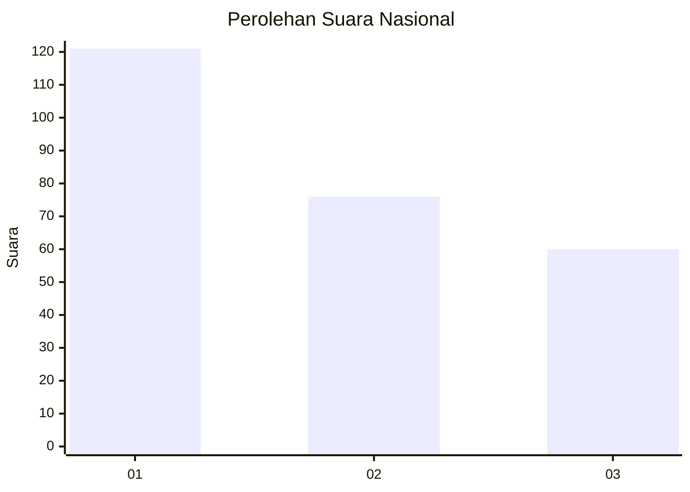
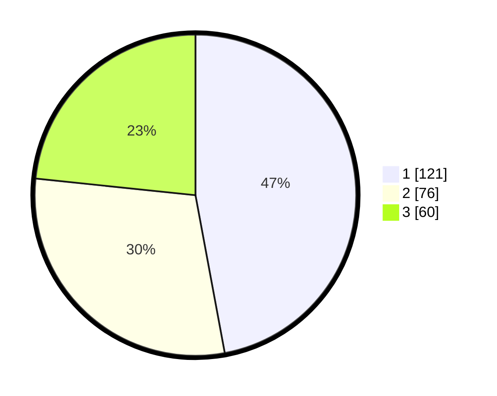

# Hasil

## Grafik

## Tabel

| No. | Nama Paslon    | Suara | Suara (raw) | Persentase |
|:--- |:-------------- | -----:| -----------:| ----------:|
| 1   | ANIES MUHAIMIN | 121   | [121][p-1]  | 47,08      |
| 2   | PRABOWO GIBRAN | 76    | [76][p-2]   | 29,57      |
| 3   | GANJAR MAHFUD  | 60    | [60][p-3]   | 23,35      |

[p-1]: https://github.com/gigit-pemilu/pemilu-2024/blob/main/pilpres/hitung-suara/sub/11-aceh/sub/05-aceh-barat/sub/01-johan-pahlawan/sub/2005-ujong-baroh/sub/010-tps/sub/paslon-1.txt
[p-2]: https://github.com/gigit-pemilu/pemilu-2024/blob/main/pilpres/hitung-suara/sub/11-aceh/sub/05-aceh-barat/sub/01-johan-pahlawan/sub/2005-ujong-baroh/sub/010-tps/sub/paslon-2.txt
[p-3]: https://github.com/gigit-pemilu/pemilu-2024/blob/main/pilpres/hitung-suara/sub/11-aceh/sub/05-aceh-barat/sub/01-johan-pahlawan/sub/2005-ujong-baroh/sub/010-tps/sub/paslon-3.txt

## Foto C Plano

https://sirekap-obj-formc.kpu.go.id/d93e/pemilu/ppwp/11/05/01/20/05/1105012005010-20240214-212914--6c330ab3-6ac0-4d73-9da4-29adaa8d8ef2.jpg

https://sirekap-obj-formc.kpu.go.id/d93e/pemilu/ppwp/11/05/01/20/05/1105012005010-20240214-214102--0ef54150-6f23-4437-a3f7-1ed9799b59c2.jpg

https://sirekap-obj-formc.kpu.go.id/d93e/pemilu/ppwp/11/05/01/20/05/1105012005010-20240214-214250--4b0a146b-b0be-40fe-84aa-0ea8ee86da6c.jpg

## Metadata

| Key        | Value               |
| ---------- | ------------------- |
| Time Stamp | 2024-02-15 09:00:24 |

