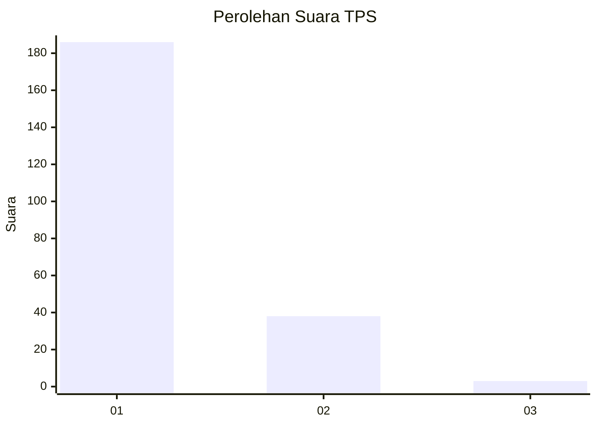
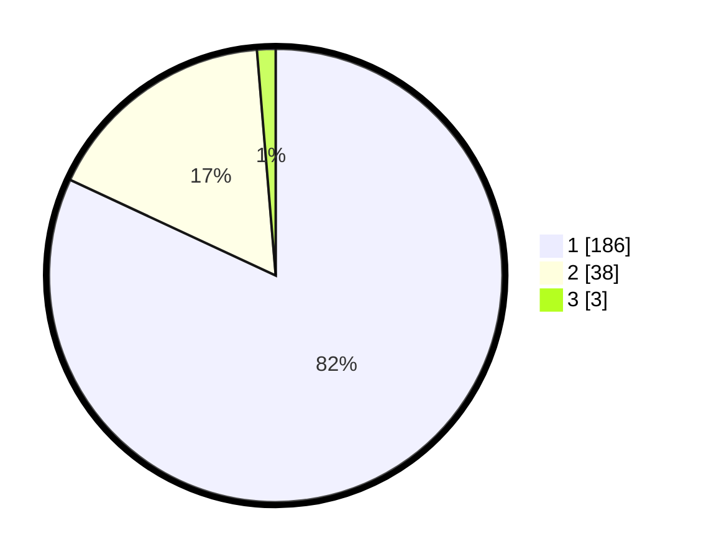

# Hasil

## Grafik

## Tabel

| No. | Nama Paslon    | Suara | Suara (raw) | Persentase |
|:--- |:-------------- | -----:| -----------:| ----------:|
| 1   | ANIES MUHAIMIN | 186   | [186][p-1]  | 81,94      |
| 2   | PRABOWO GIBRAN | 38    | [38][p-2]   | 16,74      |
| 3   | GANJAR MAHFUD  | 3     | [3][p-3]    | 1,32       |

[p-1]: https://github.com/gigit-pemilu/pemilu-2024-11-aceh/blob/main/pilpres/hitung-suara/sub/11-aceh/sub/05-aceh-barat/sub/01-johan-pahlawan/sub/2005-ujong-baroh/sub/013-tps/sub/paslon-1.txt
[p-2]: https://github.com/gigit-pemilu/pemilu-2024-11-aceh/blob/main/pilpres/hitung-suara/sub/11-aceh/sub/05-aceh-barat/sub/01-johan-pahlawan/sub/2005-ujong-baroh/sub/013-tps/sub/paslon-2.txt
[p-3]: https://github.com/gigit-pemilu/pemilu-2024-11-aceh/blob/main/pilpres/hitung-suara/sub/11-aceh/sub/05-aceh-barat/sub/01-johan-pahlawan/sub/2005-ujong-baroh/sub/013-tps/sub/paslon-3.txt

## Foto C Plano

https://sirekap-obj-formc.kpu.go.id/882c/pemilu/ppwp/11/05/01/20/05/1105012005013-20240215-092814--8eafde30-ebd3-42f3-abe5-75d7ff8dfe74.jpg

https://sirekap-obj-formc.kpu.go.id/882c/pemilu/ppwp/11/05/01/20/05/1105012005013-20240215-093001--f80d7deb-a234-4ebe-ad98-cdf065616bde.jpg

https://sirekap-obj-formc.kpu.go.id/882c/pemilu/ppwp/11/05/01/20/05/1105012005013-20240215-093305--4c9aed4a-e332-4619-9a1b-bf58d063e9db.jpg

## Metadata

| Key        | Value               |
| ---------- | ------------------- |
| Time Stamp | 2024-02-15 20:00:44 |

