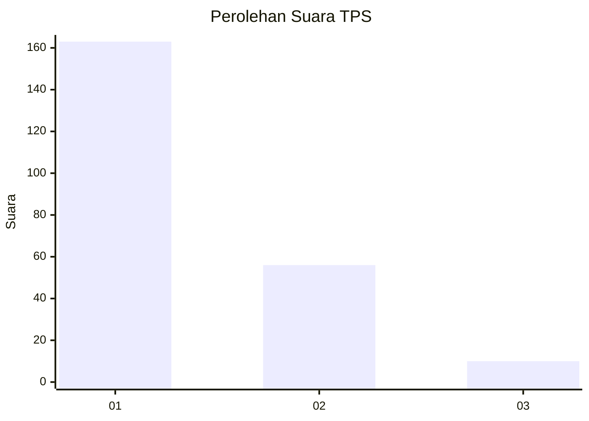
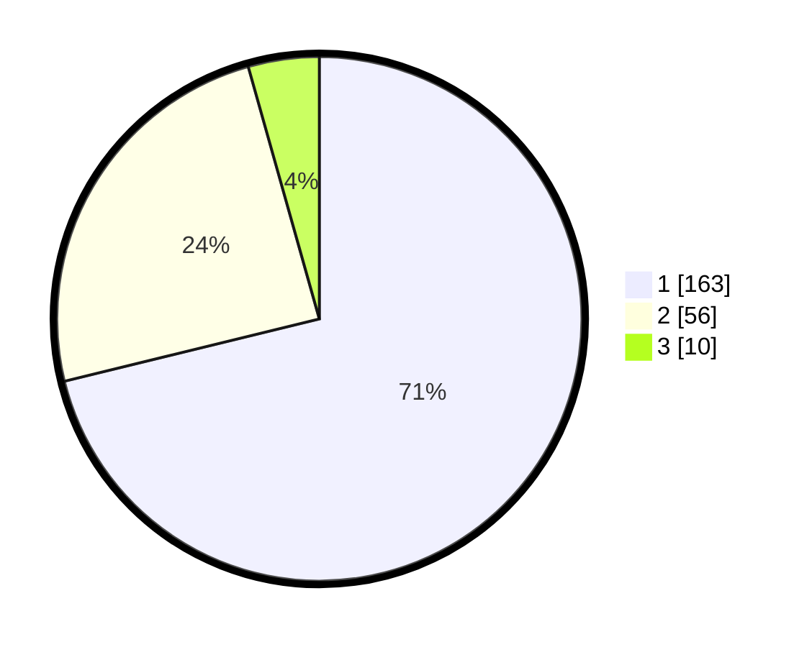

# Hasil

## Grafik

## Tabel

| No. | Nama Paslon    | Suara | Suara (raw) | Persentase |
|:--- |:-------------- | -----:| -----------:| ----------:|
| 1   | ANIES MUHAIMIN | 163   | [163][p-1]  | 71,18      |
| 2   | PRABOWO GIBRAN | 56    | [56][p-2]   | 24,45      |
| 3   | GANJAR MAHFUD  | 10    | [10][p-3]   | 4,37       |

[p-1]: https://github.com/gigit-pemilu/pemilu-2024-11-aceh/blob/main/pilpres/hitung-suara/sub/11-aceh/sub/05-aceh-barat/sub/01-johan-pahlawan/sub/2006-rundeng/sub/002-tps/sub/paslon-1.txt
[p-2]: https://github.com/gigit-pemilu/pemilu-2024-11-aceh/blob/main/pilpres/hitung-suara/sub/11-aceh/sub/05-aceh-barat/sub/01-johan-pahlawan/sub/2006-rundeng/sub/002-tps/sub/paslon-2.txt
[p-3]: https://github.com/gigit-pemilu/pemilu-2024-11-aceh/blob/main/pilpres/hitung-suara/sub/11-aceh/sub/05-aceh-barat/sub/01-johan-pahlawan/sub/2006-rundeng/sub/002-tps/sub/paslon-3.txt

## Foto C Plano

https://sirekap-obj-formc.kpu.go.id/a5a1/pemilu/ppwp/11/05/01/20/06/1105012006002-20240215-125840--89f3639b-d881-41bb-923f-8441c9134212.jpg

https://sirekap-obj-formc.kpu.go.id/a5a1/pemilu/ppwp/11/05/01/20/06/1105012006002-20240215-125900--3abb0d3a-64a5-4cb6-b2b4-7348b821fd8d.jpg

https://sirekap-obj-formc.kpu.go.id/a5a1/pemilu/ppwp/11/05/01/20/06/1105012006002-20240215-125920--ee7a252e-6dba-4806-ba23-6e027d573bac.jpg

## Metadata

| Key        | Value               |
| ---------- | ------------------- |
| Time Stamp | 2024-02-15 21:01:18 |

