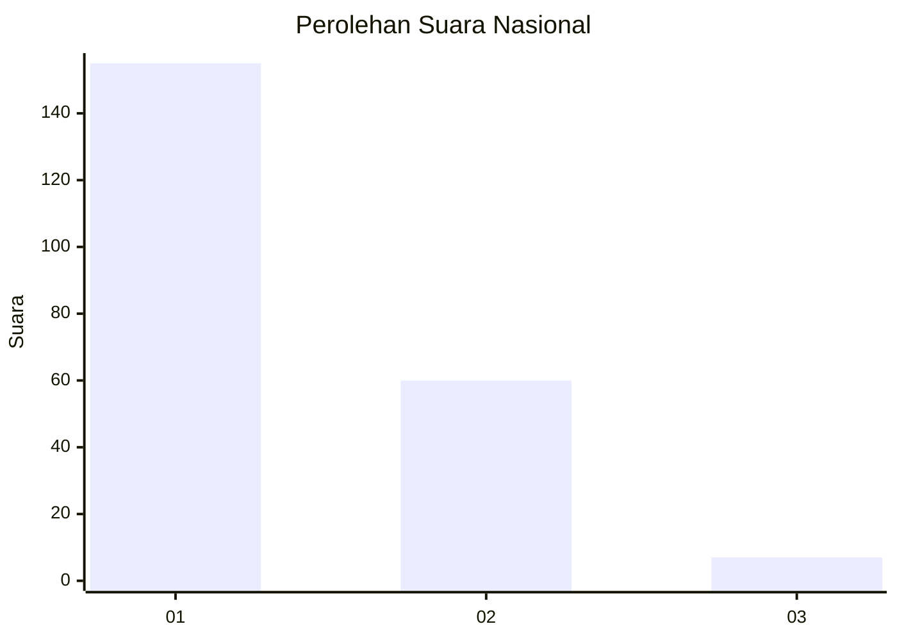
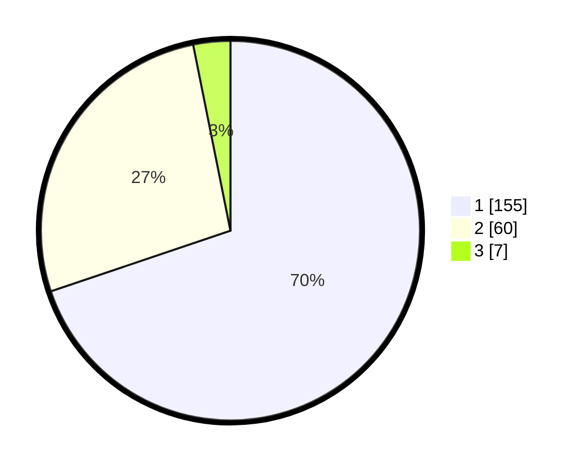

# Hasil

## Grafik

## Tabel

| No. | Nama Paslon    | Suara | Suara (raw) | Persentase |
|:--- |:-------------- | -----:| -----------:| ----------:|
| 1   | ANIES MUHAIMIN | 155   | [155][p-1]  | 69,82      |
| 2   | PRABOWO GIBRAN | 60    | [60][p-2]   | 27,03      |
| 3   | GANJAR MAHFUD  | 7     | [7][p-3]    | 3,15       |

[p-1]: https://github.com/gigit-pemilu/pemilu-2024/blob/main/pilpres/hitung-suara/sub/11-aceh/sub/05-aceh-barat/sub/01-johan-pahlawan/sub/2006-rundeng/sub/005-tps/sub/paslon-1.txt
[p-2]: https://github.com/gigit-pemilu/pemilu-2024/blob/main/pilpres/hitung-suara/sub/11-aceh/sub/05-aceh-barat/sub/01-johan-pahlawan/sub/2006-rundeng/sub/005-tps/sub/paslon-2.txt
[p-3]: https://github.com/gigit-pemilu/pemilu-2024/blob/main/pilpres/hitung-suara/sub/11-aceh/sub/05-aceh-barat/sub/01-johan-pahlawan/sub/2006-rundeng/sub/005-tps/sub/paslon-3.txt

## Foto C Plano

https://sirekap-obj-formc.kpu.go.id/9b66/pemilu/ppwp/11/05/01/20/06/1105012006005-20240214-204322--e17c473c-a7b9-463a-8676-8f17b4dc8750.jpg

https://sirekap-obj-formc.kpu.go.id/9b66/pemilu/ppwp/11/05/01/20/06/1105012006005-20240214-204337--7043ebb5-5514-4657-9ed3-84177e9fd052.jpg

https://sirekap-obj-formc.kpu.go.id/9b66/pemilu/ppwp/11/05/01/20/06/1105012006005-20240214-204344--8bcc1368-36fa-43e1-b539-63266452f6f0.jpg

## Metadata

| Key        | Value               |
| ---------- | ------------------- |
| Time Stamp | 2024-02-15 18:30:25 |

