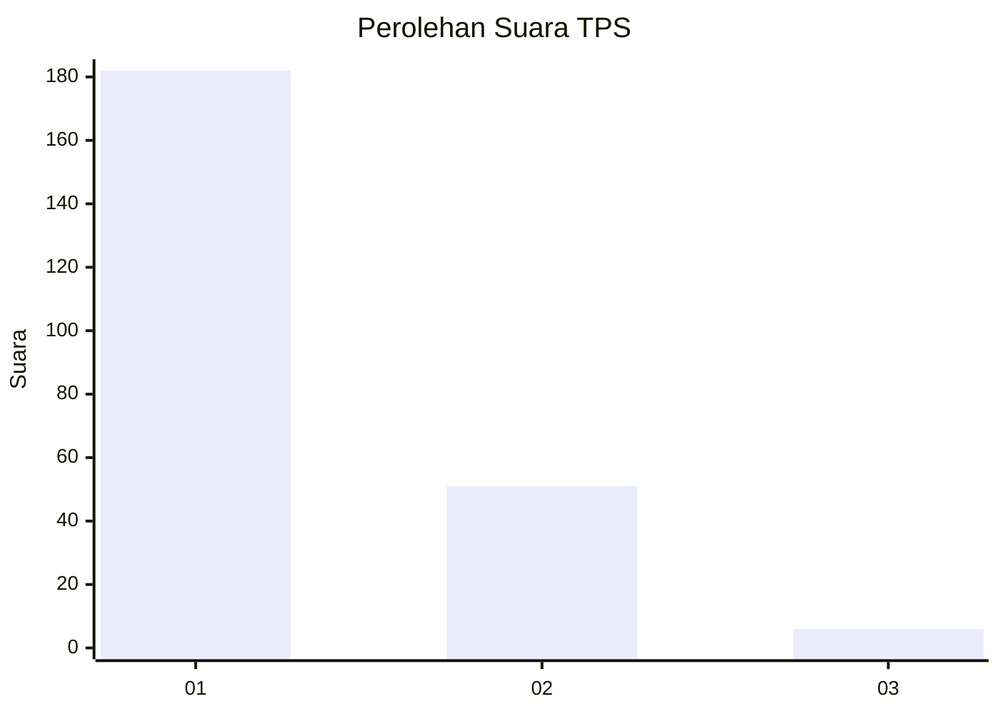
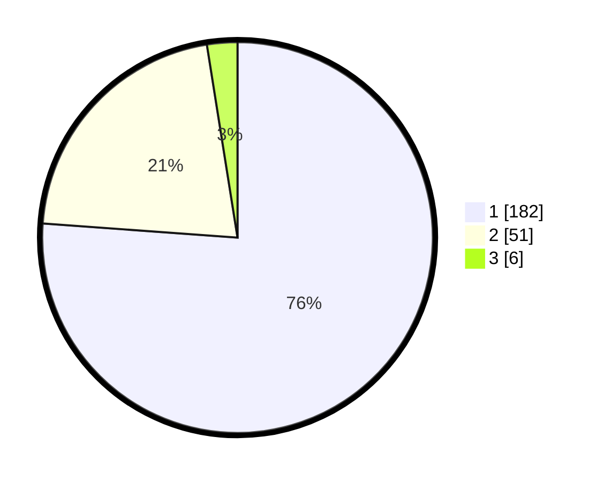

# Hasil

## Grafik

## Tabel

| No. | Nama Paslon    | Suara | Suara (raw) | Persentase |
|:--- |:-------------- | -----:| -----------:| ----------:|
| 1   | ANIES MUHAIMIN | 182   | [182][p-1]  | 76,15      |
| 2   | PRABOWO GIBRAN | 51    | [51][p-2]   | 21,34      |
| 3   | GANJAR MAHFUD  | 6     | [6][p-3]    | 2,51       |

[p-1]: https://github.com/gigit-pemilu/pemilu-2024-11-aceh/blob/main/pilpres/hitung-suara/sub/11-aceh/sub/05-aceh-barat/sub/01-johan-pahlawan/sub/2006-rundeng/sub/006-tps/sub/paslon-1.txt
[p-2]: https://github.com/gigit-pemilu/pemilu-2024-11-aceh/blob/main/pilpres/hitung-suara/sub/11-aceh/sub/05-aceh-barat/sub/01-johan-pahlawan/sub/2006-rundeng/sub/006-tps/sub/paslon-2.txt
[p-3]: https://github.com/gigit-pemilu/pemilu-2024-11-aceh/blob/main/pilpres/hitung-suara/sub/11-aceh/sub/05-aceh-barat/sub/01-johan-pahlawan/sub/2006-rundeng/sub/006-tps/sub/paslon-3.txt

## Foto C Plano

https://sirekap-obj-formc.kpu.go.id/58db/pemilu/ppwp/11/05/01/20/06/1105012006006-20240215-160001--1ffc815e-0672-4867-ab93-71e9aa30f375.jpg

https://sirekap-obj-formc.kpu.go.id/58db/pemilu/ppwp/11/05/01/20/06/1105012006006-20240215-160035--c808a72f-1964-4ad6-9612-26372cc223e2.jpg

https://sirekap-obj-formc.kpu.go.id/58db/pemilu/ppwp/11/05/01/20/06/1105012006006-20240215-160115--37d2a731-7d6d-422e-830b-d9b672a667ea.jpg

## Metadata

| Key        | Value               |
| ---------- | ------------------- |
| Time Stamp | 2024-02-15 20:00:44 |

